# Dominds Dialog System Implementation

Chinese version: [中文版](./dialog-system.zh.md)

This document provides detailed implementation specifications for the Dominds dialog system, including core tools, technical architecture, dialog management, memory management, system integration, and the Questions for Human (Q4H) mechanism.

## Table of Contents

1. [Terminology](#terminology)
2. [Backend-Driven Architecture](#backend-driven-architecture)
3. [3-Type Teammate Tellask Taxonomy](#3-type-teammate-tellask-taxonomy)
4. [Core Mechanisms](#core-mechanisms)
5. [Q4H: Questions for Human](#q4h-questions-for-human)
6. [Dialog Hierarchy & Subdialogs](#dialog-hierarchy--subdialogs)
7. [Mental Clarity Tools](#mental-clarity-tools)
8. [Reminder Management](#reminder-management)
9. [Subdialog Registry](#subdialog-registry)
10. [Technical Architecture](#technical-architecture)
11. [Dialog Management](#dialog-management)
12. [Memory Management](#memory-management)
13. [System Integration](#system-integration)
14. [State Diagrams](#state-diagrams)
15. [Complete Flow Reference](#complete-flow-reference)

---

## Terminology

This chapter defines the implementation-facing terms used throughout this document.
For bilingual / user-facing naming conventions (mainline dialog / sideline dialog; tellasker dialog / tellaskee dialog), see [`dominds-terminology.md`](./dominds-terminology.md).
For Taskdoc package structure and encapsulation rules, see [`encapsulated-taskdoc.md`](./encapsulated-taskdoc.md).

### Supdialog

A **supdialog** (short for "super dialog") is the supdialog in a hierarchical dialog relationship. It orchestrates and manages subdialogs, providing context, objectives, and guidance while receiving results, questions, and escalations from its subdialogs. The supdialog maintains the overall task context and determines when subdialogs are no longer needed.

Note: **supdialog** is a structural parent in the dialog hierarchy. It is not the same as the **tellasker dialog** (the caller for the current Tellask). For TYPE A (`tellaskBack`), the tellasker dialog is the direct supdialog; for TYPE B/C, the tellasker dialog may be a different dialog.

A supdialog may receive **TellaskBack** from its subdialogs during their task execution. When a subdialog needs guidance or additional context, it can Tellask back via `tellaskBack({ tellaskContent: "..." })` (TYPE A / `TellaskBack` / 回问诉请), which provides responses that feed back into the subdialog's context.

### Subdialog

A **subdialog** is a specialized dialog spawned by a supdialog to handle specific subtasks. Subdialogs operate with fresh context, focusing on targeted objectives while maintaining a communication link back to their supdialog.

**TellaskBack**: A subdialog can Tellask its **tellasker dialog** to request clarification during task execution. In TYPE A, the tellasker dialog is the direct supdialog. This allows the subdialog to ask questions and receive guidance while maintaining its own context and progress.

### Tellasker dialog / Tellaskee dialog (caller roles)

A **tellasker dialog** is the dialog that issued the current Tellask (the caller). A **tellaskee dialog** is the dialog handling that Tellask (this dialog). These are **call roles**, not hierarchy:

- For TYPE A (`tellaskBack`), the tellasker dialog is the direct supdialog.
- For TYPE B/C, the tellasker dialog may be a different dialog (root dialog or another sideline dialog).
- Responses route to the **current tellasker dialog** recorded in `assignmentFromSup`.

### Main Dialog (Root Dialog)

The **main dialog** (also called **root dialog**) is the top-level dialog in a dialog hierarchy, with no supdialog relationship. It serves as the main entry point for task execution and can spawn multiple levels of subdialogs. These terms are used interchangeably throughout the system.

### Q4H (Questions for Human)

A **Q4H** is a pending question raised by a dialog (main or subdialog) that requires human input to proceed. Q4Hs are indexed in the dialog's `q4h.yaml` file (an index, not source of truth) and are **cleared by `clear_mind` operations**. The actual question content is stored in the dialog's messages where the `askHuman({ tellaskContent: "..." })` Tellask was recorded.

### Subdialog Index (subdlg.yaml)

A **subdlg.yaml** file indexes pending subdialogs that a supdialog is waiting for. Like `q4h.yaml`, it is an index file, not the source of truth:

- The index tracks which subdialog IDs the parent is waiting for
- Actual subdialog state is verified from disk (done/ directory)
- Used by the backend coroutine for crash recovery and auto-revive

### Subdialog Registry

The **subdialog registry** is a root dialog-scoped Map that maintains persistent references to registered subdialogs. The registry uses `agentId!sessionSlug` as its key format. It moves with the root to `done/` when the root completes, and is rebuilt on root load by scanning done/ subdialog YAMLs.
If a sideline dialog is declared dead, its Type B registry entry is removed so the same `agentId!sessionSlug` can start a brand-new sideline dialog on the next Tellask.

### Teammate Tellask

A **teammate Tellask** is a Dominds specific syntax that triggers communication with another agent as subdialog. Teammate Tellasks have three distinct patterns with different semantics (see Section 3).

**Tellask block structure** (see also [`dominds-terminology.md`](./dominds-terminology.md)):

- **Tellask headline**: the first line `tellaskSessionless({ targetAgentId: "<name>", tellaskContent: "..." })` (additional `tellask* function call` lines in the same block are appended to the headline).
- **Tellask body**: `tellaskContent` payload carried by tellask-special function arguments.
- Structured directives like `sessionSlug` MUST be in the headline.

---

## Backend-Driven Architecture

### Core Design Principle

Dialog driving is a **sole backend algorithm**. The frontend/client never drives dialogs. All dialog state transitions, resumption logic, and generation loops execute entirely in backend coroutines. Frontend only subscribes to publish channels (PubChan) for real-time UI updates.

### Registry Hierarchy

The system maintains three levels of registries for dialog management:

**Global Registry (Server-Scoped)**
A server-wide mapping of `rootId → RootDialog` objects. This is the single source of truth for all active root dialogs. Backend coroutines scan this registry to find dialogs needing driving.

**Local Registry (Per RootDialog)**
A per-root mapping of `selfId → Dialog` objects. This registry contains the root dialog itself plus all loaded subdialogs, enabling O(1) lookup of any dialog within a hierarchy.

**Subdialog Registry (Per RootDialog)**
A per-root mapping of `agentId!sessionSlug → Subdialog` objects. This registry tracks TYPE B registered subdialogs for resumption across multiple interactions. TYPE C transient subdialogs are never registered.

### Per-Dialog Mutex

Each Dialog object carries an exclusive mutex with an associated wait queue. When a backend coroutine needs to drive a dialog, it first acquires the mutex. If the dialog is already locked, the coroutine enqueues its promise and waits until the mutex is released. This ensures only one coroutine drives a dialog at any moment, preventing race conditions and ensuring consistent state.

### Backend Coroutine Driving Loop

Backend coroutines drive dialogs using the following pattern:

1. Scan the Global Registry to identify root dialogs needing driving
2. For each candidate, check resumption conditions (Q4H answered, subdialog completions received)
3. Acquire the dialog's mutex before driving
4. Execute the generation loop until suspension point or completion
5. Release the mutex
6. Persist all state changes to storage

The driving loop continues until a dialog suspends (awaiting Q4H or subdialog) or completes. When conditions change (user answers Q4H, subdialog finishes), the backend detects these via storage checks and resumes driving automatically.

### Frontend Integration

Frontend clients never drive dialogs. Instead, they:

- Subscribe to the current dialog's PubChan for real-time updates
- Receive events for messages, state changes, and UI indicators
- Send user input via API endpoints (drive_dlg_by_user_msg, drive_dialog_by_user_answer)
- Never maintain a full cached dialog corpus in frontend memory: keep only render-scope view data; fetch non-rendered nodes on demand, and drop collapsed subtrees so re-expand always refetches from backend

All driving logic, resumption decisions, and state management remain purely backend concerns.

### State Persistence

Dialog state is persisted to storage at key points:

- After each message generation
- On suspension (Q4H raised, subdialog created)
- On resumption (Q4H answered, subdialog completed)
- On completion

This ensures crash recovery and enables the backend to resume from any persisted state without depending on frontend state.

---

## 3-Type Teammate Tellask Taxonomy

This section documents the three distinct types of teammate Tellasks in the Dominds system, their syntax, behaviors, and use cases.

```mermaid
flowchart TD
  M[LLM emits tellaskSessionless({ targetAgentId: "mention", tellaskContent: "..." })] --> Q{Is this a subdialog Tellasking its direct supdialog (tellasker dialog for TYPE A)?}
  Q -- yes --> A[TYPE A: TellaskBack<br/>(`TellaskBack` / 回问诉请)<br/>Primary: tellaskBack({ tellaskContent: "..." }) (NO sessionSlug)]
  Q -- no --> T{Is sessionSlug present?}
  T -- yes --> B[TYPE B: Registered subdialog Tellask<br/>(`Tellask Session` / 长线诉请)<br/>tellask({ targetAgentId: "agentId", sessionSlug: "tellaskSession", tellaskContent: "..." })]
  T -- no --> C[TYPE C: Transient subdialog Tellask<br/>(`Fresh Tellask` / 一次性诉请)<br/>tellaskSessionless({ targetAgentId: "agentId", tellaskContent: "..." })]
```

### TYPE A: TellaskBack (Type A / `TellaskBack` / 回问诉请)

**Primary syntax**: `tellaskBack({ tellaskContent: "..." })` (NO `sessionSlug`) — `tellaskBack({ tellaskContent: "..." }) sessionSlug ...` is a **syntax error**

**Tolerated fallback**: `tellaskBack({ tellaskContent: "..." })` (NO `sessionSlug`)

**Behavior**:

1. Current subdialog **suspends**
2. Driver switches to drive the **tellasker dialog** (direct supdialog for TYPE A; uses `subdialog.supdialog` reference)
3. Tellasker dialog response flows back to the subdialog
4. Subdialog **resumes** with tellasker dialog's response in context

**Key Characteristics**:

- Uses `subdialog.supdialog` reference (no registry lookup)
- No registration - supdialog relationship is inherent
- Supdialog is always the direct parent in the hierarchy (the tellasker dialog for TYPE A)
- `tellaskBack({ tellaskContent: "..." })` is the canonical Type A syntax: it always routes to the tellasker (the dialog that issued the current Tellask).
- This matters especially when the supdialog’s `agentId` is identical to the subdialog’s `agentId` (common when a sideline
  is created via `freshBootsReasoning({ tellaskContent: "..." })`), where an explicit `tellaskBack({ tellaskContent: "..." })` is easier to get wrong by accident.
- The explicit `tellaskBack({ tellaskContent: "..." })` form is accepted as a semantic fallback for backwards compatibility, but is more
  error-prone in FBR/self-subdialog cases.

**Sideline delivery rule (normative)**:

- A sideline dialog may reply directly to the tellasker dialog **only when all assigned goals are complete**.
- If any goal is incomplete or critical context is missing, it MUST issue `tellaskBack({ tellaskContent: "..." })` to request clarification or next-step confirmation before proceeding.
- **FBR exception**: FBR sideline dialogs are tellask-free (no `tellaskBack`); they must list missing context and return.

**Content markers (first line required)**:

- `【tellaskBack】` — required when asking the tellasker dialog for clarification / next-step confirmation.
- `【最终完成】` — required for final delivery when all goals are complete.
- FBR-only: `【FBR-直接回复】` or `【FBR-仅推理】` for FBR sideline responses.

Note: no extra "Status: ..." line is required; the first-line marker is the stage reminder.

**Example**:

```
Current dialog: sub-001 (agentId: "backend-dev")
Parent supdialog: "orchestrator" (agentId)

LLM emits: tellaskSessionless({ targetAgentId: "orchestrator", tellaskContent: "..." }) How should I handle the database migration?

Result:
- sub-001 suspends
- Driver drives orchestrator with the question
- orchestrator responds with guidance
- sub-001 resumes with orchestrator's response
```

### TYPE B: Registered Subdialog Tellask (Type B / `Tellask Session` / 长线诉请)

**Syntax**: `tellask({ targetAgentId: "<anyAgentId>", sessionSlug: "<tellaskSession>", tellaskContent: "..." })` (note the space before `sessionSlug`)

**Fresh Boots Reasoning (FBR) syntax**: `freshBootsReasoning({ tellaskContent: "..." })`

- `freshBootsReasoning` is a dedicated function tool, not a Tellask special-target alias.
- FBR does not accept `sessionSlug` or `mentionList`.
- FBR is driven under a stricter, tool-less policy; see [`fbr.md`](./fbr.md).

**Tellask Session Key Schema**: `<tellaskSession>` uses the same identifier schema as `<mention-id>`:
`[a-zA-Z][a-zA-Z0-9_-]*`. Parsing stops at whitespace or punctuation; any trailing
headline text is ignored for tellaskSession parsing.

**Registry Key**: `agentId!sessionSlug`

**Behavior**:

1. Check registry for existing subdialog with key `agentId!sessionSlug`
2. **If exists**: Resume the registered subdialog
3. **If not exists**: Create NEW subdialog AND register it with key `agentId!sessionSlug`
4. Parent dialog **suspends** while subdialog runs
5. Subdialog response flows back to parent
6. Parent **resumes** with subdialog's response

**Current Caller Tracking (important for reuse):**

When a registered subdialog is Tellasked again (same `agentId!sessionSlug`), the caller can be a **different dialog** (root dialog or another sideline dialog). On every Type B Tellask, the subdialog’s metadata is updated with:

- The **current caller dialog ID** (so responses route back to the _latest_ caller)
- The **Tellask info** (headline/body, origin role, origin member, callId)

This makes Type B subdialogs reusable across multiple Tellask sites without losing correct response routing.

**Tellask Context on Resume**:

- On every TYPE B Tellask (new or resumed), the parent-provided `mentionList`/`tellaskContent`
  is appended to the subdialog as a new user message before the subdialog is driven.
  This ensures the subdialog receives the latest request context for each Tellask.
- System-injected resume prompts are context only and are **not parsed** for teammate/tool Tellasks.

**Key Characteristics**:

- Registry lookup is performed on each Tellask
- Enables **resumption** of previous subdialogs
- Registered subdialogs persist in the registry until root completion
- Registry is root-dialog scoped (not accessible to subdialogs)

**Example**:

```
Root dialog: orchestrator
Registry: {} (empty)

LLM emits: tellask({ targetAgentId: "researcher", sessionSlug: "market-analysis", tellaskContent: "..." })

Result (first call):
- Registry lookup: no "researcher!market-analysis" exists
- Create new subdialog "researcher!market-analysis"
- Register it in root's registry
- orchestrator suspends
- Drive researcher subdialog
- Response flows back to orchestrator
- orchestrator resumes

LLM emits again: tellask({ targetAgentId: "researcher", sessionSlug: "market-analysis", tellaskContent: "..." })

Result (second call):
- Registry lookup: "researcher!market-analysis" exists
- Resume existing subdialog
- orchestrator suspends
- Drive existing researcher subdialog from where it left off
- Response flows back to orchestrator
- orchestrator resumes
```

### TYPE C: Transient Subdialog Tellask (Type C / `Fresh Tellask` / 一次性诉请)

**Syntax**: `tellaskSessionless({ targetAgentId: "<nonSupdialogAgentId>", tellaskContent: "..." })` (NO `sessionSlug`)

**Fresh Boots Reasoning (FBR) self-tellask syntax (default; most common)**: `freshBootsReasoning({ tellaskContent: "..." })`

- `freshBootsReasoning({ tellaskContent: "..." })` targets the current dialog’s agentId and creates a **new ephemeral subdialog** routed to the same agentId.
- The sideline dialog created by `freshBootsReasoning({ tellaskContent: "..." })` is FBR and is driven under a stricter, tool-less policy; see [`fbr.md`](./fbr.md).
- Use this for most Fresh Boots Reasoning sessions: isolate a single sub-problem, produce an answer, and return.

**Behavior**:

1. Current dialog **suspends**
2. Create **NEW subdialog** with the specified agentId
3. Drive the new subdialog:
   - For general Type C, the subdialog is full-fledged (supcalls, teammate Tellasks, tools per config).
   - For `freshBootsReasoning({ tellaskContent: "..." })`, runtime applies the FBR tool-less policy (no tools; no Tellasks).
4. Subdialog response flows back to parent
5. Parent **resumes** with subdialog's response

**Key Characteristics**:

- **No registry lookup** - always creates a new subdialog
- **Not registered** - no persistence across Tellasks
- The subdialog itself is fully capable **except** for `freshBootsReasoning({ tellaskContent: "..." })` FBR, which is tool-less and tellask-free (see `fbr.md`).
- Only difference from TYPE B: no registry lookup/resume capability
- Used for one-off, independent tasks

**Example**:

```
Current dialog: orchestrator

LLM emits: @code-reviewer Please review this PR

Result:
- orchestrator suspends
- Create NEW subdialog with agentId "code-reviewer"
- Drive the code-reviewer subdialog (it can make its own Tellasks, tools, etc.)
- code-reviewer completes with review findings
- orchestrator resumes with review in context

LLM emits again: @code-reviewer Review this other PR

Result:
- orchestrator suspends
- Create ANOTHER NEW subdialog (not the same as before!)
- Drive the new code-reviewer subdialog
- orchestrator resumes with new review in context
```

### Comparison Summary

| Aspect                     | TYPE A: Supdialog Tellask (`TellaskBack`) | TYPE B: Registered Subdialog Tellask (`Tellask Session`)                                 | TYPE C: Transient Subdialog Tellask (`Fresh Tellask`)                                   |
| -------------------------- | ----------------------------------------- | ---------------------------------------------------------------------------------------- | --------------------------------------------------------------------------------------- |
| **Syntax**                 | `tellaskBack({ tellaskContent: "..." })`  | `tellask({ targetAgentId: "<anyAgentId>", sessionSlug: "<id>", tellaskContent: "..." })` | `tellaskSessionless({ targetAgentId: "<nonSupdialogAgentId>", tellaskContent: "..." })` |
| **sessionSlug**            | Not allowed                               | Required                                                                                 | Not allowed                                                                             |
| **Registry Lookup**        | No (uses `subdialog.supdialog`)           | Yes (`agentId!sessionSlug`)                                                              | No (never registered)                                                                   |
| **Resumption**             | No (supdialog not a subdialog)            | Yes (lookup finds existing)                                                              | No (always new)                                                                         |
| **Registration**           | Not applicable                            | Created AND registered                                                                   | Never registered                                                                        |
| **Parent Behavior**        | Subdialog suspends                        | Parent suspends                                                                          | Parent suspends                                                                         |
| **Subdialog Capabilities** | Full (supcalls, teammates, tools)         | Full (supcalls, teammates, tools)                                                        | Full (supcalls, teammates, tools)                                                       |
| **Use Case**               | Clarification from parent (`TellaskBack`) | Resume persistent subtask (`Tellask Session`)                                            | One-off independent task (`Fresh Tellask`)                                              |

---

## Core Mechanisms

The Dominds dialog system is built on four interconnected core mechanisms that work together to provide a robust, human-in-the-loop AI collaboration environment:

```mermaid
flowchart TD
  H[Dialog hierarchy<br/>(root ↔ subdialogs)] <--> S[Subdialog supply<br/>(responses, pending list, registry)]
  H --> Q[Q4H (askHuman({ tellaskContent: "..." }))<br/>(q4h.yaml index)]
  S --> Q

  Q --> UI[Frontend Q4H panel<br/>(questions_count_update)]
  UI --> Ans[User answers Q4H<br/>(drive_dialog_by_user_answer)]
  Ans --> Q

  Clarity[clear_mind] -->|clears| Q
  Clarity -->|preserves| R[Reminders]
  Clarity -->|preserves| Reg[Registry (root only)]
```

### Key Design Principles

1. **Q4H Index in `q4h.yaml`**: Q4H questions are indexed in `q4h.yaml` (as an index, not source of truth) and cleared by mental clarity operations. The actual question content is in the dialog's messages where the `askHuman({ tellaskContent: "..." })` Tellask was recorded. They do not survive `clear_mind`.

2. **Hierarchical Q4H**: Any dialog in the hierarchy can raise Q4H on its own right (root dialog or subdialog). Questions are indexed in the dialog that asked them, not passed upward.

3. **Subdialog Q4H Autonomy**: Subdialogs can ask Q4H questions directly, not as a proxy for parent. User navigates to the subdialog to answer inline.

4. **UI Renders Q4H Like Teammate Tellasks**: The UI treats Q4H similarly to other teammate Tellasks - with navigation linking to the Tellask site in the dialog. The user answers inline using the same input textarea used for regular messages.

5. **Subdialog Response Supply**: Subdialogs write their responses to the _current Tellasker’s_ context via persistence (not callbacks). For TYPE B, each Tellask updates the subdialog’s `assignmentFromSup` with the latest Tellasker + tellaskInfo, so the response is routed to the most recent Tellasker (root or subdialog). This enables detached operation, reuse, and crash recovery.

6. **Subdialog Registry**: Registered subdialogs (TYPE B Tellasks) are tracked in a root-dialog-scoped registry. The registry persists across `clear_mind` operations and is rebuilt on root load.

7. **State Preservation Contract**:
   - `clear_mind`: Clears messages, clears Q4H index, preserves reminders, preserves registry
   - Subdialog completion: Writes response to the current tellasker dialog, removes from pending list (registry unchanged)
   - Subdialog declared dead: marks runState dead and removes its Type B registry entry; same slug can be reused as a fresh sideline dialog
   - Q4H answer: Clears the answered question from index, continues the dialog

---

## Q4H: Questions for Human

### Overview

Q4H (Questions for Human) is the mechanism by which dialogs can suspend execution and request human input. It is a core, integral mechanism that works seamlessly with subdialogs, reminders, and mental clarity tools.

### Q4H Data Structure

```typescript
/**
 * HumanQuestion - index entry persisted in q4h.yaml per dialog
 * NOTE: This is an INDEX, not the source of truth. The actual question
 * content is in the dialog's messages where the askHuman() Tellask was recorded
 * (invoked via askHuman({ tellaskContent: "..." })).
 */
interface HumanQuestion {
  readonly id: string; // Unique identifier (UUID) - matches message ID
  readonly mentionList: string; // Question headline/title
  readonly tellaskContent: string; // Detailed question context
  readonly askedAt: string; // ISO timestamp
}
```

**Storage Location**: `<dialog-path>/q4h.yaml` - serves as an index for quick lookup

**Source of Truth**: The actual `askHuman({ tellaskContent: "..." })` Tellask is stored in the dialog's messages (course JSONL files), where the question was asked.

### Q4H Mechanism Flow

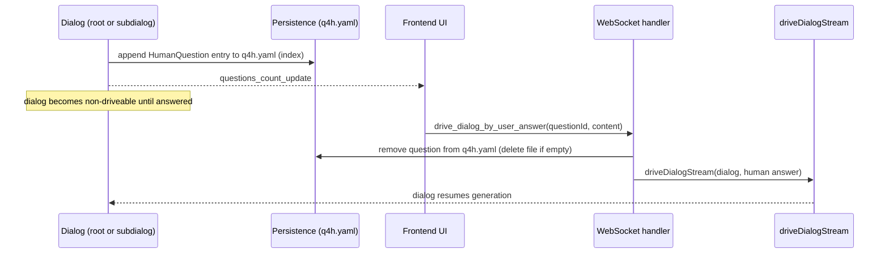

### When Does a Dialog Raise Q4H?

Q4H is raised when the `askHuman({ tellaskContent: "..." })` tellask function is invoked by ANY dialog (root or subdialog) on its own right:

```typescript
// From main/llm/driver-v2/tellask-bridge.ts
const isQ4H = callName === 'askHuman';
```

**Invocation Pattern**:

```typescript
askHuman({ tellaskContent: '<question headline>\n<question body content>' });
```

### Q4H Recording Process

```typescript
// When askHuman({ tellaskContent: "..." }) is detected as a teammate Tellask
async function recordQuestionForHuman(
  dlg: Dialog,
  mentionList: string,
  tellaskContent: string,
): Promise<void> {
  const question: HumanQuestion = {
    id: generateDialogID(),
    mentionList,
    tellaskContent,
    askedAt: formatUnifiedTimestamp(new Date()),
  };

  // Load existing questions
  const existing = await DialogPersistence.loadQuestions4HumanState(dlg.id);

  // Append new question
  await DialogPersistence._saveQuestions4HumanState(dlg.id, [...existing, question]);

  // Emit event for UI notification
  await dlg.updateQuestions4Human([...existing, question]);
}
```

### How UI Knows About Q4H

**Event-Based Notification**:

When a question is recorded, the system emits a `questions_count_update` event:

```typescript
// From main/persistence.ts, DiskFileDialogStore.updateQuestions4Human
const questionsCountUpdateEvt: QuestionsCountUpdateEvent = {
  type: 'questions_count_update',
  previousCount: existing.length,
  questionCount: questions.length,
  dialog: {
    selfId: dialog.id.selfId,
    rootId: dialog.id.rootId,
  },
  course: dialog.currentCourse,
};
postDialogEvent(dialog, questionsCountUpdateEvt);
```

**Frontend Response**:

1. Receives `questions_count_update` event
2. Reads `q4h.yaml` to get question index entries
3. Displays Q4H indicator/badge on dialog
4. Questions link to their Tellask sites in the dialog
5. User clicks link to navigate to Tellask site, answers inline

### How User Answers Q4H (Agent-Pull Model)

**Wire Protocol**: `drive_dialog_by_user_answer`

When a dialog is suspended due to Q4H, the agent is waiting for human input. The wire protocol uses an "agent-pull" styled packet to trigger resumption:

```typescript
// shared/types/wire.ts
interface DriveDialogByUserAnswerRequest {
  type: 'drive_dialog_by_user_answer';
  dialog: DialogIdent;
  content: string; // User's answer text
  msgId: string; // Unique ID for tracking
  questionId: string; // ID from q4h.yaml being answered
  continuationType: 'answer';
}
```

**Process (Agent-Pull Model)**:

1. User sees Q4H indicator/badge in UI
2. User clicks Q4H in panel/list, navigates to the `askHuman()` Tellask site
3. User types answer in the input textarea (same as regular messages)
4. Frontend sends `drive_dialog_by_user_answer` packet
5. Backend validates `questionId` against q4h.yaml
6. Backend clears the answered Q4H from q4h.yaml index
7. Backend invokes `driveDialogStream()` with human response as prompt
8. Agent resumes generation with new context (agent-pull satisfied)

**Key Design Points**:

- Uses dedicated packet type for Q4H answers, distinct from regular user messages
- `questionId` ensures the correct Q4H is cleared and answered
- Backend atomically: clear q4h.yaml → resume dialog
- Agent-pull: agent waits for this specific packet before continuing

**Comparison with Regular Messages**:

| Aspect            | Regular Message         | Q4H Answer                          |
| ----------------- | ----------------------- | ----------------------------------- |
| Packet Type       | `drive_dlg_by_user_msg` | `drive_dialog_by_user_answer`       |
| questionId        | Not present             | Required                            |
| Backend Action    | Just drive dialog       | Clear q4h.yaml first → drive dialog |
| Continuation Type | N/A                     | `'answer'`                          |

### Subdialog Q4H Handling

**Key Principles**:

1. Q4H is indexed in the dialog that asked it, not passed upward to the supdialog
2. Subdialogs ask Q4H on their own right (not as proxy for parent)
3. User navigates to the subdialog to answer inline
4. The `q4h.yaml` file is an index, not source of truth

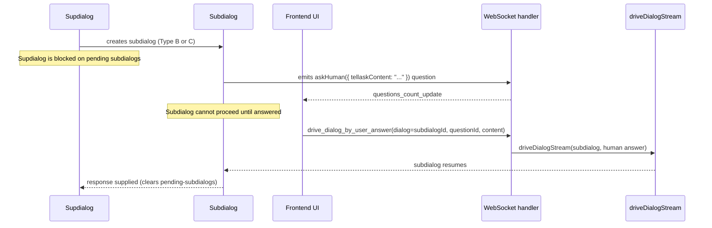

### Q4H and Mental Clarity Operations

**Critical Design Decision**: Q4H questions are **CLEARED** by `clear_mind` operations.

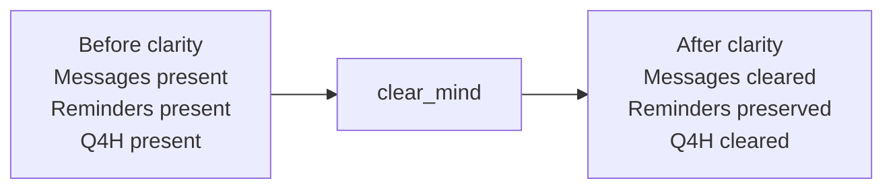

---

## Dialog Hierarchy & Subdialogs

### Hierarchy Overview

```mermaid
flowchart TD
  Root[Root dialog] --> S1[Subdialog sub-001]
  Root --> S2[Subdialog sub-002]
  Root --> S3[Subdialog sub-003]

  S1 --> N1[Nested subdialog sub-001-001]

  Root -.-> Reg["registry.yaml<br/>(root-scoped, Type B only)"]
  Root -.-> QRoot[q4h.yaml (root)]
  S1 -.-> QS1[q4h.yaml (sub-001)]
  N1 -.-> QN1[q4h.yaml (sub-001-001)]
```

**Typical storage (paths are relative to rtws (runtime workspace)):**

- `.dialogs/run/<root-id>/dialog.yaml`
- `.dialogs/run/<root-id>/latest.yaml`
- `.dialogs/run/<root-id>/reminders.json`
- `.dialogs/run/<root-id>/q4h.yaml`
- `.dialogs/run/<root-id>/course-001.jsonl` (and further courses)
- `.dialogs/run/<root-id>/subdialogs/<sub-id>/dialog.yaml`
- `.dialogs/run/<root-id>/subdialogs/<sub-id>/q4h.yaml`
- `.dialogs/run/<root-id>/registry.yaml` (root only; Type B registry)

### Subdialog Response Supply Mechanism

**Core Principle**: Subdialogs supply responses to the **current tellasker dialog's** context via persistence, not callbacks (the tellasker is the direct supdialog for TYPE A; for TYPE B/C it may be a different dialog).

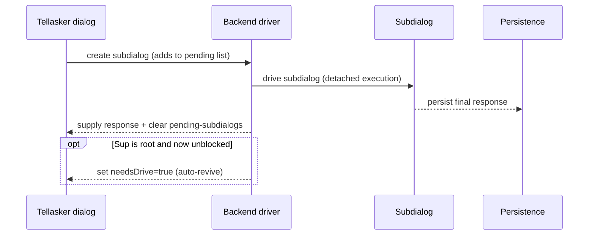

### Subdialog Q4H and Supdialog Revival

When a subdialog has raised Q4H and is waiting for human input, the supdialog's auto-revival logic must handle this:

```typescript
// Supdialog checks subdialog completion status
async function checkSubdialogRevival(supdialog: Dialog): Promise<void> {
  const pending = await loadPendingSubdialogs(supdialog.id);

  for (const p of pending) {
    // Check if subdialog has unresolved Q4H
    const subdialogQ4H = await DialogPersistence.loadQuestions4HumanState(p.subdialogId);

    if (subdialogQ4H.length > 0) {
      // Subdialog is waiting for human input
      // Do NOT auto-revive - wait for human to answer Q4H
      log.debug(`Subdialog ${p.subdialogId} has ${subdialogQ4H.length} Q4H, skipping auto-revive`);
      continue;
    }

    // Subdialog has no Q4H, check if it's done
    const isDone = await isSubdialogCompleted(p.subdialogId);
    if (isDone) {
      // Incorporate response and auto-revive
      await incorporateSubdialogResponse(supdialog, p.subdialogId);
    }
  }
}
```

---

## Dialog Control Tools

**Implementation**: `clear_mind` delegates to `Dialog.startNewCourse(newCoursePrompt)`, which:

1. Clears all dialog messages
2. Clears all Q4H questions
3. Increments the course counter
4. Updates the dialog's timestamp
5. Queues `newCoursePrompt` in `dlg.upNext` so the driver can start a new coroutine and use it as the **first `role=user` message** in the next dialog course

### `clear_mind`

**Purpose**: Achieve mental clarity by clearing dialog noise while preserving essential context.

**Function tool arguments**:

- `reminder_content?: string` (optional reminder to add before clearing)

Example:

```text
Invoke the function tool `clear_mind` with:
```

**Behavior**:

- Clears all dialog messages in the current dialog
- Preserves all reminders
- **Clears all Q4H questions** (critical!)
- Preserves subdialog registry (root dialog only)
- Has no effect on supdialog
- Redirects attention to Taskdoc
- A system-generated new-course prompt is queued and used as the **first `role=user` message** in the new dialog course
- Starts a new dialog course

**Multi-course dialog note**:

- The first course is created naturally when a main dialog or subdialog is created.
- Later courses are started by the dialog responder via `clear_mind`.
- Exception: the system may auto-start a new course as remediation (e.g., context health becomes critical).

**Implementation Notes**:

- Operation is scoped to the current dialog only
- Subdialogs are not affected by parent's `clear_mind`
- Taskdoc remains unchanged and accessible
- Reminders provide continuity across the clarity operation

### `change_mind`

**Purpose**: Update the shared Taskdoc content that all dialogs in the dialog tree reference (without starting a new dialog course). Treat the Taskdoc as the task’s **live coordination bulletin board**.

**Function tool arguments**:

- `selector: "goals" | "constraints" | "progress"`
- `content: string`

Example:

```text
Invoke the function tool `change_mind` with:
```

**Behavior**:

- Updates the rtws (runtime workspace) Taskdoc content (exactly one section file in a `*.tsk/` Taskdoc package)
- **Does not change the Taskdoc path.** `dlg.taskDocPath` is immutable for the dialog's entire lifecycle.
- The updated file immediately becomes available to all dialogs referencing it
- **Does not start a new dialog course.** If starting a new dialog course is desired, use `clear_mind` separately.
- Does not clear messages, reminders, Q4H, or registry by itself
- Affects all participant agents (main and subdialogs) referencing the same Taskdoc
- Use `progress` for key decisions/status/next steps; use `constraints` for hard rules (don’t leave them only in chat/reminders).

**Implementation Notes**:

- `change_mind` is only available in root dialogs (not subdialogs); subdialogs must ask the tellasker via a TellaskBack (`tellaskBack({ tellaskContent: "..." })`) to update the shared Taskdoc.
- For `*.tsk/` Taskdoc packages, the Taskdoc is encapsulated: general file tools must not read/write/list/delete anything under `*.tsk/`. See [`encapsulated-taskdoc.md`](./encapsulated-taskdoc.md).

---

## Reminder Management

**Tools**: `add_reminder`, `update_reminder`, `delete_reminder`

**Purpose**: Manage dialog-scoped working memory that persists across dialog cleanup.

**Behavior**:

- Scoped to individual dialogs
- **Survive clear_mind operations**
- **Survive change_mind operations**
- Provide guidance for refreshed mental focus
- Support structured capture of insights, decisions, and next steps

**Relationship with Q4H**:

- Reminders persist across mental clarity operations
- Q4H is cleared by mental clarity operations
- They serve different purposes:
  - **Reminders**: Self-generated notes for continuity (survive clarity)
  - **Q4H**: External requests requiring human input (cleared by clarity)

---

## Subdialog Registry

### Overview

The **subdialog registry** is a root-dialog-scoped data structure that maintains persistent references to registered subdialogs created via TYPE B (Registered Subdialog Tellask / `Tellask Session`) teammate Tellasks.

### Key Characteristics

| Aspect          | Description                                                     |
| --------------- | --------------------------------------------------------------- |
| **Scope**       | Root dialog only (not accessible to subdialogs)                 |
| **Key Format**  | `agentId!sessionSlug` (single-level Map)                        |
| **Storage**     | `registry.yaml` in root dialog directory                        |
| **Lifecycle**   | Retained during normal runs; dead subdialog entries are removed |
| **Persistence** | Moves with root to `done/` when root completes                  |
| **Restoration** | Rebuilt on root load by scanning done/ subdialog YAMLs          |

### Registry Operations

Example `registry.yaml` (conceptual):

```yaml
researcher!market-analysis:
  subdialogId: uuid-123
  agentId: researcher
  tellaskSession: market-analysis
  createdAt: 2025-12-27T10:00:00Z
  lastAccessed: 2025-12-27T11:30:00Z
```

```mermaid
flowchart TD
  Tellask[TYPE B Tellask: tellask({ targetAgentId: "agentId", sessionSlug: "tellaskSession", tellaskContent: "..." })] --> Key[Compute key: agentId!sessionSlug]
  Key --> Lookup{Registry hit?}
  Lookup -- yes --> Resume[Restore + drive existing subdialog]
  Lookup -- no --> Create[Create + register + drive new subdialog]
  Resume --> Supply[Supply response to caller]
  Create --> Supply
```

### Class Design: RootDialog vs SubDialog

**Critical Design Principle**: The subdialog registry is managed exclusively by `RootDialog` and is **not accessible** to `SubDialog` instances.

**Responsibilities:**

- `RootDialog`
  - Owns the TYPE B subdialog registry (`registry.yaml`)
  - Creates/registers/looks up registered subdialogs (`agentId!sessionSlug`)
- `SubDialog`
  - Has a `supdialog` reference (direct parent) and uses it for TYPE A (`tellaskBack({ tellaskContent: "..." })`)
  - Cannot access or mutate the root registry (by design)

**Mutex Semantics**:

- `locked: true` → Subdialog is currently being driven (mutex held)
- `locked: false` → Entry exists but subdialog is not locked (can resume)
- Registry does NOT track: 'active' | 'completed' | 'suspended' lifecycle states

**Design Principle**: The registry tracks "locked" (being driven) vs "unlocked" (can resume) state. It does NOT track dialog lifecycle states (active/completed/suspended). Those are Dialog concerns, not Registry concerns. A registered subdialog may be unlocked (not currently being driven) but still exist as a completed or suspended dialog.

### Registry Persistence

**File Location**: `<root-dialog-path>/registry.yaml`

**Format**:

```typescript
interface SubdialogRegistry {
  [key: string]: {
    subdialogId: string; // UUID of the subdialog
    agentId: string; // Agent identifier
    tellaskSession: string; // Tellask session key
    createdAt: string; // ISO timestamp
    lastAccessed?: string; // ISO timestamp (updated on each Tellask)
    locked: boolean; // Mutex state - is someone driving this right now?
  };
}
```

**Persistence Behavior**:

1. **On Registration**: New entry added to registry, file saved
2. **On Resume**: `lastAccessed` updated, file saved
3. **On Clear Mind**: Registry preserved (not cleared)
4. **On Root Completion**: Registry moves with root to `done/`
5. **On Root Load**: Registry rebuilt from done/ subdialog YAMLs

---

## Technical Architecture

### Dialog Class Structure

The complete Dialog class implementation with all methods, properties, and detailed behavior can be found in `dominds/main/dialog.ts`.

**Key Components**:

- **Hierarchy Support**: Parent-child relationships for subdialog management
- **Memory Management**: Persistent reminders and ephemeral dialog messages
- **Mental Clarity Operations**: `startNewCourse(newCoursePrompt)` method (clears messages, clears Q4H, increments course, queues new course prompt for the next drive)
- **Subdialog Management**: Creation and coordination of specialized subtasks
- **Q4H Management**: `updateQuestions4Human()` method for question tracking
- **Memory Access**: Integration with Taskdocs and team/agent memories
- **Registry Management** (RootDialog only): Registration and lookup of subdialogs

### Main Dialog Resolution

For subdialogs needing to communicate with the main dialog (root dialog), see the implementation in `dominds/main/dialog.ts` which provides methods for traversing the dialog hierarchy.

### Persistence Layer

The persistence layer handles:

- **Dialog Storage**: `dominds/main/persistence.ts`
- **Q4H Storage**: `q4h.yaml` per dialog (cleared by clear_mind)
- **Reminder Storage**: `reminders.json` per dialog
- **Event Persistence**: Course-based JSONL files
- **Registry Storage**: `registry.yaml` per root dialog

**Q4H Persistence Methods**:

```typescript
// In persistence.ts
static async _saveQuestions4HumanState(
  dialogId: DialogID,
  questions: HumanQuestion[],
): Promise<void>

static async loadQuestions4HumanState(
  dialogId: DialogID,
): Promise<HumanQuestion[]>

static async clearQuestions4HumanState(
  dialogId: DialogID,
): Promise<void>
```

**Registry Persistence Methods**:

```typescript
// In RootDialog (dialog.ts)
interface RegistryMethods {
  loadRegistry(): Promise<SubdialogRegistry>;
  saveRegistry(registry: SubdialogRegistry): Promise<void>;
  registerSubdialog(key: string, metadata: SubdialogMetadata): void;
  lookupSubdialog(key: string): SubdialogMetadata | undefined;
  getRegistry(): SubdialogRegistry;
}
```

---

## Dialog Management

### Hierarchy Management

**Creation**: Subdialogs are created when agents need to delegate specialized tasks or when complex problems require decomposition.

**Context Inheritance**: New subdialogs automatically receive:

- Reference to the same rtws (runtime workspace) Taskdoc (recommended: `tasks/feature-auth.tsk/`); `dlg.taskDocPath` is fixed at dialog creation and never reassigned
- Tellasker dialog Tellask context (mentionList + tellaskContent) explaining their purpose
- Access to shared team memories
- Access to their agent's individual memories

### Subdialog course header (required)

At the start of every subdialog course, the runtime must prepend a role header to the assignment prompt:

- EN: `You are the responder (tellaskee dialog) for this dialog; the tellasker dialog is @xxx (the current caller).`
- ZH: `你是当前被诉请者对话（tellaskee dialog）的主理人；诉请者对话（tellasker dialog）为 @xxx（当前发起本次诉请）。`

**FBR special handling**: FBR is a self-subdialog and must keep a dedicated header to avoid confusion:

- EN (example): `This is an FBR sideline dialog; the tellasker dialog is @xxx (may be the same agent).`
- ZH（示例）: `这是一次 FBR 支线对话；诉请者对话为 @xxx（可能与当前对话同一 agent）。`

**Insertion point**: prefer a single insertion point by updating `formatAssignmentFromSupdialog()` (covers `dialog.ts`, `tellask-bridge`, and `agent-priming`).
Frontend twin must stay in sync: `dominds/webapp/src/shared/utils/inter-dialog-format.ts`.

**Storage**: All subdialogs are stored flat under the main dialog's (root dialog's) `subdialogs/` directory, regardless of nesting depth.

**Navigation**: Each subdialog maintains a reference to its parent, enabling upward traversal to the main dialog.

**Registry**: Registered subdialogs (TYPE B Tellasks) are tracked in the root dialog's registry and persist across restarts.

### Lifecycle Management

**Active State**: Dialogs remain active while agents are working on tasks.

**Completion**: Dialogs transition to completed state when:

- Tasks are finished successfully
- Agents explicitly mark them complete
- Supdialogs determine subtasks are no longer needed
- All pending subdialogs are complete AND all Q4H are answered

**Registry on Completion**: When a root dialog completes, its registry moves with it to the `done/` directory and is preserved for potential restoration.

**Cleanup**: Completed dialogs may be archived or cleaned up based on retention policies.

### Communication Patterns

**Upward Communication**: Subdialogs communicate results, questions, and escalations to their **tellasker dialog** (the caller).

- **Clarification Requests (TYPE A / `TellaskBack`)**: A subdialog may Tellask its tellasker dialog to request clarification while working on its subtask. For TYPE A, the tellasker dialog is the direct supdialog. The tellasker dialog provides guidance, and the subdialog continues with updated context.
- **Subtask Response**: When a subdialog produces a final "saying" content block (no pending Q4H), that message is treated as the response to the **current caller** recorded in `assignmentFromSup` (root or another subdialog). This keeps responses aligned with the most recent Tellask site.
- **Q4H Escalation**: If a subdialog has Q4H, it suspends. The user can answer via the UI, which triggers continuation of the subdialog only.
- **Registered Subdialogs (TYPE B / `Tellask Session`)**: A parent can resume a previously created registered subdialog, enabling ongoing task continuation.
- **Transient Subdialogs (TYPE C / `Fresh Tellask`)**: A parent can spawn a one-off subdialog for independent tasks that don't require persistence.

**Downward Communication**: Supdialogs provide context, objectives, and guidance to subdialogs.

**Lateral Communication**: Sibling subdialogs coordinate through their shared supdialog.

**Broadcast Communication**: Main dialog (root dialog) can communicate changes (like rtws Taskdoc file updates) to all dialogs through the Taskdoc reference.

---

## Memory Management

### Dialog-Scoped Memory

**Dialog Messages**: Ephemeral dialog content that can be cleared for mental clarity.

**Reminders**: Semi-persistent working memory that survives clarity operations.

**Q4H Questions**: Transient questions for human input that are **cleared by mental clarity operations**.

**Parent Call Context**: Immutable context explaining why a subdialog was created.

**Subdialog Registry**: Root-dialog-scoped persistent mapping of registered subdialogs (survives clarity operations).

### rtws-Persistent Memory

**Team-Shared Memories**: Persistent across the entire project lifecycle, shared by all agents.

**Agent-Individual Memories**: Personal knowledge that persists per agent across all dialogs.

### Memory Synchronization

**Taskdoc Propagation**: Changes to the rtws Taskdoc file are immediately visible to all dialogs that reference it.

**Memory Updates**: Team and agent memories are updated asynchronously and eventually consistent across all dialogs.

**Q4H Persistence**: Q4H questions are persisted when created and cleared atomically when answered or when clear_mind is called.

**Registry Persistence**: Registry is persisted after each modification and restored on root dialog load.

---

## System Integration

### File System Integration

**Dialog Storage**: Each dialog corresponds to a directory structure containing:

- `<dialog-root>/dialog.yaml` — dialog metadata and configuration
- `<dialog-root>/latest.yaml` — current course tracking and status
- `<dialog-root>/reminders.json` — persistent reminder storage
- `<dialog-root>/q4h.yaml` — Q4H index (cleared by clarity tools)
- `<dialog-root>/registry.yaml` — subdialog registry (root dialogs only)
- `<dialog-root>/course-001.jsonl` (and further courses) — streamed message files
- `<dialog-root>/subdialogs/<subdialog-id>/dialog.yaml`
- `<dialog-root>/subdialogs/<subdialog-id>/q4h.yaml` — per-subdialog Q4H index (cleared by clarity)

**Taskdoc Storage**: Taskdocs are rtws artifacts referenced by dialogs through paths. Taskdocs MUST be encapsulated `*.tsk/` Taskdoc packages.

**Memory Storage**: Team and agent memories are stored in dedicated files within the rtws.

**Registry Storage**: The subdialog registry (`registry.yaml`) is stored in the root dialog directory and moves to `done/` on root completion.

### Streaming Substream Ordering Contract (Thinking / Saying)

Dominds splits LLM output into multiple “substreams” (thinking, saying, plus markdown / function tool call subsegments derived from saying) and delivers them to the UI via WebSocket events.
To make the UI **faithfully reflect the original generation order**, and to ensure ordering bugs are observable and debuggable across the stack, the following contract MUST hold:

- **Arbitrary alternation is allowed**: Within a single generation (`genseq`), thinking and saying may appear in any number of segments, each as `start → chunk* → finish`, alternating over time.
- **No overlap**: At any moment, at most one active substream exists (thinking or saying). A new `start` MUST NOT occur before the prior segment has `finish`ed.
- **UI renders by event arrival order**: The frontend should not reorder DOM nodes to “fix” ordering; it should append sections in event order to represent the true generation trace.
- **Ordering violations must be loud**: On overlap/out-of-order detection (e.g., thinking and saying both active), the backend SHOULD emit `stream_error_evt` and abort the generation so provider / parsing-chain protocol issues surface quickly.

### CLI Integration

**Dialog Creation**: New dialogs are created through CLI commands with appropriate context.

**Tool Invocation**: Mental clarity tools are invoked through CLI commands or agent actions.

**Status Monitoring**: Dialog status, pending subdialogs, Q4H count, and registered subdialogs can be inspected through CLI tools.

### Agent Integration

**Autonomous Operation**: Agents can independently create subdialogs (TYPE B and C), manage reminders, raise Q4H, and trigger clarity operations.

**Context Awareness**: Agents have full access to their dialog context, memories, hierarchy position, pending Q4H from subdialogs, and (for root dialogs) the subdialog registry.

**Teammate Tellask Capability**: Agents can invoke all three types of teammate Tellasks:

- TYPE A / `TellaskBack`: Tellask the tellasker dialog for clarification (direct supdialog for TYPE A)
- TYPE B / `Tellask Session`: Tellask/resume registered subdialogs
- TYPE C / `Fresh Tellask`: Spawn transient subdialogs

**Tool Access**: All mental clarity tools, Q4H capability, and teammate Tellask capability are available to agents for autonomous cognitive management.

### Dialog State Machine

Dominds' runtime does **not** persist a single enum-like “awaiting …” state. Whether a dialog can be
driven is derived from persisted facts:

- Persisted status (API/index): `running | completed | archived`
- Persisted `latest.yaml`: `status`, `needsDrive`, `generating`
- Derived gates: `hasPendingQ4H()` and `hasPendingSubdialogs()`

**Persisted status lifecycle:**

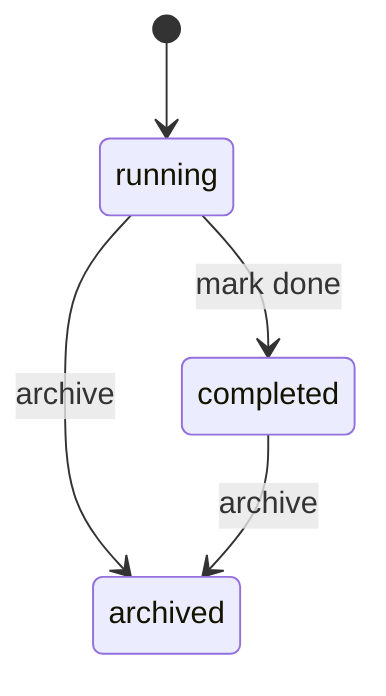

**Root driver gating (conceptual):**

```mermaid
flowchart TD
  A[status=running] --> B{canDrive?\\n(no pending Q4H\\n& no pending subdialogs)}
  B -- no --> S[Suspended\\n(waiting on Q4H and/or subdialogs)]
  S -->|Q4H answered\\nor subdialog responses supplied| C{needsDrive?}
  B -- yes --> C{needsDrive?}
  C -- no --> I[Idle\\n(waiting for trigger)]
  C -- yes --> D[Drive loop\\n(generating=true while streaming)]
  D --> E{hasUpNext?}
  E -- yes --> C
  E -- no --> I
```

### Teammate Tellask State Transitions

These diagrams focus on **control flow** and avoid box-art alignment so they stay readable even when
rendered in different markdown viewers.

#### TYPE A: TellaskBack (`TellaskBack`) (`tellaskBack({ tellaskContent: "..." })`, no `sessionSlug`)

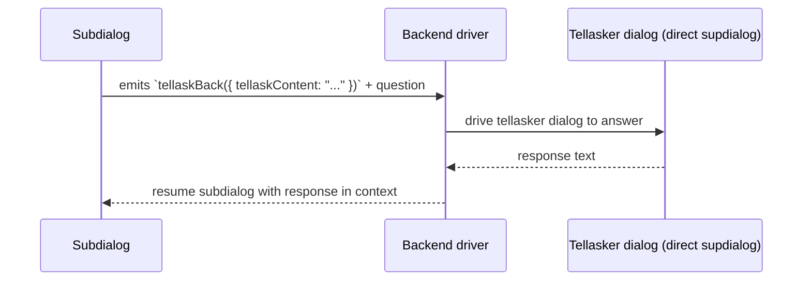

#### TYPE B: Registered Subdialog Tellask (`Tellask Session`) (`tellask({ targetAgentId: "agentId", sessionSlug: "tellaskSession", tellaskContent: "..." })`)

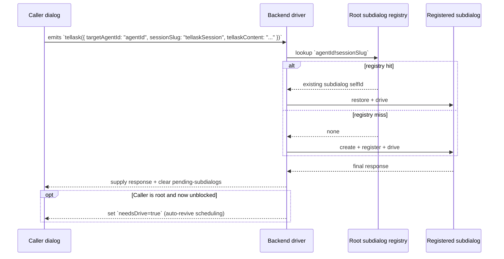

#### TYPE C: Transient Subdialog Tellask (`Fresh Tellask`) (`tellaskSessionless({ targetAgentId: "agentId", tellaskContent: "..." })`; `freshBootsReasoning({ tellaskContent: "..." })` is FBR tool-less)

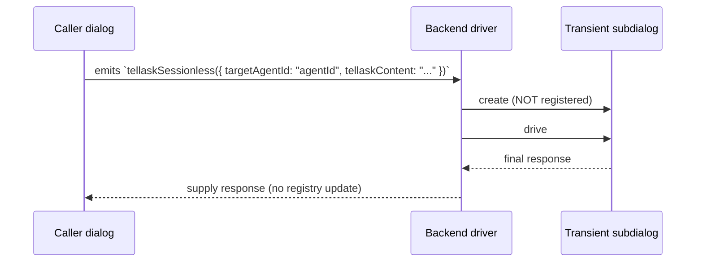

### Q4H Lifecycle State

```mermaid
flowchart TD
  A[askHuman({ tellaskContent: "..." }) Tellask emitted] --> B[Append HumanQuestion entry to q4h.yaml]
  B --> C[Emit questions_count_update]
  C --> D[UI shows Q4H badge / list]
  D --> E{How is it cleared?}
  E -->|User answers (drive_dialog_by_user_answer)| F[Remove question from q4h.yaml\\n(delete file if empty)]
  E -->|clear_mind| G[Clear q4h.yaml (all questions)]
  F --> H[Dialog may become driveable again]
  G --> H
```

`q4h.yaml` is treated as an index; the source-of-truth “asked question” content lives in the dialog’s
message stream, referenced by `callSiteRef`.

### Subdialog + Q4H Interaction

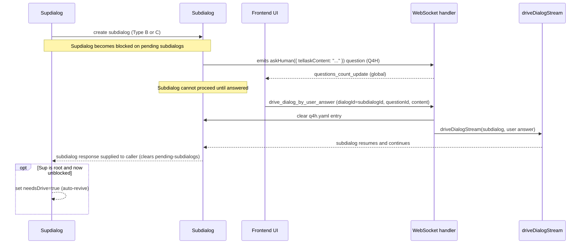

---

## Complete Flow Reference

### 1. Main Dialog Raises Q4H

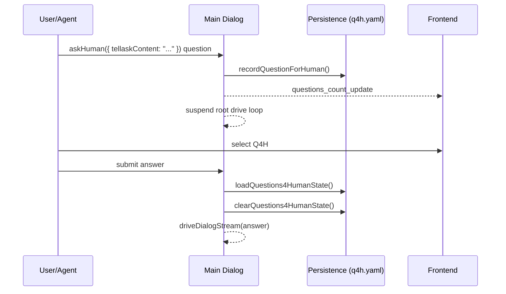

### 2. Subdialog Raises Q4H, User Answers via Root

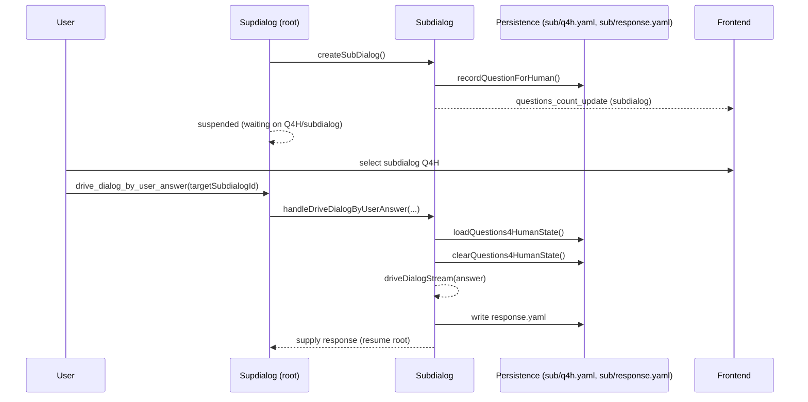

### 3. Registered Subdialog Tellask (TYPE B / `Tellask Session` / 长线诉请)

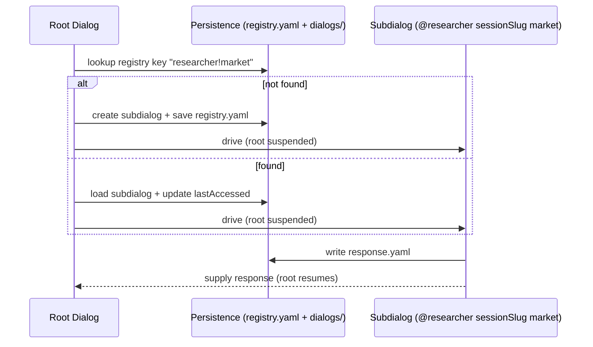

### 4. Clarity Operations Preserve Registry

| State Element | Effect of `clear_mind`                       |
| ------------- | -------------------------------------------- |
| Messages      | Cleared (new course / fresh message context) |
| Q4H           | Cleared                                      |
| Reminders     | Preserved                                    |
| Registry      | Preserved                                    |

`change_mind` is not a clarity operation; it updates Taskdoc content in-place and does not clear messages/Q4H/reminders/registry.

---

## Performance Considerations

### Scalability

**Flat Storage**: Subdialog flat storage prevents deep directory nesting issues.

**Registry Efficiency**: Single-level Map lookup for registered subdialogs is O(1).

**Memory Efficiency**: Shared memories reduce duplication across dialogs.

**Lazy Loading**: Dialog content is loaded on-demand to minimize memory usage.

### Reliability

**Atomic Operations**: Q4H and registry persistence use atomic write patterns (temp file + rename).

**Backup and Recovery**: Dialog state can be backed up and restored independently. Registry is restored from done/ on load.

**Error Handling**: System gracefully handles dialog corruption, missing files, and registry corruption.

### Monitoring

**Performance Metrics**: System tracks dialog creation, completion, registry size, resource usage, and Q4H count.

**Health Checks**: Regular validation of dialog hierarchy integrity, Q4H persistence, registry consistency, and memory.

**Debugging Support**: Comprehensive logging and inspection tools for troubleshooting teammate Tellasks, registry operations, and Q4H flows.

---

## Summary

The Dominds dialog system provides a robust framework for hierarchical, human-in-the-loop AI collaboration:

### Four Core Mechanisms

| Mechanism              | Purpose                       | Survives Clarity | Cleared By                                   |
| ---------------------- | ----------------------------- | ---------------- | -------------------------------------------- |
| **Dialog Hierarchy**   | Parent-child task delegation  | N/A              | N/A                                          |
| **Q4H**                | Human input requests          | No               | clear_mind                                   |
| **Mental Clarity**     | Context reset tools           | N/A              | N/A                                          |
| **Reminders**          | Persistent working memory     | Yes              | N/A                                          |
| **Subdialog Registry** | Registered subdialog tracking | Yes              | dead-entry prune on `declare_subdialog_dead` |

### Three Types of Teammate Tellasks

| Type (internal) | User-facing term  | Syntax                                                                              | Registry              | Use Case                   |
| --------------- | ----------------- | ----------------------------------------------------------------------------------- | --------------------- | -------------------------- |
| TYPE A          | `TellaskBack`     | `tellaskBack({ tellaskContent: "..." })`                                            | no registry           | clarification (ask origin) |
| TYPE B          | `Tellask Session` | `tellask({ targetAgentId: "agentId", sessionSlug: "<id>", tellaskContent: "..." })` | `agentId!sessionSlug` | resumable multi-turn work  |
| TYPE C          | `Fresh Tellask`   | `tellaskSessionless({ targetAgentId: "agentId", tellaskContent: "..." })`           | not registered        | one-shot / non-resumable   |

### Class Responsibility

- **RootDialog**: Manages registry, can make all three teammate Tellask types
- **SubDialog**: Has supdialog reference, can make TYPE A and TYPE C directly; TYPE B routes through the root registry and updates caller context on each Tellask

### Persistence Guarantees

- **Q4H**: Persisted, cleared by clarity operations
- **Reminders**: Persisted, survives clarity operations
- **Registry**: Persisted, survives clarity operations, moves to done/ on completion
- **Subdialogs**: Registered subdialogs persist in registry; transient subdialogs are not registered
