# Dominds Dialog System Implementation

Chinese version: [中文版](./dialog-system.zh.md)

This document provides detailed implementation specifications for the Dominds dialog system, including core tools, technical architecture, dialog management, memory management, system integration, and the Questions for Human (Q4H) mechanism.

## Table of Contents

1. [Terminology](#terminology)
2. [Backend-Driven Architecture](#backend-driven-architecture)
3. [3-Type Teammate Tellask Taxonomy](#3-type-teammate-tellask-taxonomy)
4. [Core Mechanisms](#core-mechanisms)
5. [Q4H: Questions for Human](#q4h-questions-for-human)
6. [Dialog Relationship & SideDialogs](#dialog-relationship--sidedialogs)
7. [Mental Clarity Tools](#mental-clarity-tools)
8. [Reminder Management](#reminder-management)
9. [SideDialog Registry](#sideDialog-registry)
10. [Technical Architecture](#technical-architecture)
11. [Dialog Management](#dialog-management)
12. [Memory Management](#memory-management)
13. [System Integration](#system-integration)
14. [State Diagrams](#state-diagrams)
15. [Complete Flow Reference](#complete-flow-reference)

---

## Terminology

This chapter defines the implementation-facing terms used throughout this document.
For bilingual / user-facing naming conventions (Main Dialog / Side Dialog; tellasker / tellaskee), see [`dominds-terminology.md`](./dominds-terminology.md).
For Taskdoc package structure and encapsulation rules, see [`encapsulated-taskdoc.md`](./encapsulated-taskdoc.md).

### AskerDialog

An **askerDialog** is the implementation-facing dialog that currently owns an assignment or reply obligation for a sideDialog. It may be the main dialog or another sideDialog; it is a tellask/reply relationship, not inherently a hierarchy label.

Note: **askerDialog** is a tellask/reply relation, not a hierarchy or seniority label. For TYPE A (`tellaskBack`), the tellasker is the direct askerDialog; for TYPE B/C, the tellasker may be a different dialog.

An askerDialog may receive **TellaskBack** from sideDialogs that currently owe it a reply. When a sideDialog needs guidance or additional context, it can Tellask back via `tellaskBack({ tellaskContent: "..." })` (TYPE A / `TellaskBack`), which provides responses that feed back into the sideDialog's context.

### SideDialog

A **sideDialog** is a specialized dialog spawned by an askerDialog to handle specific subtasks. SideDialogs operate with fresh context, focusing on targeted objectives while maintaining a communication link back to their askerDialog.

**TellaskBack**: A sideDialog can Tellask its **tellasker** to request clarification during task execution. In TYPE A, the tellasker is the direct askerDialog. This allows the sideDialog to ask questions and receive guidance while maintaining its own context and progress.

### Tellasker / Tellaskee (Tellask roles)

A **tellasker** is the dialog that issued the current Tellask. A **tellaskee** is the dialog handling that Tellask (this dialog). These are **Tellask roles**, not hierarchy:

- For TYPE A (`tellaskBack`), the tellasker is the direct askerDialog.
- For TYPE B/C, the tellasker may be a different dialog (main dialog or another Side Dialog).
- Responses route to the **current tellasker** recorded in `assignmentFromAsker`.

### Main Dialog

The **main dialog** is the top-level dialog with no askerDialog relationship. It serves as the main entry point for task execution and can spawn multiple levels of sideDialogs.

### Q4H (Questions for Human)

A **Q4H** is a pending question raised by a dialog (main or sideDialog) that requires human input to proceed. Q4Hs are indexed in the dialog's `q4h.yaml` file (an index, not source of truth) and are **cleared by `clear_mind` operations**. The actual question content is stored in the dialog's messages where the `askHuman({ tellaskContent: "..." })` Tellask was recorded.

### SideDialog Index (subdlg.yaml)

A **subdlg.yaml** file indexes pending sideDialogs that an askerDialog is waiting for. Like `q4h.yaml`, it is an index file, not the source of truth:

- The index tracks which sideDialog IDs the tellasker is waiting for
- Actual sideDialog state is verified from disk (done/ directory)
- Used by the backend coroutine for crash recovery and auto-revive

### SideDialog Registry

The **sideDialog registry** is a main-dialog-scoped Map that maintains persistent references to registered sideDialogs. The registry uses `agentId!sessionSlug` as its key format. It moves with the main dialog to `done/` when the main dialog completes, and is rebuilt on main dialog load by scanning done/ sideDialog YAMLs.
If a Side Dialog is declared dead, its Type B registry entry is removed so the same `agentId!sessionSlug` can start a brand-new Side Dialog on the next Tellask.

### Teammate Tellask

A **teammate Tellask** is a Dominds specific syntax that triggers communication with another agent as sideDialog. Teammate Tellasks have three distinct patterns with different semantics (see Section 3).

**Tellask block structure** (see also [`dominds-terminology.md`](./dominds-terminology.md)):

- **Tellask headline**: the first line `tellaskSessionless({ targetAgentId: "<name>", tellaskContent: "..." })` (additional `tellask* function call` lines in the same block are appended to the headline).
- **Tellask body**: `tellaskContent` payload carried by tellask-special function arguments.
- Structured directives like `sessionSlug` MUST be in the headline.

---

## Backend-Driven Architecture

### Core Design Principle

Dialog driving is a **sole backend algorithm**. The frontend/client never drives dialogs. All dialog state transitions, resumption logic, and generation loops execute entirely in backend coroutines. Frontend only subscribes to publish channels (PubChan) for real-time UI updates.

### Registry Structure

The system maintains three levels of registries for dialog management:

**Global Registry (Server-Scoped)**
A server-wide mapping of `rootId → MainDialog` objects. This is the single source of truth for all active main dialogs. Backend coroutines scan this registry to find dialogs needing driving.

**Local Registry (Per MainDialog)**
A per-root mapping of `selfId → Dialog` objects. This registry contains the main dialog itself plus all loaded sideDialogs, enabling O(1) lookup of any dialog within a main dialog tree.

**SideDialog Registry (Per MainDialog)**
A per-root mapping of `agentId!sessionSlug → SideDialog` objects. This registry tracks TYPE B registered sideDialogs for resumption across multiple interactions. TYPE C transient sideDialogs are never registered.

### Per-Dialog Mutex

Each Dialog object carries an exclusive mutex with an associated wait queue. When a backend coroutine needs to drive a dialog, it first acquires the mutex. If the dialog is already locked, the coroutine enqueues its promise and waits until the mutex is released. This ensures only one coroutine drives a dialog at any moment, preventing race conditions and ensuring consistent state.

### Backend Coroutine Driving Loop

Backend coroutines drive dialogs using the following pattern:

1. Scan the Global Registry to identify main dialogs needing driving
2. For each candidate, check resumption conditions (Q4H answered, sideDialog completions received)
3. Acquire the dialog's mutex before driving
4. Execute the generation loop until suspension point or completion
5. Release the mutex
6. Persist all state changes to storage

The driving loop continues until a dialog suspends (awaiting Q4H or sideDialog) or completes. When conditions change (user answers Q4H, sideDialog finishes), the backend detects these via storage checks and resumes driving automatically.

### Frontend Integration

Frontend clients never drive dialogs. Instead, they:

- Subscribe to the current dialog's PubChan for real-time updates
- Receive events for messages, state changes, and UI indicators
- Send user input via API endpoints (drive_dlg_by_user_msg, drive_dialog_by_user_answer)
- Never maintain a full cached dialog corpus in frontend memory: keep only render-scope view data; fetch non-rendered nodes on demand, and drop collapsed subtrees so re-expand always refetches from backend

All driving logic, resumption decisions, and state management remain purely backend concerns.

### Global Dialog Event Broadcaster

Some dialog events are rtws-global rather than dialog-scoped, including `new_q4h_asked`, `q4h_answered`, `sideDialog_created_evt`, and `dlg_touched_evt`.

These events require a **global dialog event broadcaster** to be installed during runtime bootstrap before any dialog-driving logic runs. This broadcaster is mandatory infrastructure, not an optional optimization:

- WebUI server runtime installs a WebSocket fanout broadcaster
- Script / test / future runtimes must also install a broadcaster, typically a recording broadcaster
- Tests should bootstrap the broadcaster at runtime entry and then either assert on captured events or ignore them

Missing broadcaster is therefore a runtime bootstrap invariant violation, not a Q4H/business-layer condition.

### State Persistence

Dialog state is persisted to storage at key points:

- After each message generation
- On suspension (Q4H raised, sideDialog created)
- On resumption (Q4H answered, sideDialog completed)
- On completion

This ensures crash recovery and enables the backend to resume from any persisted state without depending on frontend state.

### User Interjection Pause And Continue Semantics

When a dialog still carries an inter-dialog reply obligation, but the user temporarily interjects and asks it to handle a local question first, the system must distinguish between the **UI projection** and the **true driving source state**.

**Normative semantics**:

1. Every user interjection message is driven as a complete normal round.
2. If that round needs tools, the system MUST finish the full tool round and any post-tool follow-up before pausing.
3. The system only projects the original task as resumable `stopped` when this interjection has actually parked an original task that still needs explicit restoration.
4. If there is no parked original task to resume afterwards (for example, no inter-dialog reply obligation needs reassertion), the interjection round should simply finish and return to the true underlying state without showing this special `stopped` panel.
5. As long as the user keeps sending new messages, the dialog stays in temporary interjection-chat handling, and that paused projection remains in place only if it was established in the first place.
6. Only an explicit UI `Continue` attempts to restore the original task.

**Strict boundary**: a formal `askHuman` answer is not part of this "user interjection" category. As soon as a prompt carries a real `q4hAnswerCallId`, it belongs to the askHuman reply channel and semantically continues an already-materialized question/answer chain; it must never be downgraded into temporary local side-chat.

**Key point**: this `stopped` state is only a temporary run-control / UI projection. It is not the same as an ordinary system-stop failure, and it is not the final business source of truth. It also does not apply to every interjection; it exists only when there really is a parked original task to resume.

After the user clicks `Continue`, the backend MUST re-evaluate fresh persistence facts and decide which true-source case now applies. It must not infer the result purely from the visible `displayState`:

- **Case 1: the dialog no longer has a reply obligation**
  If there is also no blocker, the dialog should simply continue driving. If it has already become ordinary idle-waiting-user, then `resume_dialog` is no longer actually resumable.
- **Case 2: the dialog still has a reply obligation and is still suspended**
  Typical examples are pending Q4H or pending sideDialogs. In this case, `Continue` should exit the interjection-paused projection and restore the true `blocked` state.
- **Case 3: the dialog still has a reply obligation but is no longer suspended and is eligible to proceed**
  For example, the blocker has disappeared, or a queued prompt provides a valid continuation path. In this case, `Continue` must not first fall back to an intermediate placeholder `blocked/idle` state; it should keep driving immediately.

**This leads to two implementation constraints**:

- `refreshRunControlProjectionFromPersistenceFacts()` MUST preserve the special "interjection handled; original task paused" `stopped` projection until the user explicitly clicks `Continue`; otherwise the UI collapses back to ordinary `blocked` too early and breaks multi-turn interjection UX. Conversely, when there is no parked original task, this paused projection should not be created at all.
- The actual outcome of `Continue` MUST be decided in the resume drive path by re-reading fresh persistence facts. "Continue is clickable" does not mean "the dialog will definitely enter proceeding immediately".
- If `Continue` reveals that the true state is still `blocked`, the reply-obligation reassertion copy should be materialized immediately as a runtime guide in both `dlg.msgs` and persisted course history, while also surfacing as a frontend bubble. That lets the later real resume path rely on ordinary context replay instead of synthesizing a second duplicate runtime prompt.
- The run-control toolbar's `resumable` count should align with "manual Continue attempt is meaningful". Therefore an interjection-paused `stopped` dialog still counts as resumable even when underlying blocker facts remain, because the business meaning of `Continue` there is "exit the temporary paused projection and re-evaluate from source-of-truth facts".

**Mental-model warning**:

- Do not reason about this flow from `displayState.kind === 'stopped'` alone.
- Do not reason about it from blocker facts alone and then wonder why the UI still shows `stopped`.
- Do not reason about it from `resume_dialog` eligibility alone and assume resumption always means immediate running.
- Do not flatten every `origin === 'user'` prompt into "interjection"; a non-empty `q4hAnswerCallId` means askHuman answer continuation and follows a different semantic path.

You need all of the following together to understand the behavior correctly:

- reply-guidance suppression / deferred reassertion for interjection turns
- flow logic for "pause after local interjection reply" plus "fresh-fact second decision after Continue"
- dialog-display-state projection preservation
- websocket resume entry semantics distinguishing "allowed to attempt Continue" from "actually re-entered driving"

This is an intentionally cross-module semantic contract. Do not locally "simplify" one piece based only on its surface meaning.

---

## 3-Type Teammate Tellask Taxonomy

This section documents the three distinct types of teammate Tellasks in the Dominds system, their syntax, behaviors, and use cases.

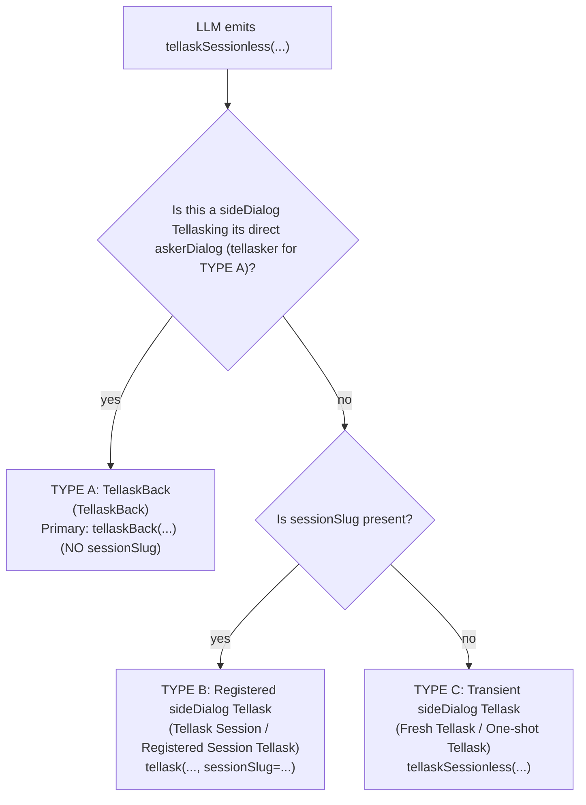
```mermaid
flowchart TD
  M["LLM emits tellaskSessionless(...)"] --> Q{"Is this a sideDialog Tellasking its direct askerDialog (tellasker for TYPE A)?"}
  Q -- yes --> A["TYPE A: TellaskBack<br/>(TellaskBack)<br/>Primary: tellaskBack(...) (NO sessionSlug)"]
  Q -- no --> T{Is sessionSlug present?}
  T -- yes --> B["TYPE B: Registered sideDialog Tellask<br/>(Tellask Session / Registered Session Tellask)<br/>tellask(..., sessionSlug=...)"]
  T -- no --> C["TYPE C: Transient sideDialog Tellask<br/>(Fresh Tellask / One-shot Tellask)<br/>tellaskSessionless(...)"]
```

### TYPE A: TellaskBack (Type A / `TellaskBack`)

**Primary syntax**: `tellaskBack({ tellaskContent: "..." })` (NO `sessionSlug`) — `tellaskBack({ tellaskContent: "..." }) sessionSlug ...` is a **syntax error**

**Behavior**:

1. Current sideDialog **suspends**
2. Driver switches to drive the **tellasker** (direct askerDialog for TYPE A; uses `sideDialog.askerDialog` reference)
3. Tellasker response flows back to the sideDialog
4. SideDialog **resumes** with tellasker's response in context

**Key Characteristics**:

- Uses `sideDialog.askerDialog` reference (no registry lookup)
- No registration - askerDialog relationship is inherent
- TYPE A always targets the direct askerDialog (the tellasker for that Tellask).
- `tellaskBack({ tellaskContent: "..." })` is the canonical Type A syntax: it always routes to the tellasker (the dialog that issued the current Tellask).

**Side Dialog delivery rule (normative)**:

- If a Side Dialog has completed all assigned goals and can deliver the final result, it MUST reply directly with the response body; do not use `tellaskBack` to send final delivery.
- Runtime treats that direct reply as the completion delivery to the tellasker and injects the work-language marker automatically (`【Completed】` in English work language, `【最终完成】` in Chinese work language).
- If the work is unfinished, do not default to `tellaskBack`; first use team SOP / role ownership to judge whether a responsible owner is already clear, and if yes for execution work, directly use `tellask` / `tellaskSessionless` for that owner.
- Use `tellaskBack({ tellaskContent: "..." })` only when the tellasker must clarify the request, decide a tradeoff, confirm acceptance criteria, provide missing input, or current SOP cannot determine ownership.
- **FBR exception**: FBR Side Dialogs forbid all tellask calls (including `tellaskBack` / `tellask` / `tellaskSessionless` / `askHuman`); they must list missing context and return.

**Inter-dialog transfer and markers (normative)**:

- Runtime builds a canonical inter-dialog transfer payload for teammate replies; this payload is delivered to target-agent context, and UI must show the same payload verbatim.
- First-line markers are runtime-injected into that transfer payload by semantics; agents must not hand-write them:
  - English work language:
    - Ask-back reply: `【TellaskBack】`
    - Regular completed Side Dialog reply: `【Completed】`
    - FBR Side Dialog reply: `【FBR-Direct Reply】` or `【FBR-Reasoning Only】`
  - Chinese work language:
    - Ask-back reply: `【回问诉请】`
    - Regular completed Side Dialog reply: `【最终完成】`
    - FBR Side Dialog reply: `【FBR-直接回复】` or `【FBR-仅推理】`
- If the tellasker defines a “reply/delivery format” inside the tellask body, keep it to the business delivery structure; do not require tellaskee-side hand-written markers, because runtime injects those markers automatically.
- Source-dialog model raw is naturally preserved in source-dialog persistence; inter-dialog transfer must not rewrite or overwrite that source raw.
- Template-wrapped transfer is allowed: a model output from one dialog may be embedded into a runtime template and sent as the body to another dialog.

**Protocol clarification**:

- When you truly need to ask the tellasker back, emit it via `tellaskBack({ tellaskContent: "..." })`; first judge whether team SOP already identifies another responsible owner. Do not post plain-text intermediate status updates while unfinished.
- A direct plain-text reply is correct when the Side Dialog is already complete and is delivering the final result to the tellasker.

Note: no extra "Status: ..." line is required; the first-line marker is the stage reminder.

**Example**:

```
Current dialog: sub-001 (agentId: "backend-dev")
Tellasker: "orchestrator" (agentId)

LLM emits: tellaskSessionless({ targetAgentId: "orchestrator", tellaskContent: "..." }) How should I handle the database migration?

Result:
- sub-001 suspends
- Driver drives orchestrator with the question
- orchestrator responds with guidance
- sub-001 resumes with orchestrator's response
```

### TYPE B: Registered SideDialog Tellask (Type B / `Tellask Session` / Registered Session Tellask)

**Syntax**: `tellask({ targetAgentId: "<anyAgentId>", sessionSlug: "<tellaskSession>", tellaskContent: "..." })` (note the space before `sessionSlug`)

**Fresh Boots Reasoning (FBR) syntax**: `freshBootsReasoning({ tellaskContent: "..." })`

- `freshBootsReasoning` is a dedicated function tool, not a Tellask special-target alias.
- FBR does not accept `sessionSlug` or `mentionList`.
- FBR is driven under a stricter, tool-less policy; see [`fbr.md`](./fbr.md).

**Tellask Session Key Schema**: `<tellaskSession>` uses the same identifier schema as `<mention-id>`:
`[a-zA-Z][a-zA-Z0-9_-]*`. Parsing stops at whitespace or punctuation; any trailing
headline text is ignored for tellaskSession parsing.

**Registry Key**: `agentId!sessionSlug`

**Behavior**:

1. Check registry for existing sideDialog with key `agentId!sessionSlug`
2. **If exists**: Resume the registered sideDialog
3. **If not exists**: Create NEW sideDialog AND register it with key `agentId!sessionSlug`
4. Tellasker **suspends** while sideDialog runs
5. SideDialog response flows back to the tellasker
6. Tellasker **resumes** with sideDialog's response

**Current Tellasker Tracking (important for reuse):**

When a registered sideDialog is Tellasked again (same `agentId!sessionSlug`), the tellasker can be a **different dialog** (main dialog or another Side Dialog). On every Type B Tellask, the sideDialog’s metadata is updated with:

- The **current tellasker ID** (so responses route back to the _latest_ tellasker)
- The **Tellask info** (headline/body, origin role, origin member, callId)

This makes Type B sideDialogs reusable across multiple Tellask sites without losing correct response routing.

**Tellask Context on Resume**:

- On every TYPE B Tellask (new or resumed), the tellasker-provided `mentionList`/`tellaskContent`
  is appended to the sideDialog as a new user message before the sideDialog is driven.
  This ensures the sideDialog receives the latest request context for each Tellask.
- System-injected resume prompts are context only and are **not parsed** for teammate/tool Tellasks.

**Updated Tellask While an Earlier Round Is Still Waiting (normative)**:

- For a registered Side Dialog (`same agentId!sessionSlug`), runtime maintains one current waiting tellasker round.
- If a newer TYPE B Tellask arrives before the earlier round replies, runtime immediately closes the earlier waiting round with a system-generated failed Tellask result. The wording must describe the conversation fact in business terms, not protocol jargon.
- The tellaskee is not force-stopped. Instead, its next runtime prompt explains that the work request has been updated, explicitly says not to send a standalone acknowledgement, and includes the latest full assignment.
- Delivery of that updated assignment prompt is queued in-order at the next safe turn boundary. Runtime must not reject the update merely because another normal queued prompt already exists; queued prompts are ordered work, not a single overwrite slot.
- A Side Dialog reply produced before that updated assignment prompt is rendered locally MUST NOT be delivered to the tellasker as the newer round's result.

**Key Characteristics**:

- Registry lookup is performed on each Tellask
- Enables **resumption** of previous sideDialogs
- Registered sideDialogs persist in the registry until main dialog completion
- Registry is main-dialog scoped (not accessible to sideDialogs)

**Example**:

```
Main dialog: orchestrator
Registry: {} (empty)

LLM emits: tellask({ targetAgentId: "researcher", sessionSlug: "market-analysis", tellaskContent: "..." })

Result (first call):
- Registry lookup: no "researcher!market-analysis" exists
- Create new sideDialog "researcher!market-analysis"
- Register it in main dialog's registry
- orchestrator suspends
- Drive researcher sideDialog
- Response flows back to orchestrator
- orchestrator resumes

LLM emits again: tellask({ targetAgentId: "researcher", sessionSlug: "market-analysis", tellaskContent: "..." })

Result (second call):
- Registry lookup: "researcher!market-analysis" exists
- Resume existing sideDialog
- orchestrator suspends
- Drive existing researcher sideDialog from where it left off
- Response flows back to orchestrator
- orchestrator resumes
```

### TYPE C: Transient SideDialog Tellask (Type C / `Fresh Tellask` / One-shot Tellask)

**Syntax**: `tellaskSessionless({ targetAgentId: "<nonAskerDialogAgentId>", tellaskContent: "..." })` (NO `sessionSlug`)

**Fresh Boots Reasoning (FBR) self-tellask syntax (default; most common)**: `freshBootsReasoning({ tellaskContent: "..." })`

- `freshBootsReasoning({ tellaskContent: "..." })` targets the current dialog’s agentId and creates a **new ephemeral sideDialog** routed to the same agentId.
- The Side Dialog created by `freshBootsReasoning({ tellaskContent: "..." })` is FBR and is driven under a stricter, tool-less policy; see [`fbr.md`](./fbr.md).
- Use this for most Fresh Boots Reasoning sessions: isolate a single sub-problem, produce an answer, and return.

**Behavior**:

1. Current dialog **suspends**
2. Create **NEW sideDialog** with the specified agentId
3. Drive the new sideDialog:
   - For general Type C, the sideDialog is full-fledged (TellaskBack, teammate Tellasks, tools per config).
   - For `freshBootsReasoning({ tellaskContent: "..." })`, runtime applies the FBR tool-less policy (no tools; no Tellasks).
4. SideDialog response flows back to the tellasker
5. Tellasker **resumes** with sideDialog's response

**Key Characteristics**:

- **No registry lookup** - always creates a new sideDialog
- **Not registered** - no persistence across Tellasks
- **No assignment-update channel** - once emitted, it cannot be updated in place like Type B
- Another `tellaskSessionless` creates **another new transient sideDialog**; it does not update, stop, or tell the earlier Type C Side Dialog to stop
- If later correction, scope change, or earlier wrap-up may be needed, choose Type B `tellask` with `sessionSlug` from the start
- The sideDialog itself is fully capable **except** for `freshBootsReasoning({ tellaskContent: "..." })` FBR, which is tool-less and tellask-free (see `fbr.md`).
- Only difference from TYPE B: no registry lookup/resume capability
- Used for one-off, independent tasks

**Example**:

```
Current dialog: orchestrator

LLM emits: @code-reviewer Please review this PR

Result:
- orchestrator suspends
- Create NEW sideDialog with agentId "code-reviewer"
- Drive the code-reviewer sideDialog (it can make its own Tellasks, tools, etc.)
- code-reviewer completes with review findings
- orchestrator resumes with review in context

LLM emits again: @code-reviewer Review this other PR

Result:
- orchestrator suspends
- Create ANOTHER NEW sideDialog (not the same as before!)
- Drive the new code-reviewer sideDialog
- orchestrator resumes with new review in context
```

### Comparison Summary

| Aspect                      | TYPE A: AskerDialog Tellask (`TellaskBack`)  | TYPE B: Registered SideDialog Tellask (`Tellask Session`)                                | TYPE C: Transient SideDialog Tellask (`Fresh Tellask`)                                    |
| --------------------------- | -------------------------------------------- | ---------------------------------------------------------------------------------------- | ----------------------------------------------------------------------------------------- |
| **Syntax**                  | `tellaskBack({ tellaskContent: "..." })`     | `tellask({ targetAgentId: "<anyAgentId>", sessionSlug: "<id>", tellaskContent: "..." })` | `tellaskSessionless({ targetAgentId: "<nonAskerDialogAgentId>", tellaskContent: "..." })` |
| **sessionSlug**             | Not allowed                                  | Required                                                                                 | Not allowed                                                                               |
| **Registry Lookup**         | No (uses `sideDialog.askerDialog`)           | Yes (`agentId!sessionSlug`)                                                              | No (never registered)                                                                     |
| **Resumption**              | No (askerDialog not a sideDialog)            | Yes (lookup finds existing)                                                              | No (always new)                                                                           |
| **Registration**            | Not applicable                               | Created AND registered                                                                   | Never registered                                                                          |
| **Tellasker Behavior**      | SideDialog suspends                          | Tellasker suspends                                                                       | Tellasker suspends                                                                        |
| **SideDialog Capabilities** | Full (TellaskBack, teammates, tools)         | Full (TellaskBack, teammates, tools)                                                     | Full (TellaskBack, teammates, tools)                                                      |
| **Use Case**                | Clarification from tellasker (`TellaskBack`) | Resume persistent subtask (`Tellask Session`)                                            | One-off independent task (`Fresh Tellask`)                                                |

---

## Core Mechanisms

The Dominds dialog system is built on four interconnected core mechanisms that work together to provide a robust, human-in-the-loop AI collaboration environment:

```mermaid
flowchart TD
  H[Dialog relationship<br/>(main ↔ sideDialogs)] <--> S[SideDialog supply<br/>(responses, pending list, registry)]
  H --> Q["Q4H (askHuman(...))<br/>(q4h.yaml index)"]
  S --> Q

  Q --> UI[Frontend Q4H panel<br/>(questions_count_update)]
  UI --> Ans[User answers Q4H<br/>(drive_dialog_by_user_answer)]
  Ans --> Q

  Clarity[clear_mind] -->|clears| Q
  Clarity -->|preserves| R[Reminders]
  Clarity -->|preserves| Reg[Registry (main only)]
```

### Key Design Principles

1. **Q4H Index in `q4h.yaml`**: Q4H questions are indexed in `q4h.yaml` (as an index, not source of truth) and cleared by mental clarity operations. The actual question content is in the dialog's messages where the `askHuman({ tellaskContent: "..." })` Tellask was recorded. They do not survive `clear_mind`.

2. **Dialog-scoped Q4H**: Any dialog in a Main Dialog / Side Dialog relationship can raise Q4H on its own right. Questions are indexed in the dialog that asked them, not passed upward.

3. **SideDialog Q4H Autonomy**: SideDialogs can ask Q4H questions directly, not as a proxy for tellasker. User navigates to the sideDialog to answer inline.

4. **UI Renders Q4H Like Teammate Tellasks**: The UI treats Q4H similarly to other teammate Tellasks - with navigation linking to the Tellask site in the dialog. The user answers inline using the same input textarea used for regular messages.

5. **SideDialog Response Supply**: SideDialogs write their responses to the _current tellasker’s_ context via persistence (not callbacks). For TYPE B, each Tellask updates the sideDialog’s `assignmentFromAsker` with the latest tellasker + tellaskInfo, so the response is routed to the most recent tellasker (main dialog or sideDialog). This enables detached operation, reuse, and crash recovery.

6. **SideDialog Registry**: Registered sideDialogs (TYPE B Tellasks) are tracked in a main-dialog-scoped registry. The registry persists across `clear_mind` operations and is rebuilt on main dialog load.

7. **State Preservation Contract**:
   - `clear_mind`: Clears messages, clears Q4H index, preserves reminders, preserves registry
   - SideDialog completion: Writes response to the current tellasker, removes from pending list (registry unchanged)
   - SideDialog declared dead: marks runState dead and removes its Type B registry entry; same slug can be reused as a fresh Side Dialog
   - Q4H answer: Clears the answered question from index, continues the dialog

---

## Q4H: Questions for Human

### Overview

Q4H (Questions for Human) is the mechanism by which dialogs can suspend execution and request human input. It is a core, integral mechanism that works seamlessly with sideDialogs, reminders, and mental clarity tools.

### Q4H Data Structure

```typescript
/**
 * HumanQuestion - index entry persisted in q4h.yaml per dialog
 * NOTE: This is an INDEX, not the source of truth. The actual question
 * content is in the dialog's messages where the askHuman() Tellask was recorded
 * (invoked via askHuman({ tellaskContent: "..." })).
 */
interface HumanQuestion {
  readonly id: string; // Unique identifier (UUID) - matches message ID
  readonly mentionList: string; // Question headline/title
  readonly tellaskContent: string; // Detailed question context
  readonly askedAt: string; // ISO timestamp
}
```

**Storage Location**: `<dialog-path>/q4h.yaml` - serves as an index for quick lookup

**Source of Truth**: The actual `askHuman({ tellaskContent: "..." })` Tellask is stored in the dialog's messages (course JSONL files), where the question was asked.

### Q4H Mechanism Flow

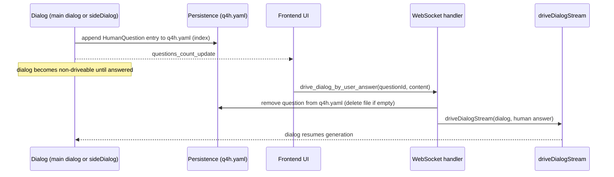
```mermaid
sequenceDiagram
  participant D as Dialog (main dialog or sideDialog)
  participant P as Persistence (q4h.yaml)
  participant UI as Frontend UI
  participant WS as WebSocket handler
  participant Driver as driveDialogStream

  D->>P: append HumanQuestion entry to q4h.yaml (index)
  D-->>UI: questions_count_update
  Note over D: dialog becomes non-driveable until answered

  UI->>WS: drive_dialog_by_user_answer(questionId, content)
  WS->>P: remove question from q4h.yaml (delete file if empty)
  WS->>Driver: driveDialogStream(dialog, human answer)
  Driver-->>D: dialog resumes generation
```

### When Does a Dialog Raise Q4H?

Q4H is raised when the `askHuman({ tellaskContent: "..." })` tellask function is invoked by ANY dialog (main dialog or sideDialog) on its own right:

```typescript
// From main/llm/kernel-driver/tellask-special.ts
const isQ4H = callName === 'askHuman';
```

**Invocation Pattern**:

```typescript
askHuman({ tellaskContent: '<question headline>\n<question body content>' });
```

### Q4H Recording Process

```typescript
// When askHuman({ tellaskContent: "..." }) is detected as a teammate Tellask
async function recordQuestionForHuman(
  dlg: Dialog,
  mentionList: string,
  tellaskContent: string,
): Promise<void> {
  const question: HumanQuestion = {
    id: generateDialogID(),
    mentionList,
    tellaskContent,
    askedAt: formatUnifiedTimestamp(new Date()),
  };

  // Load existing questions
  const existing = await DialogPersistence.loadQuestions4HumanState(dlg.id);

  // Append new question
  await DialogPersistence._saveQuestions4HumanState(dlg.id, [...existing, question]);

  // Emit event for UI notification
  await dlg.updateQuestions4Human([...existing, question]);
}
```

### How UI Knows About Q4H

**Event-Based Notification**:

When a question is recorded, the system emits a `questions_count_update` event:

```typescript
// From main/persistence.ts, DiskFileDialogStore.updateQuestions4Human
const questionsCountUpdateEvt: QuestionsCountUpdateEvent = {
  type: 'questions_count_update',
  previousCount: existing.length,
  questionCount: questions.length,
  dialog: {
    selfId: dialog.id.selfId,
    rootId: dialog.id.rootId,
  },
  course: dialog.currentCourse,
};
postDialogEvent(dialog, questionsCountUpdateEvt);
```

**Frontend Response**:

1. Receives `questions_count_update` event
2. Reads `q4h.yaml` to get question index entries
3. Displays Q4H indicator/badge on dialog
4. Questions link to their Tellask sites in the dialog
5. User clicks link to navigate to Tellask site, answers inline

### How User Answers Q4H (Agent-Pull Model)

**Wire Protocol**: `drive_dialog_by_user_answer`

When a dialog is suspended due to Q4H, the agent is waiting for human input. The wire protocol uses an "agent-pull" styled packet to trigger resumption:

```typescript
// shared/types/wire.ts
interface DriveDialogByUserAnswerRequest {
  type: 'drive_dialog_by_user_answer';
  dialog: DialogIdent;
  content: string; // User's answer text
  msgId: string; // Unique ID for tracking
  questionId: string; // ID from q4h.yaml being answered
  continuationType: 'answer';
}
```

**Process (Agent-Pull Model)**:

1. User sees Q4H indicator/badge in UI
2. User clicks Q4H in panel/list, navigates to the `askHuman()` Tellask site
3. User types answer in the input textarea (same as regular messages)
4. Frontend sends `drive_dialog_by_user_answer` packet
5. Backend validates `questionId` against q4h.yaml
6. Backend clears the answered Q4H from q4h.yaml index
7. Backend invokes `driveDialogStream()` with human response as prompt
8. Agent resumes generation with new context (agent-pull satisfied)

**Key Design Points**:

- Uses dedicated packet type for Q4H answers, distinct from regular user messages
- `questionId` ensures the correct Q4H is cleared and answered
- Backend atomically: clear q4h.yaml → resume dialog
- Agent-pull: agent waits for this specific packet before continuing

**Comparison with Regular Messages**:

| Aspect            | Regular Message         | Q4H Answer                          |
| ----------------- | ----------------------- | ----------------------------------- |
| Packet Type       | `drive_dlg_by_user_msg` | `drive_dialog_by_user_answer`       |
| questionId        | Not present             | Required                            |
| Backend Action    | Just drive dialog       | Clear q4h.yaml first → drive dialog |
| Continuation Type | N/A                     | `'answer'`                          |

### SideDialog Q4H Handling

**Key Principles**:

1. Q4H is indexed in the dialog that asked it, not passed upward to the askerDialog
2. SideDialogs ask Q4H on their own right (not as proxy for tellasker)
3. User navigates to the sideDialog to answer inline
4. The `q4h.yaml` file is an index, not source of truth

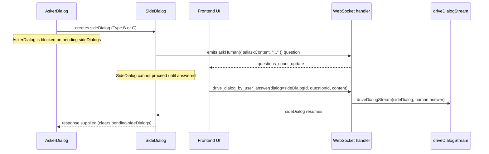
```mermaid
sequenceDiagram
  participant Asker as AskerDialog
  participant Side as SideDialog
  participant UI as Frontend UI
  participant WS as WebSocket handler
  participant Driver as driveDialogStream

  Asker->>Side: creates sideDialog (Type B or C)
  Note over Asker: AskerDialog is blocked on pending sideDialogs

  Side->>WS: emits askHuman({ tellaskContent: "..." }) question
  WS-->>UI: questions_count_update
  Note over Side: SideDialog cannot proceed until answered

  UI->>WS: drive_dialog_by_user_answer(dialog=sideDialogId, questionId, content)
  WS->>Driver: driveDialogStream(sideDialog, human answer)
  Driver-->>Side: sideDialog resumes
  Side-->>Asker: response supplied (clears pending-sideDialogs)
```

### Q4H and Mental Clarity Operations

**Critical Design Decision**: Q4H questions are **CLEARED** by `clear_mind` operations.

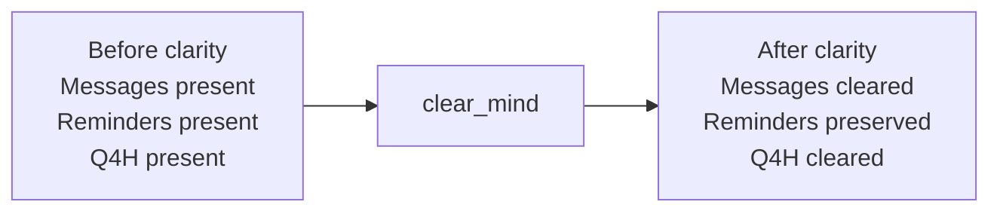
```mermaid
flowchart LR
  Before["Before clarity<br/>Messages present<br/>Reminders present<br/>Q4H present"] --> Op[clear_mind]
  Op --> After["After clarity<br/>Messages cleared<br/>Reminders preserved<br/>Q4H cleared"]
```

---

## Dialog Relationship & SideDialogs

### Relationship Overview

```mermaid
flowchart TD
  Main[Main dialog] --> S1[SideDialog sub-001]
  Main --> S2[SideDialog sub-002]
  Main --> S3[SideDialog sub-003]

  S1 --> N1[Nested sideDialog sub-001-001]

  Main -.-> Reg["registry.yaml<br/>(main-scoped, Type B only)"]
  Main -.-> QRoot[q4h.yaml (root)]
  S1 -.-> QS1[q4h.yaml (sub-001)]
  N1 -.-> QN1[q4h.yaml (sub-001-001)]
```

**Typical storage (paths are relative to rtws (runtime workspace)):**

- `.dialogs/run/<root-id>/dialog.yaml`
- `.dialogs/run/<root-id>/latest.yaml`
- `.dialogs/run/<root-id>/reminders.json`
- `.dialogs/run/<root-id>/q4h.yaml`
- `.dialogs/run/<root-id>/course-001.jsonl` (and further courses)
- `.dialogs/run/<root-id>/sideDialogs/<sub-id>/dialog.yaml`
- `.dialogs/run/<root-id>/sideDialogs/<sub-id>/q4h.yaml`
- `.dialogs/run/<root-id>/registry.yaml` (main only; Type B registry)

### SideDialog Response Supply Mechanism

**Core Principle**: SideDialogs supply responses to the **current tellasker's** context via persistence, not callbacks (the tellasker is the direct askerDialog for TYPE A; for TYPE B/C it may be a different dialog).

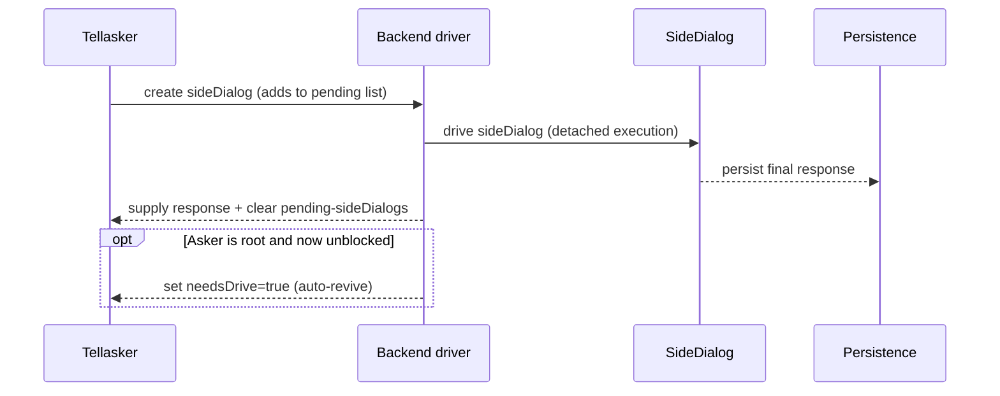
```mermaid
sequenceDiagram
  participant Asker as Tellasker
  participant Driver as Backend driver
  participant Side as SideDialog
  participant Store as Persistence

  Asker->>Driver: create sideDialog (adds to pending list)
  Driver->>Side: drive sideDialog (detached execution)
  Side-->>Store: persist final response
  Driver-->>Asker: supply response + clear pending-sideDialogs
  opt Asker is root and now unblocked
    Driver-->>Asker: set needsDrive=true (auto-revive)
  end
```

### SideDialog Q4H and AskerDialog Revival

When a sideDialog has raised Q4H and is waiting for human input, the askerDialog's auto-revival logic must handle this:

```typescript
// AskerDialog checks sideDialog completion status
async function checkSideDialogRevival(askerDialog: Dialog): Promise<void> {
  const pending = await loadPendingSideDialogs(askerDialog.id);

  for (const p of pending) {
    // Check if sideDialog has unresolved Q4H
    const sideDialogQ4H = await DialogPersistence.loadQuestions4HumanState(p.sideDialogId);

    if (sideDialogQ4H.length > 0) {
      // SideDialog is waiting for human input
      // Do NOT auto-revive - wait for human to answer Q4H
      log.debug(
        `SideDialog ${p.sideDialogId} has ${sideDialogQ4H.length} Q4H, skipping auto-revive`,
      );
      continue;
    }

    // SideDialog has no Q4H, check if it's done
    const isDone = await isSideDialogCompleted(p.sideDialogId);
    if (isDone) {
      // Incorporate response and auto-revive
      await incorporateSideDialogResponse(askerDialog, p.sideDialogId);
    }
  }
}
```

---

## Dialog Control Tools

**Implementation**: `clear_mind` delegates to `Dialog.startNewCourse(newCoursePrompt)`, which:

1. Clears all dialog messages
2. Clears all Q4H questions
3. Increments the course counter
4. Updates the dialog's timestamp
5. Queues `newCoursePrompt` into the dialog's next-prompt queue so the driver can start a new coroutine and use it as the **first `role=user` message** in the next dialog course

### `clear_mind`

**Purpose**: Achieve mental clarity by clearing dialog noise while preserving essential context.

**Function tool arguments**:

- `reminder_content?: string` (optional reminder to add before clearing)

Example:

```text
Invoke the function tool `clear_mind` with:
```

**Behavior**:

- Clears all dialog messages in the current dialog
- Preserves all reminders
- **Clears all Q4H questions** (critical!)
- Preserves sideDialog registry (main dialog only)
- Has no effect on askerDialog
- Redirects attention to Taskdoc
- A system-generated new-course prompt is queued and used as the **first `role=user` message** in the new dialog course
- Starts a new dialog course

**Multi-course dialog note**:

- The first course is created naturally when a main dialog or sideDialog is created.
- Later courses are started by the Dialog Responder via `clear_mind`.
- Exception: the system may auto-start a new course as remediation (e.g., context health becomes critical).

**Implementation Notes**:

- Operation is scoped to the current dialog only
- SideDialogs are not affected by tellasker's `clear_mind`
- Taskdoc remains unchanged and accessible
- Reminders provide continuity across the clarity operation

### `change_mind`

**Purpose**: Update the shared Taskdoc content that all dialogs in the dialog tree reference (without starting a new dialog course). Treat the Taskdoc as the task’s **live coordination bulletin board**.

**Function tool arguments**:

- `selector: "goals" | "constraints" | "progress"`
- `content: string`

Example:

```text
Invoke the function tool `change_mind` with:
```

**Behavior**:

- Updates the rtws (runtime workspace) Taskdoc content (exactly one section file in a `*.tsk/` Taskdoc package)
- **Does not change the Taskdoc path.** `dlg.taskDocPath` is immutable for the dialog's entire lifecycle.
- The updated file immediately becomes available to all dialogs referencing it
- **Does not start a new dialog course.** If starting a new dialog course is desired, use `clear_mind` separately.
- Does not clear messages, reminders, Q4H, or registry by itself
- Affects all participant agents (main and sideDialogs) referencing the same Taskdoc
- Use `progress` for key decisions/status/next steps; use `constraints` for hard rules (don’t leave them only in chat/reminders).

**Implementation Notes**:

- `change_mind` is only available in main dialogs (not sideDialogs); sideDialogs must ask the tellasker via a TellaskBack (`tellaskBack({ tellaskContent: "..." })`) to update the shared Taskdoc.
- For `*.tsk/` Taskdoc packages, the Taskdoc is encapsulated: general file tools must not read/write/list/delete anything under `*.tsk/`. See [`encapsulated-taskdoc.md`](./encapsulated-taskdoc.md).

---

## Reminder Management

**Tools**: `add_reminder`, `update_reminder`, `delete_reminder`

**Purpose**: Manage dialog-scoped working memory that persists across dialog cleanup.

**Behavior**:

- Scoped to individual dialogs
- **Survive clear_mind operations**
- **Survive change_mind operations**
- Provide guidance for refreshed mental focus
- Support structured capture of insights, decisions, and next steps

**Relationship with Q4H**:

- Reminders persist across mental clarity operations
- Q4H is cleared by mental clarity operations
- They serve different purposes:
  - **Reminders**: Self-generated notes for continuity (survive clarity)
  - **Q4H**: External requests requiring human input (cleared by clarity)

---

## SideDialog Registry

### Overview

The **sideDialog registry** is a main-dialog-scoped data structure that maintains persistent references to registered sideDialogs created via TYPE B (Registered SideDialog Tellask / `Tellask Session`) teammate Tellasks.

### Key Characteristics

| Aspect          | Description                                                      |
| --------------- | ---------------------------------------------------------------- |
| **Scope**       | Main dialog only (not accessible to sideDialogs)                 |
| **Key Format**  | `agentId!sessionSlug` (single-level Map)                         |
| **Storage**     | `registry.yaml` in main dialog directory                         |
| **Lifecycle**   | Retained during normal runs; dead sideDialog entries are removed |
| **Persistence** | Moves with root to `done/` when main dialog completes            |
| **Restoration** | Rebuilt on main dialog load by scanning done/ sideDialog YAMLs   |

### Registry Operations

Example `registry.yaml` (conceptual):

```yaml
researcher!market-analysis:
  sideDialogId: uuid-123
  agentId: researcher
  tellaskSession: market-analysis
  createdAt: 2025-12-27T10:00:00Z
  lastAccessed: 2025-12-27T11:30:00Z
```

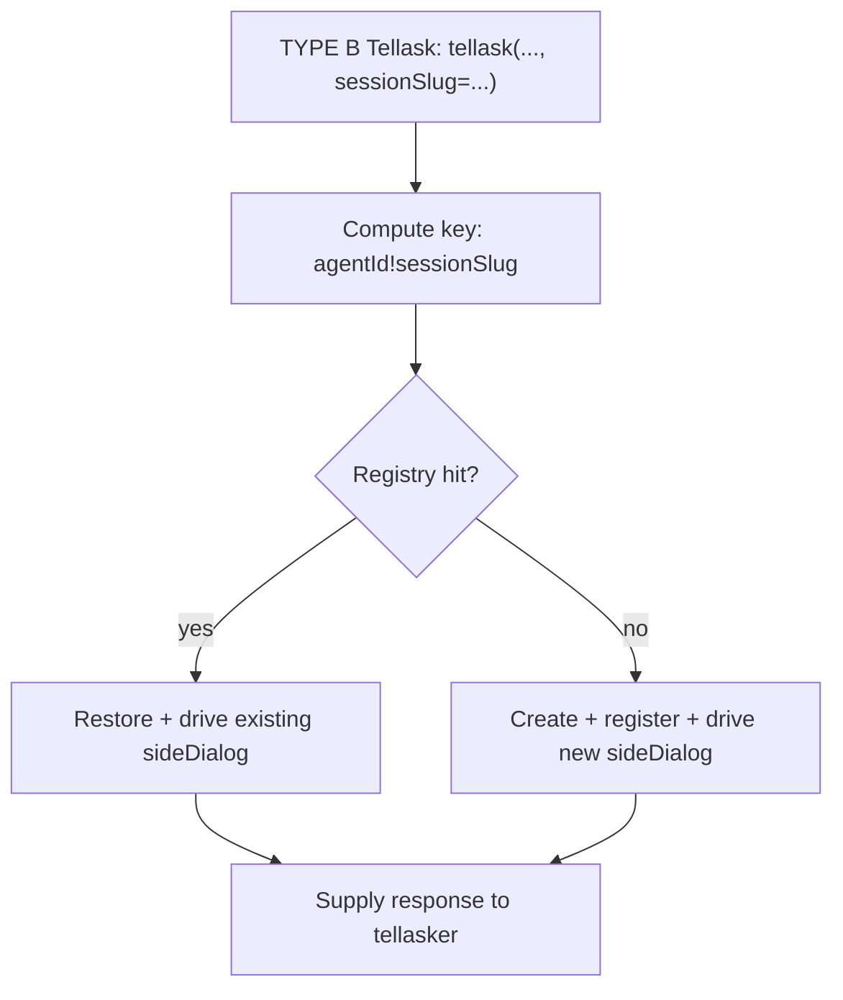
```mermaid
flowchart TD
  Tellask["TYPE B Tellask: tellask(..., sessionSlug=...)"] --> Key[Compute key: agentId!sessionSlug]
  Key --> Lookup{Registry hit?}
  Lookup -- yes --> Resume[Restore + drive existing sideDialog]
  Lookup -- no --> Create[Create + register + drive new sideDialog]
  Resume --> Supply[Supply response to tellasker]
  Create --> Supply
```

### Class Design: MainDialog vs SideDialog

**Critical Design Principle**: The sideDialog registry is managed exclusively by `MainDialog` and is **not accessible** to `SideDialog` instances.

**Responsibilities:**

- `MainDialog`
  - Owns the TYPE B sideDialog registry (`registry.yaml`)
  - Creates/registers/looks up registered sideDialogs (`agentId!sessionSlug`)
- `SideDialog`
  - Has a `askerDialog` reference (direct askerDialog) and uses it for TYPE A (`tellaskBack({ tellaskContent: "..." })`)
  - Cannot access or mutate the main dialog registry (by design)

**Mutex Semantics**:

- `locked: true` → SideDialog is currently being driven (mutex held)
- `locked: false` → Entry exists but sideDialog is not locked (can resume)
- Registry does NOT track: 'active' | 'completed' | 'suspended' lifecycle states

**Design Principle**: The registry tracks "locked" (being driven) vs "unlocked" (can resume) state. It does NOT track dialog lifecycle states (active/completed/suspended). Those are Dialog concerns, not Registry concerns. A registered sideDialog may be unlocked (not currently being driven) but still exist as a completed or suspended dialog.

### Registry Persistence

**File Location**: `<main-dialog-path>/registry.yaml`

**Format**:

```typescript
interface SideDialogRegistry {
  [key: string]: {
    sideDialogId: string; // UUID of the sideDialog
    agentId: string; // Agent identifier
    tellaskSession: string; // Tellask session key
    createdAt: string; // ISO timestamp
    lastAccessed?: string; // ISO timestamp (updated on each Tellask)
    locked: boolean; // Mutex state - is someone driving this right now?
  };
}
```

**Persistence Behavior**:

1. **On Registration**: New entry added to registry, file saved
2. **On Resume**: `lastAccessed` updated, file saved
3. **On Clear Mind**: Registry preserved (not cleared)
4. **On Main Completion**: Registry moves with root to `done/`
5. **On Main Load**: Registry rebuilt from done/ sideDialog YAMLs

---

## Technical Architecture

### Dialog Class Structure

The complete Dialog class implementation with all methods, properties, and detailed behavior can be found in `dominds/main/dialog.ts`.

**Key Components**:

- **Dialog Relationship Support**: Tellask/response relationships for sideDialog management
- **Memory Management**: Persistent reminders and ephemeral dialog messages
- **Mental Clarity Operations**: `startNewCourse(newCoursePrompt)` method (clears messages, clears Q4H, increments course, queues new course prompt for the next drive)
- **SideDialog Management**: Creation and coordination of specialized subtasks
- **Q4H Management**: `updateQuestions4Human()` method for question tracking
- **Memory Access**: Integration with Taskdocs and team/agent memories
- **Registry Management** (MainDialog only): Registration and lookup of sideDialogs

### Main Dialog Resolution

For sideDialogs needing to communicate with the Main Dialog, see the implementation in `dominds/main/dialog.ts` which provides methods for resolving dialog relationships.

### Persistence Layer

The persistence layer handles:

- **Dialog Storage**: `dominds/main/persistence.ts`
- **Q4H Storage**: `q4h.yaml` per dialog (cleared by clear_mind)
- **Reminder Storage**: `reminders.json` per dialog
- **Event Persistence**: Course-based JSONL files
- **Registry Storage**: `registry.yaml` per main dialog

**Q4H Persistence Methods**:

```typescript
// In persistence.ts
static async _saveQuestions4HumanState(
  dialogId: DialogID,
  questions: HumanQuestion[],
): Promise<void>

static async loadQuestions4HumanState(
  dialogId: DialogID,
): Promise<HumanQuestion[]>

static async clearQuestions4HumanState(
  dialogId: DialogID,
): Promise<void>
```

**Registry Persistence Methods**:

```typescript
// In MainDialog (dialog.ts)
interface RegistryMethods {
  loadRegistry(): Promise<SideDialogRegistry>;
  saveRegistry(registry: SideDialogRegistry): Promise<void>;
  registerSideDialog(key: string, metadata: SideDialogMetadata): void;
  lookupSideDialog(key: string): SideDialogMetadata | undefined;
  getRegistry(): SideDialogRegistry;
}
```

---

## Dialog Management

### Dialog Relationship Management

**Creation**: SideDialogs are created when agents need to delegate specialized tasks or when complex problems require decomposition.

**Context Inheritance**: New sideDialogs automatically receive:

- Reference to the same rtws (runtime workspace) Taskdoc (recommended: `tasks/feature-auth.tsk/`); `dlg.taskDocPath` is fixed at dialog creation and never reassigned
- Tellasker-provided context (mentionList + tellaskContent) explaining their purpose
- Access to shared team memories
- Access to their agent's individual memories

### SideDialog course header (required)

At the start of every sideDialog course, the runtime must prepend a role header to the assignment prompt:

- EN: `You are the Dialog Responder for this dialog; the tellasker is @xxx (current tellasker).`
- Chinese variant: see [the Chinese doc](./dialog-system.zh.md) for the corresponding work-language header.

**FBR special handling**: FBR is a self-sideDialog and must keep a dedicated header to avoid confusion:

- EN (example): `This is an FBR Side Dialog; the tellasker is @xxx (may be the same agent).`
- Chinese variant example: see [the Chinese doc](./dialog-system.zh.md) for the corresponding FBR header example.

**Insertion point**: prefer a single insertion point by updating `formatAssignmentFromAskerDialog()` (covers `dialog.ts`, `tellask-bridge`).
There is no separate frontend twin anymore; [`main/runtime/inter-dialog-format.ts`](../main/runtime/inter-dialog-format.ts) is the authoritative formatter.

**Storage**: All sideDialogs are stored flat under the main dialog's `sideDialogs/` directory, regardless of nesting depth.

**Navigation**: Each sideDialog maintains a reference to its askerDialog, enabling traversal toward the main dialog.

**Registry**: Registered sideDialogs (TYPE B Tellasks) are tracked in the main dialog's registry and persist across restarts.

### Main dialog fork

An entire main dialog tree can be forked at the start of a chosen root generation into a brand-new main dialog. This is used to preserve prior context while re-running the later Main Dialog/Side Dialog path from a historical branch point.

**Entry points**:

- UI shows `Fork dialog` only on generation bubbles of a main dialog (`selfId === rootId`)
- Backend API: `POST /api/dialogs/:rootId/fork`
- Request body: `{ course, genseq, status? }`

**Semantics (required)**:

- The selected generation bubble is **not** copied into the forked main dialog; the fork point means "branch immediately before this generation starts"
- The copy scope is the **entire main dialog tree**, not just one dialog
- A sideDialog is included only if the root had already persisted it as created before the cutoff
- SideDialog transcript retention is bounded by the root-generation anchor, not by the sideDialog's local `genseq`

**Post-fork actions** (returned by backend to UI):

- `draft_user_text`: if the target generation is a user message, prefill that text into the new dialog input and wait for user confirmation
- `restore_pending`: if there were pending Q4H or pending sideDialogs before the cutoff, restore those blocking states in the new main dialog
- `auto_continue`: if there is no pending blocker before the cutoff, initialize the new main dialog as `interrupted(system_stop: fork_dialog_continue)` and have UI immediately send `resume_dialog`

**Consistency requirements**:

- Fork must preserve the same Taskdoc reference
- The forked main dialog and all forked sideDialogs are persisted under `running/` with a new rootId
- Frontend must not expose this entry for Side Dialogs; current implementation supports main dialogs only

### Lifecycle Management

**Active State**: Dialogs remain active while agents are working on tasks.

**Completion**: Dialogs transition to completed state when:

- Tasks are finished successfully
- Agents explicitly mark them complete
- AskerDialogs determine subtasks are no longer needed
- All pending sideDialogs are complete AND all Q4H are answered

**Registry on Completion**: When a main dialog completes, its registry moves with it to the `done/` directory and is preserved for potential restoration.

**Cleanup**: Completed dialogs may be archived or cleaned up based on retention policies.

### Communication Patterns

**Tellasker-Bound Communication**: SideDialogs communicate results, questions, and escalations to their **tellasker**.

- **Clarification Requests (TYPE A / `TellaskBack`)**: A sideDialog may Tellask its tellasker to request clarification while working on its subtask. For TYPE A, the tellasker is the direct askerDialog. The tellasker provides guidance, and the sideDialog continues with updated context.
- **Subtask Response**: When a sideDialog produces a final "saying" content block (no pending Q4H), that message is treated as the response to the **current tellasker** recorded in `assignmentFromAsker` (main dialog or another sideDialog). This keeps responses aligned with the most recent Tellask site.
- **Q4H Escalation**: If a sideDialog has Q4H, it suspends. The user can answer via the UI, which triggers continuation of the sideDialog only.
- **Registered SideDialogs (TYPE B / `Tellask Session`)**: A tellasker can resume a previously created registered sideDialog, enabling ongoing task continuation.
- **Transient SideDialogs (TYPE C / `Fresh Tellask`)**: A tellasker can spawn a one-off sideDialog for independent tasks that don't require persistence.

**Side-Bound Communication**: AskerDialogs provide context, objectives, and guidance to sideDialogs.

**Lateral Communication**: Sibling sideDialogs coordinate through their shared askerDialog.

**Broadcast Communication**: Main dialog (main dialog) can communicate changes (like rtws Taskdoc file updates) to all dialogs through the Taskdoc reference.

---

## Memory Management

### Dialog-Scoped Memory

**Dialog Messages**: Ephemeral dialog content that can be cleared for mental clarity.

**Reminders**: Semi-persistent working memory that survives clarity operations.

**Q4H Questions**: Transient questions for human input that are **cleared by mental clarity operations**.

**Tellasker Call Context**: Immutable context explaining why a sideDialog was created.

**SideDialog Registry**: Main-dialog-scoped persistent mapping of registered sideDialogs (survives clarity operations).

### rtws-Persistent Memory

**Team-Shared Memories**: Persistent across the entire project lifecycle, shared by all agents.

**Agent-Individual Memories**: Personal knowledge that persists per agent across all dialogs.

### Memory Synchronization

**Taskdoc Propagation**: Changes to the rtws Taskdoc file are immediately visible to all dialogs that reference it.

**Memory Updates**: Team and agent memories are updated asynchronously and eventually consistent across all dialogs.

**Q4H Persistence**: Q4H questions are persisted when created and cleared atomically when answered or when clear_mind is called.

**Registry Persistence**: Registry is persisted after each modification and restored on main dialog load.

---

## System Integration

### File System Integration

**Dialog Storage**: Each dialog corresponds to a directory structure containing:

- `<dialog-root>/dialog.yaml` — dialog metadata and configuration
- `<dialog-root>/latest.yaml` — current course tracking and status
- `<dialog-root>/reminders.json` — persistent reminder storage
- `<dialog-root>/q4h.yaml` — Q4H index (cleared by clarity tools)
- `<dialog-root>/registry.yaml` — sideDialog registry (main dialogs only)
- `<dialog-root>/course-001.jsonl` (and further courses) — streamed message files
- `<dialog-root>/sideDialogs/<sideDialog-id>/dialog.yaml`
- `<dialog-root>/sideDialogs/<sideDialog-id>/q4h.yaml` — per-sideDialog Q4H index (cleared by clarity)

**Taskdoc Storage**: Taskdocs are rtws artifacts referenced by dialogs through paths. Taskdocs MUST be encapsulated `*.tsk/` Taskdoc packages.

**Memory Storage**: Team and agent memories are stored in dedicated files within the rtws.

**Registry Storage**: The sideDialog registry (`registry.yaml`) is stored in the main dialog directory and moves to `done/` on main dialog completion.

### Streaming Substream Ordering Contract (Thinking / Saying)

Dominds splits LLM output into multiple “substreams” (thinking, saying, plus markdown / function tool call subsegments derived from saying) and delivers them to the UI via WebSocket events.
To make the UI **faithfully reflect the original generation order**, and to ensure ordering bugs are observable and debuggable across the stack, the following contract MUST hold:

- **Arbitrary alternation is allowed**: Within a single generation (`genseq`), thinking and saying may appear in any number of segments, each as `start → chunk* → finish`, alternating over time.
- **No overlap**: At any moment, at most one active substream exists (thinking or saying). A new `start` MUST NOT occur before the prior segment has `finish`ed.
- **UI renders by event arrival order**: The frontend should not reorder DOM nodes to “fix” ordering; it should append sections in event order to represent the true generation trace.
- **Ordering violations must be loud**: On overlap/out-of-order detection (e.g., thinking and saying both active), the backend SHOULD emit `stream_error_evt` and abort the generation so provider / parsing-chain protocol issues surface quickly.

### LLM Provider Message Projection (Role / Turn)

Dominds persists fine-grained message entries (thinking/saying/tool call/tool result, etc.). In contrast, most mainstream LLM provider chat protocols only support `role=user|assistant` (plus limited tool-specific variants).

- **Ideal target**: Provider SDKs/protocols should natively support `role='environment'` (or an equivalent mechanism) for runtime-injected environment/system content (e.g. reminders, transient guides), so we don't have to disguise environment content as user messages.
- **Current reality**: Most providers do not support `role='environment'`. Therefore, when projecting Dominds messages into provider request payloads, Dominds must flatten internal message kinds into provider-supported roles.
  - Runtime/system notices (`environment_msg`) are projected as `role='user'` text blocks.
  - Self-authored guides / self-reminders (`transient_guide_msg`) are projected as `role='assistant'` text blocks.
  - Reminders follow their source semantics rather than one blanket rule: system-maintained reminders (for example runtime status signals) should land on the `user` side as explicit system notices, while self-maintained work reminders stay on the `assistant` side as first-person work notes.

Additionally, some providers (especially Anthropic-compatible endpoints) enforce stricter validation around **role alternation** and **tool_use/tool_result boundaries**. Dominds' projection layer must assemble internal fine-grained entries into provider-friendly turns (turn assembly), rather than sending a 1:1 mapping of persisted entries.

### CLI Integration

**Dialog Creation**: New dialogs are created through CLI commands with appropriate context.

**Tool Invocation**: Mental clarity tools are invoked through CLI commands or agent actions.

**Status Monitoring**: Dialog status, pending sideDialogs, Q4H count, and registered sideDialogs can be inspected through CLI tools.

### Agent Integration

**Autonomous Operation**: Agents can independently create sideDialogs (TYPE B and C), manage reminders, raise Q4H, and trigger clarity operations.

**Context Awareness**: Agents have full access to their dialog context, memories, dialog relationship position, pending Q4H from sideDialogs, and (for main dialogs) the sideDialog registry.

**Teammate Tellask Capability**: Agents can invoke all three types of teammate Tellasks:

- TYPE A / `TellaskBack`: Tellask the tellasker for clarification (direct askerDialog for TYPE A)
- TYPE B / `Tellask Session`: Tellask/resume registered sideDialogs
- TYPE C / `Fresh Tellask`: Spawn transient sideDialogs

**Tool Access**: All mental clarity tools, Q4H capability, and teammate Tellask capability are available to agents for autonomous cognitive management.

### Dialog State Machine

Dominds' runtime does **not** persist a single enum-like “awaiting …” state. Whether a dialog can be
driven is derived from persisted facts:

- Persisted status (API/index): `running | completed | archived`
- Persisted `latest.yaml`: `status`, `needsDrive`, `generating`
- Derived gates: `hasPendingQ4H()` and `hasPendingSideDialogs()`

**Persisted status lifecycle:**

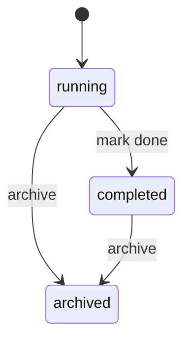
```mermaid
stateDiagram-v2
  [*] --> running
  running --> completed: mark done
  running --> archived: archive
  completed --> archived: archive
```

**Main driver gating (conceptual):**

```mermaid
flowchart TD
  A[status=running] --> B{canDrive?\\n(no pending Q4H\\n& no pending sideDialogs)}
  B -- no --> S[Suspended\\n(waiting on Q4H and/or sideDialogs)]
  S -->|Q4H answered\\nor sideDialog responses supplied| C{needsDrive?}
  B -- yes --> C{needsDrive?}
  C -- no --> I[Idle\\n(waiting for trigger)]
  C -- yes --> D[Drive loop\\n(generating=true while streaming)]
  D --> E{hasUpNext?}
  E -- yes --> C
  E -- no --> I
```

### Teammate Tellask State Transitions

These diagrams focus on **control flow** and avoid box-art alignment so they stay readable even when
rendered in different markdown viewers.

#### TYPE A: TellaskBack (`TellaskBack`) (`tellaskBack({ tellaskContent: "..." })`, no `sessionSlug`)

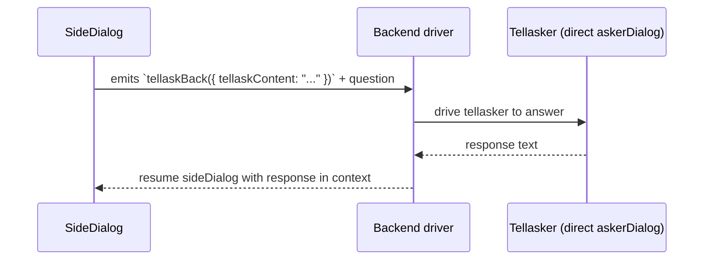
```mermaid
sequenceDiagram
  participant Side as SideDialog
  participant Driver as Backend driver
  participant Asker as Tellasker (direct askerDialog)

  Side->>Driver: emits `tellaskBack({ tellaskContent: "..." })` + question
  Driver->>Asker: drive tellasker to answer
  Asker-->>Driver: response text
  Driver-->>Side: resume sideDialog with response in context
```

#### TYPE B: Registered SideDialog Tellask (`Tellask Session`) (`tellask({ targetAgentId: "agentId", sessionSlug: "tellaskSession", tellaskContent: "..." })`)

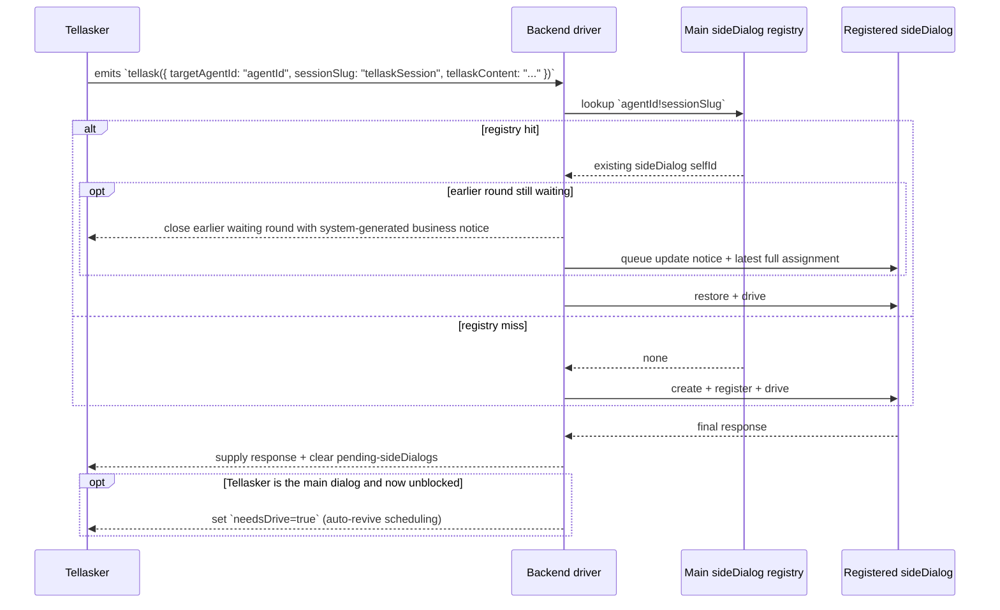
```mermaid
sequenceDiagram
  participant Tellasker as Tellasker
  participant Driver as Backend driver
  participant Reg as Main sideDialog registry
  participant Side as Registered sideDialog

  Tellasker->>Driver: emits `tellask({ targetAgentId: "agentId", sessionSlug: "tellaskSession", tellaskContent: "..." })`
  Driver->>Reg: lookup `agentId!sessionSlug`
  alt registry hit
    Reg-->>Driver: existing sideDialog selfId
    opt earlier round still waiting
      Driver-->>Tellasker: close earlier waiting round with system-generated business notice
      Driver->>Side: queue update notice + latest full assignment
    end
    Driver->>Side: restore + drive
  else registry miss
    Reg-->>Driver: none
    Driver->>Side: create + register + drive
  end
  Side-->>Driver: final response
  Driver-->>Tellasker: supply response + clear pending-sideDialogs
  opt Tellasker is the main dialog and now unblocked
    Driver-->>Tellasker: set `needsDrive=true` (auto-revive scheduling)
  end
```

#### TYPE C: Transient SideDialog Tellask (`Fresh Tellask`) (`tellaskSessionless({ targetAgentId: "agentId", tellaskContent: "..." })`; `freshBootsReasoning({ tellaskContent: "..." })` is FBR tool-less)

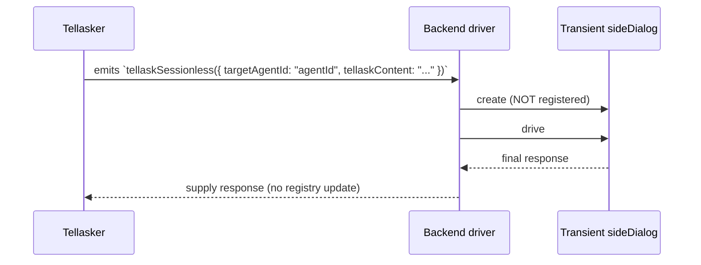
```mermaid
sequenceDiagram
  participant Tellasker as Tellasker
  participant Driver as Backend driver
  participant Side as Transient sideDialog

  Tellasker->>Driver: emits `tellaskSessionless({ targetAgentId: "agentId", tellaskContent: "..." })`
  Driver->>Side: create (NOT registered)
  Driver->>Side: drive
  Side-->>Driver: final response
  Driver-->>Tellasker: supply response (no registry update)
```

### Q4H Lifecycle State

```mermaid
flowchart TD
  A["askHuman(...) Tellask emitted"] --> B[Append HumanQuestion entry to q4h.yaml]
  B --> C[Emit questions_count_update]
  C --> D[UI shows Q4H badge / list]
  D --> E{How is it cleared?}
  E -->|User answers (drive_dialog_by_user_answer)| F[Remove question from q4h.yaml\\n(delete file if empty)]
  E -->|clear_mind| G[Clear q4h.yaml (all questions)]
  F --> H[Dialog may become driveable again]
  G --> H
```

`q4h.yaml` is treated as an index; the source-of-truth “asked question” content lives in the dialog’s
message stream, referenced by `callSiteRef`.

### SideDialog + Q4H Interaction

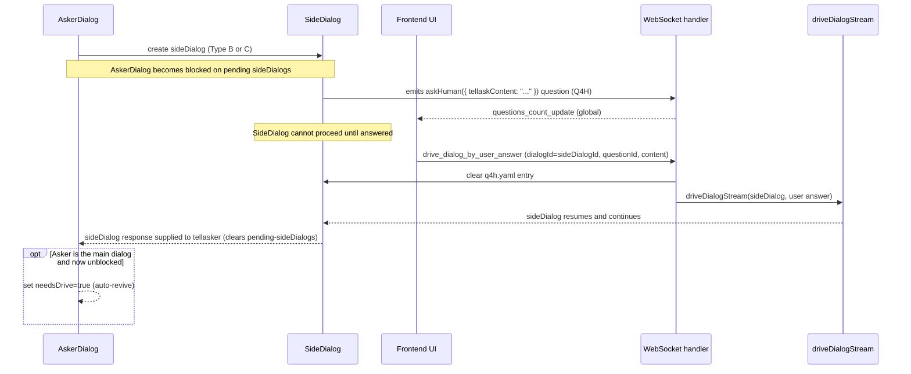
```mermaid
sequenceDiagram
  participant Asker as AskerDialog
  participant Side as SideDialog
  participant UI as Frontend UI
  participant WS as WebSocket handler
  participant Driver as driveDialogStream

  Asker->>Side: create sideDialog (Type B or C)
  Note over Asker,Side: AskerDialog becomes blocked on pending sideDialogs
  Side->>WS: emits askHuman({ tellaskContent: "..." }) question (Q4H)
  WS-->>UI: questions_count_update (global)

  Note over Side: SideDialog cannot proceed until answered

  UI->>WS: drive_dialog_by_user_answer (dialogId=sideDialogId, questionId, content)
  WS->>Side: clear q4h.yaml entry
  WS->>Driver: driveDialogStream(sideDialog, user answer)
  Driver-->>Side: sideDialog resumes and continues
  Side-->>Asker: sideDialog response supplied to tellasker (clears pending-sideDialogs)

  opt Asker is the main dialog and now unblocked
    Asker-->>Asker: set needsDrive=true (auto-revive)
  end
```

---

## Complete Flow Reference

### 1. Main Dialog Raises Q4H

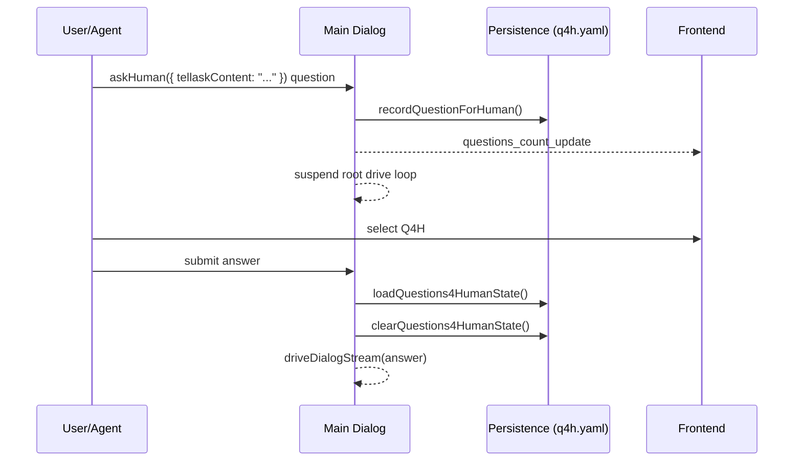
```mermaid
sequenceDiagram
  participant User as User/Agent
  participant Main as Main Dialog
  participant Store as Persistence (q4h.yaml)
  participant UI as Frontend

  User->>Main: askHuman({ tellaskContent: "..." }) question
  Main->>Store: recordQuestionForHuman()
  Main-->>UI: questions_count_update
  Main-->>Main: suspend root drive loop

  User->>UI: select Q4H
  User->>Main: submit answer
  Main->>Store: loadQuestions4HumanState()
  Main->>Store: clearQuestions4HumanState()
  Main-->>Main: driveDialogStream(answer)
```

### 2. SideDialog Raises Q4H, User Answers via Main

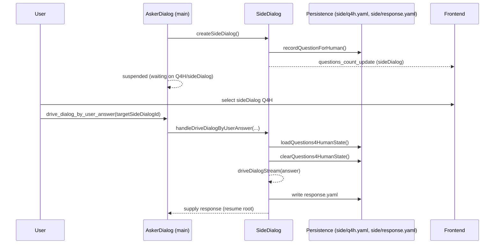
```mermaid
sequenceDiagram
  participant User as User
  participant Asker as AskerDialog (main)
  participant Side as SideDialog
  participant Store as Persistence (side/q4h.yaml, side/response.yaml)
  participant UI as Frontend

  Asker->>Side: createSideDialog()
  Side->>Store: recordQuestionForHuman()
  Side-->>UI: questions_count_update (sideDialog)
  Asker-->>Asker: suspended (waiting on Q4H/sideDialog)

  User->>UI: select sideDialog Q4H
  User->>Asker: drive_dialog_by_user_answer(targetSideDialogId)
  Asker->>Side: handleDriveDialogByUserAnswer(...)
  Side->>Store: loadQuestions4HumanState()
  Side->>Store: clearQuestions4HumanState()
  Side-->>Side: driveDialogStream(answer)
  Side->>Store: write response.yaml
  Side-->>Asker: supply response (resume root)
```

### 3. Registered SideDialog Tellask (TYPE B / `Tellask Session` / Registered Session Tellask)

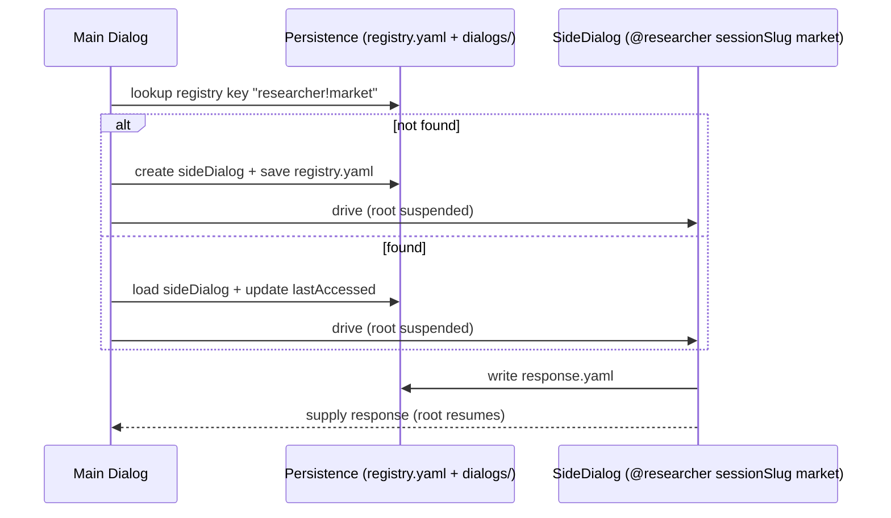
```mermaid
sequenceDiagram
  participant Main as Main Dialog
  participant Store as Persistence (registry.yaml + dialogs/)
  participant Side as SideDialog (@researcher sessionSlug market)

  Main->>Store: lookup registry key "researcher!market"
  alt not found
    Main->>Store: create sideDialog + save registry.yaml
    Main->>Side: drive (root suspended)
  else found
    Main->>Store: load sideDialog + update lastAccessed
    Main->>Side: drive (root suspended)
  end

  Side->>Store: write response.yaml
  Side-->>Main: supply response (root resumes)
```

### 4. Clarity Operations Preserve Registry

| State Element | Effect of `clear_mind`                       |
| ------------- | -------------------------------------------- |
| Messages      | Cleared (new course / fresh message context) |
| Q4H           | Cleared                                      |
| Reminders     | Preserved                                    |
| Registry      | Preserved                                    |

`change_mind` is not a clarity operation; it updates Taskdoc content in-place and does not clear messages/Q4H/reminders/registry.

---

## Performance Considerations

### Scalability

**Flat Storage**: SideDialog flat storage prevents deep directory nesting issues.

**Registry Efficiency**: Single-level Map lookup for registered sideDialogs is O(1).

**Memory Efficiency**: Shared memories reduce duplication across dialogs.

**Lazy Loading**: Dialog content is loaded on-demand to minimize memory usage.

### Reliability

**Atomic Operations**: Q4H and registry persistence use atomic write patterns (temp file + rename).

**Backup and Recovery**: Dialog state can be backed up and restored independently. Registry is restored from done/ on load.

**Error Handling**: System loudly reports and quarantines malformed dialog state instead of silently ignoring dialog corruption, missing files, or registry corruption.

### Monitoring

**Performance Metrics**: System tracks dialog creation, completion, registry size, resource usage, and Q4H count.

**Health Checks**: Regular validation of dialog dialog relationship integrity, Q4H persistence, registry consistency, and memory.

**Debugging Support**: Comprehensive logging and inspection tools for troubleshooting teammate Tellasks, registry operations, and Q4H flows.

---

## Summary

The Dominds dialog system provides a robust framework for human-in-the-loop AI collaboration:

### Four Core Mechanisms

| Mechanism               | Purpose                               | Survives Clarity | Cleared By                                    |
| ----------------------- | ------------------------------------- | ---------------- | --------------------------------------------- |
| **Dialog Relationship** | Tellasker/Side Dialog task delegation | N/A              | N/A                                           |
| **Q4H**                 | Human input requests                  | No               | clear_mind                                    |
| **Mental Clarity**      | Context reset tools                   | N/A              | N/A                                           |
| **Reminders**           | Persistent working memory             | Yes              | N/A                                           |
| **SideDialog Registry** | Registered sideDialog tracking        | Yes              | dead-entry prune on `declare_sideDialog_dead` |

### Three Types of Teammate Tellasks

| Type (internal) | User-facing term  | Syntax                                                                              | Registry              | Use Case                   |
| --------------- | ----------------- | ----------------------------------------------------------------------------------- | --------------------- | -------------------------- |
| TYPE A          | `TellaskBack`     | `tellaskBack({ tellaskContent: "..." })`                                            | no registry           | clarification (ask origin) |
| TYPE B          | `Tellask Session` | `tellask({ targetAgentId: "agentId", sessionSlug: "<id>", tellaskContent: "..." })` | `agentId!sessionSlug` | resumable multi-turn work  |
| TYPE C          | `Fresh Tellask`   | `tellaskSessionless({ targetAgentId: "agentId", tellaskContent: "..." })`           | not registered        | one-shot / non-resumable   |

### Class Responsibility

- **MainDialog**: Manages registry, can make all three teammate Tellask types
- **SideDialog**: Has askerDialog reference, can make TYPE A and TYPE C directly; TYPE B routes through the main dialog registry and updates tellasker context on each Tellask

### Persistence Guarantees

- **Q4H**: Persisted, cleared by clarity operations
- **Reminders**: Persisted, survives clarity operations
- **Registry**: Persisted, survives clarity operations, moves to done/ on completion
- **SideDialogs**: Registered sideDialogs persist in registry; transient sideDialogs are not registered
