# Dominds 对话系统实现

英文版：[English](./dialog-system.md)

本文档提供 Dominds 对话系统的详细实现规范，包括核心工具、技术架构、对话管理、内存管理、系统集成以及"向人类提问"(Q4H)机制。

## 目录

1. [术语](#术语)
2. [后端驱动架构](#后端驱动架构)
3. [三类队友 Tellask 分类](#三类队友-tellask-分类)
4. [核心机制](#核心机制)
5. [Q4H：向人类提问](#q4h向人类提问)
6. [对话层级与子对话](#对话层级与子对话)
7. [思维清晰工具](#思维清晰工具)
8. [提醒管理](#提醒管理)
9. [子对话注册表](#子对话注册表)
10. [技术架构](#技术架构)
11. [对话管理](#对话管理)
12. [内存管理](#内存管理)
13. [系统集成](#系统集成)
14. [状态图](#状态图)
15. [完整流程参考](#完整流程参考)

---

## 术语

本章定义本文档中使用的面向实现的术语。
关于双语/面向用户的命名约定，请参阅 [`dominds-terminology.md`](./dominds-terminology.md)。
关于 Taskdoc 包结构和封装规则，请参阅 [`encapsulated-taskdoc.zh.md`](./encapsulated-taskdoc.zh.md)。

### 上位对话 (Supdialog)

**上位对话** (supdialog，全称 "super dialog") 是层级对话关系中的上位对话。它编排和管理子对话，提供上下文、目标和指导，同时接收来自子对话的结果、问题和升级。上位对话维护整体任务上下文，并决定何时不再需要子对话。

上位对话可以在子对话执行期间接收**上位 Tellask**。当子对话需要指导或额外上下文时，它可以向上位对话 Tellask（TYPE A / `TellaskBack` / 回问诉请），提供反馈到子对话上下文的响应。

### 子对话 (Subdialog)

**子对话** 是由上位对话生成的专门对话，用于处理特定子任务。子对话使用新的上下文操作，专注于定向目标，同时保持与上位对话的通信链接。

**上位 Tellask**：子对话可以在任务执行期间向上位对话 Tellask 以请求澄清。这允许子对话在保持自身上下文和进度的同时提问并接收指导。

### 主对话 (Root Dialog)

**主对话** (也称为 **根对话**) 是对话层级中的顶级对话，没有上位对话关系。它作为任务执行的主要入口点，可以生成多级子对话。这些术语在系统中可互换使用。

### Q4H (向人类提问)

**Q4H** 是由对话（主对话或子对话）提出的待处理问题，需要人工输入才能继续。Q4H 被索引在对话的 `q4h.yaml` 文件中（一个索引，不是真理之源），并由 `clear_mind` 操作清除。实际的问题内容存储在对话的对话消息中，其中记录了 `!?@human` Tellask。

### 子对话索引 (subdlg.yaml)

**subdlg.yaml** 文件索引上位对话正在等待的待处理子对话。与 `q4h.yaml` 类似，它是一个索引文件，不是真理之源：

- 索引跟踪父对话正在等待哪些子对话 ID
- 实际的子对话状态从磁盘 (done/ 目录) 验证
- 用于后端协程的崩溃恢复和自动重启

### 子对话注册表

**子对话注册表** 是根对话作用域的 Map，维护对已注册子对话的持久引用。注册表使用 `agentId!tellaskSession` 作为其键格式，在对话生命周期中永远不会被删除。当根完成时，它随根移动到 `done/`，并在根加载时通过扫描 done/ 子对话 YAML 重建。

### 队友 Tellask

**队友 Tellask** 是 Dominds 特定的语法，触发与另一个作为子对话的智能体的通信。队友 Tellask 有三种不同模式，具有不同语义（见第 3 节）。

**诉请块结构**（另见 [`dominds-terminology.md`](./dominds-terminology.md)）：

- **诉请头（Tellask headline）**：诉请块第一行 `!?@<name> ...`（同一诉请块内，后续以 `!?@...` 开头的行会并入诉请头）。
- **诉请正文（Tellask body）**：后续以 `!?` 开头但不以 `!?@` 开头的行。
- `!tellaskSession <slug>` 等结构化指令必须写在诉请头中。

---

## 后端驱动架构

### 核心设计原则

对话驱动是一个**唯一的后端算法**。前端/客户端从不驱动对话。所有对话状态转换、恢复逻辑和生成循环都在后端协程中完全执行。前端只订阅发布频道 (PubChan) 以进行实时 UI 更新。

### 注册表层级

系统维护三个级别的注册表用于对话管理：

**全局注册表（服务器作用域）**
`rootId → RootDialog` 对象的服务器范围映射。这是所有活动根对话的单一真理之源。后端协程扫描此注册表以找到需要驱动的对话。

**本地注册表（每个根对话）**
每个根的 `selfId → Dialog` 对象映射。此注册表包含根对话本身以及所有已加载的子对话，支持在层级内对任何对话进行 O(1) 查找。

**子对话注册表（每个根对话）**
每个根的 `agentId!tellaskSession → Subdialog` 对象映射。此注册表跟踪用于在多次交互中恢复的 TYPE B 已注册子对话。TYPE C 瞬态子对话永远不会被注册。

### 每对话互斥锁

每个 Dialog 对象带有一个具有关联等待队列的排他互斥锁。当后端协程需要驱动对话时，它首先获取互斥锁。如果对话已被锁定，协程将其 promise 加入队列并等待直到互斥锁被释放。这确保任何时刻只有一个协程驱动对话，防止竞争条件并确保状态一致。

### 后端协程驱动循环

后端协程使用以下模式驱动对话：

1. 扫描全局注册表以识别需要驱动的根对话
2. 对于每个候选者，检查恢复条件（Q4H 已回答，子对话完成已接收）
3. 在驱动之前获取对话的互斥锁
4. 执行生成循环直到挂起点或完成
5. 释放互斥锁
6. 将所有状态变更持久化到存储

驱动循环持续进行，直到对话挂起（等待 Q4H 或子对话）或完成。当条件变化时（用户回答 Q4H，子对话完成），后端通过存储检查检测这些变化并自动恢复驱动。

### 前端集成

前端客户端从不驱动对话。相反，它们：

- 订阅当前对话的 PubChan 以获取实时更新
- 接收消息、状态变化和 UI 指标的事件
- 通过 API 端点发送用户输入（drive_dlg_by_user_msg, drive_dialog_by_user_answer）

所有驱动逻辑、恢复决策和状态管理仍然是纯粹的后端关注点。

### 状态持久化

对话状态在关键点持久化到存储：

- 每次消息生成后
- 挂起时（Q4H 提出，子对话创建）
- 恢复时（Q4H 已回答，子对话完成）
- 完成时

这确保了崩溃恢复，并使后端能够从任何持久化状态恢复，而不依赖于前端状态。

---

## 三类队友 Tellask 分类

本节记录 Dominds 系统中三种不同类型的队友 Tellask，它们的语法、行为和用例。

```mermaid
flowchart TD
  M[LLM 发出 !?@mention] --> Q{这是子对话在告诉其直接上位对话吗？}
  Q -- 是 --> A[TYPE A：回问诉请<br/>(`TellaskBack` / 回问诉请)<br/>主要：`!?@tellasker`（无 !tellaskSession）]
  Q -- 否 --> T{是否存在 !tellaskSession？}
  T -- 是 --> B[TYPE B：已注册子对话 Tellask<br/>(`Tellask Session` / 长线诉请)<br/>!?@agentId !tellaskSession tellaskSession]
  T -- 否 --> C[TYPE C：瞬态子对话 Tellask<br/>(`Fresh Tellask` / 一次性诉请)<br/>!?@agentId]
```

### TYPE A：上位 Tellask（Type A / `TellaskBack` / 回问诉请）

**主要语法**：`!?@tellasker`（无 `!tellaskSession`）— `!?@tellasker !tellaskSession ...` 是**语法错误**

**可容忍的回退**：`!?@<supdialogAgentId>`（无 `!tellaskSession`）

**行为**：

1. 当前子对话**挂起**
2. 驱动程序切换到驱动**上位对话**（使用 `subdialog.supdialog` 引用）
3. 上位对话的响应流回子对话
4. 子对话**恢复**，上位对话的响应在上下文中

**关键特征**：

- 使用 `subdialog.supdialog` 引用（无注册表查找）
- 无需注册 — 上位对话关系是固有的
- 上位对话始终是层级中的直接父级
- `!?@tellasker` 是**规范**的 TYPE A 语法：它始终路由到“诉请者”（发起本次诉请的对话），避免自行猜测。

**示例**：

```
当前对话：sub-001（agentId: "backend-dev"）
父上位对话："orchestrator"（agentId）

LLM 发出：!?@orchestrator 我应该如何处理数据库迁移？

结果：
- sub-001 挂起
- 驱动程序使用问题驱动 orchestrator
- orchestrator 用指导响应
- sub-001 恢复，Orchestrator 的响应在上下文中
```

### TYPE B：已注册子对话 Tellask（Type B / `Tellask Session` / 长线诉请）

**语法**：`!?@<anyAgentId> !tellaskSession <tellaskSession>`（注意 `!tellaskSession` 前的空格）

**扪心自问 (FBR) 自调用语法（罕见；可恢复）**：`!?@self !tellaskSession <tellaskSession>`

- `!?@self` 是一个显式的"相同角色"调用，指向**当前对话的 agentId**（不是单独队友）。
- 这是自调用的**明确**语法，有助于避免因回声/引用先前调用标题而导致的意外 `@teammate`→`@teammate` 自调用。
- **FBR 本身应该很常见**，但使用 `!tellaskSession` 寻址的变体应该很罕见。对于大多数 FBR 使用，首选 `!?@self`（TYPE C，瞬态）。仅当你明确想要一个可恢复的、长期存在的"初心会话"用于多步骤子问题时，才使用 `!?@self !tellaskSession ...`。

**Tellask 会话键模式**：`<tellaskSession>` 使用与 `<mention-id>` 相同的标识符模式：`[a-zA-Z][a-zA-Z0-9_-]*`。解析在空白或标点处停止；任何尾随的标题文本在 tellaskSession 解析时被忽略。

**注册表键**：`agentId!tellaskSession`

**行为**：

1. 检查注册表中是否存在键为 `agentId!tellaskSession` 的现有子对话
2. **如果存在**：恢复已注册的子对话
3. **如果不存在**：创建新的子对话并使用键 `agentId!tellaskSession` 注册它
4. 父对话在子对话运行时**挂起**
5. 子对话的响应流回父级
6. 父级**恢复**，子对话的响应在上下文中

**当前调用者跟踪（对复用很重要）：**

当已注册的子对话被再次 Tellask（相同的 `agentId!tellaskSession`）时，调用者可能是**不同的对话**（主线对话或其他支线对话）。在每次 TYPE B Tellask 时，子对话的元数据都会更新为：

- **当前调用者对话 ID**（这样响应就会路由回*最新*的调用者）
- **Tellask 信息**（标题/正文、来源角色、来源成员、callId）

这使得 TYPE B 子对话可以在多个 Tellask 站点复用，而不会丢失正确的响应路由。

**恢复时的 Tellask 上下文**：

- 在每次 TYPE B Tellask（新的或恢复的）时，父级提供的 `tellaskHead`/`tellaskBody`
  在驱动子对话之前作为新用户消息追加到子对话中。
  这确保子对话在每次 Tellask 时都能收到最新的请求上下文。
- 系统注入的恢复提示仅用于上下文，**不会被解析**为队友/工具 Tellask。

**关键特征**：

- 每次 Tellask 都会执行注册表查找
- 支持**恢复**先前的子对话
- 已注册的子对话在注册表中持久存在直到根完成
- 注册表是根对话作用域的（子对话无法访问）

**示例**：

```
根对话：orchestrator
注册表：{}（空）

LLM 发出：!?@researcher !tellaskSession market-analysis

结果（第一次调用）：
- 注册表查找：不存在 "researcher!market-analysis"
- 创建新的子对话 "researcher!market-analysis"
- 在根的注册表中注册它
- orchestrator 挂起
- 驱动 researcher 子对话
- 响应流回 orchestrator
- orchestrator 恢复

LLM 再次发出：!?@researcher !tellaskSession market-analysis

结果（第二次调用）：
- 注册表查找："researcher!market-analysis" 存在
- 恢复现有的子对话
- orchestrator 挂起
- 从离开的地方继续驱动现有的 researcher 子对话
- 响应流回 orchestrator
- orchestrator 恢复
```

### TYPE C：瞬态子对话 Tellask（Type C / `Fresh Tellask` / 一次性诉请）

**语法**：`!?@<nonSupdialogAgentId>`（无 `!tellaskSession`）

**扪心自问 (FBR) 自调用语法（默认；最常见）**：`!?@self`

- `!?@self` 指向当前对话的 agentId，并创建一个具有相同角色/配置的**新的临时子对话**。
- 对于大多数扪心自问 会话使用此方式：隔离单个子问题，产生答案，然后返回。

**行为**：

1. 当前对话**挂起**
2. 使用指定的 agentId 创建**新的子对话**
3. 驱动新的子对话（它是完全成熟的 - 可以进行上位调用、队友 Tellask、工具调用）
4. 子对话的响应流回父级
5. 父级**恢复**，子对话的响应在上下文中

**关键特征**：

- **无注册表查找** - 总是创建新的子对话
- **不注册** - 在 Tellask 之间不持久化
- 子对话本身是完全 capable 的（可以进行上位调用、队友 Tellask、工具调用）
- 与 TYPE B 的唯一区别：无注册表查找/恢复能力
- 用于一次性的、独立的任务

**示例**：

```
当前对话：orchestrator

LLM 发出：@code-reviewer 请审查这个 PR

结果：
- orchestrator 挂起
- 使用 agentId "code-reviewer" 创建新的子对话
- 驱动 code-reviewer 子对话（它可以进行自己的 Tellask、工具等）
- code-reviewer 完成并返回审查结果
- orchestrator 恢复，审查结果在上下文中

LLM 再次发出：@code-reviewer 审查这个其他 PR

结果：
- orchestrator 挂起
- 创建另一个新的子对话（与之前的不同！）
- 驱动新的 code-reviewer 子对话
- orchestrator 恢复，新的审查结果在上下文中
```

### 对比总结

| 方面                | TYPE A：上位 Tellask (`TellaskBack`) | TYPE B：已注册子对话 Tellask (`Tellask Session`) | TYPE C：瞬态子对话 Tellask (`Fresh Tellask`) |
| ------------------- | ------------------------------------ | ------------------------------------------------ | -------------------------------------------- |
| **语法**            | `!?@<supdialogAgentId>`              | `!?@<anyAgentId> !tellaskSession <id>`           | `!?@<nonSupdialogAgentId>`                   |
| **!tellaskSession** | 不允许                               | 必须                                             | 不允许                                       |
| **注册表查找**      | 否（使用 `subdialog.supdialog`）     | 是（`agentId!tellaskSession`）                   | 否（永不注册）                               |
| **恢复**            | 否（上位对话不是子对话）             | 是（查找找到现有的）                             | 否（总是新的）                               |
| **注册**            | 不适用                               | 创建并注册                                       | 永不注册                                     |
| **父级行为**        | 子对话挂起                           | 父级挂起                                         | 父级挂起                                     |
| **子对话能力**      | 完整（上位调用、队友、工具）         | 完整（上位调用、队友、工具）                     | 完整（上位调用、队友、工具）                 |
| **用例**            | 从父级澄清（`TellaskBack`）          | 恢复持久子任务（`Tellask Session`）              | 一次性独立任务（`Fresh Tellask`）            |

---

## 核心机制

Dominds 对话系统建立在四个相互关联的核心机制之上，这些机制共同工作，提供稳健的、人在环路的 AI 协作环境：

```mermaid
flowchart TD
  H[对话层级<br/>(root ↔ 子对话)] <--> S[子对话供应<br/>(响应、待处理列表、注册表)]
  H --> Q[Q4H (!?@human)<br/>(q4h.yaml 索引)]
  S --> Q

  Q --> UI[前端 Q4H 面板<br/>(questions_count_update)]
  UI --> Ans[用户回答 Q4H<br/>(drive_dialog_by_user_answer)]
  Ans --> Q

  清晰度[clear_mind] -->|清除| Q
  清晰度 -->|保留| R[提醒]
  清晰度 -->|保留| Reg[注册表（仅根）]
```

### 关键设计原则

1. **Q4H 索引在 `q4h.yaml` 中**：Q4H 问题被索引在 `q4h.yaml` 中（作为索引，不是真理之源），并由思维清晰操作清除。实际的问题内容在对话的对话消息中，其中记录了 `!?@human` Tellask。它们不会在 `clear_mind` 中存活。

2. **层级 Q4H**：层级中的任何对话都可以自行提出 Q4H（根对话或子对话）。问题被索引在提出问题的对话中，而不是向上传递。

3. **子对话 Q4H 自主性**：子对话可以直接提出 Q4H 问题，而不是作为父级的智能体。用户导航到子对话的对话中以内联回答。

4. **UI 将 Q4H 呈现为队友 Tellask**：UI 类似于其他队友 Tellask 处理 Q4H — 具有导航链接到对话对话中的 Tellask 站点。用户使用与常规消息相同的输入文本区域内联回答。

5. **子对话响应供应**：子对话通过持久化将响应写入*当前 Tellask 者*的上下文（不是回调）。对于 TYPE B，每次 Tellask 都会用最新的 Tellask 者 + tellaskInfo 更新子对话的 `assignmentFromSup`，因此响应被路由到最近的 Tellask 者（根或子对话）。这支持分离操作、复用和崩溃恢复。

6. **子对话注册表**：已注册的子对话（TYPE B Tellask）在根对话作用域的注册表中跟踪。注册表在 `clear_mind` 操作中持续存在，并在根加载时重建。

7. **状态保留契约**：
   - `clear_mind`：清除消息，清除 Q4H 索引，保留提醒，保留注册表
   - 子对话完成：向父对话写入响应，从待处理列表中删除（注册表不变）
   - Q4H 回答：从索引中清除已回答的问题，继续对话

---

## Q4H：向人类提问

### 概述

Q4H（向人类提问）是对话可以暂停执行并请求人工输入的机制。它是一个核心的、完整的机制，与子对话、提醒和思维清晰工具无缝协作。

### Q4H 数据结构

```typescript
/**
 * HumanQuestion - 索引条目持久化在每个对话的 q4h.yaml 中
 * 注意：这是索引，不是真理之源。实际的 question
 * 内容在对话的对话消息中，其中记录了 @human Tellask
 *（通过 !?@human 调用）。
 */
interface HumanQuestion {
  readonly id: string; // 唯一标识符（UUID）- 匹配消息 ID
  readonly tellaskHead: string; // 问题标题
  readonly bodyContent: string; // 详细问题上下文
  readonly askedAt: string; // ISO 时间戳
}
```

**存储位置**：`<dialog-path>/q4h.yaml` - 作为快速查找的索引

**真理之源**：实际的 `!?@human` Tellask 存储在对话的对话消息中（course JSONL 文件），即提出问题的地方。

### Q4H 机制流程

```mermaid
sequenceDiagram
  participant D as 对话（根或子对话）
  participant P as 持久化（q4h.yaml）
  participant UI as 前端 UI
  participant WS as WebSocket 处理器
  participant Driver as driveDialogStream

  D->>P: 将 HumanQuestion 条目追加到 q4h.yaml（索引）
  D-->>UI: questions_count_update
  注意：对话在回答之前变为不可驱动

  UI->>WS: drive_dialog_by_user_answer(questionId, content)
  WS->>P: 从 q4h.yaml 中删除问题（如果为空则删除文件）
  WS->>Driver: driveDialogStream(dialog, human answer)
  Driver-->>D: 对话恢复生成
```

### 对话何时提出 Q4H？

当 `!?@human` 队友 Tellask 被任何对话（根或子对话）自行调用时，会提出 Q4H：

```typescript
// 来自 main/llm/driver.ts，executeTellaskCall 函数
const isQ4H = firstMention === 'human';
```

**调用模式**：

```
!?@human <问题标题>
!?<问题正文内容>
```

### Q4H 记录过程

```typescript
// 当检测到 !?@human 作为队友 Tellask 时
async function recordQuestionForHuman(
  dlg: Dialog,
  tellaskHead: string,
  bodyContent: string,
): Promise<void> {
  const question: HumanQuestion = {
    id: generateDialogID(),
    tellaskHead,
    bodyContent,
    askedAt: formatUnifiedTimestamp(new Date()),
  };

  // 加载现有问题
  const existing = await DialogPersistence.loadQuestions4HumanState(dlg.id);

  // 追加新问题
  await DialogPersistence._saveQuestions4HumanState(dlg.id, [...existing, question]);

  // 为 UI 通知发出事件
  await dlg.updateQuestions4Human([...existing, question]);
}
```

### UI 如何知道 Q4H

**基于事件的通知**：

当一个问题被记录时，系统会发出 `questions_count_update` 事件：

```typescript
// 来自 main/persistence.ts，DiskFileDialogStore.updateQuestions4Human
const questionsCountUpdateEvt: QuestionsCountUpdateEvent = {
  type: 'questions_count_update',
  previousCount: existing.length,
  questionCount: questions.length,
  dialog: {
    selfId: dialog.id.selfId,
    rootId: dialog.id.rootId,
  },
  course: dialog.currentCourse,
};
postDialogEvent(dialog, questionsCountUpdateEvt);
```

**前端响应**：

1. 接收 `questions_count_update` 事件
2. 读取 `q4h.yaml` 获取问题索引条目
3. 在对话上显示 Q4H 指示器/徽章
4. 问题链接到对话中它们的 Tellask 站点
5. 用户点击链接导航到 Tellask 站点，内联回答

### 用户如何回答 Q4H（智能体拉取模型）

**线路协议**：`drive_dialog_by_user_answer`

当对话因 Q4H 暂停时，智能体正在等待人工输入。线路协议使用"智能体拉取"样式的数据包来触发恢复：

```typescript
// shared/types/wire.ts
interface DriveDialogByUserAnswerRequest {
  type: 'drive_dialog_by_user_answer';
  dialog: DialogIdent;
  content: string; // 用户的回答文本
  msgId: string; // 用于跟踪的唯一 ID
  questionId: string; // 来自 q4h.yaml 的被回答问题的 ID
  continuationType: 'answer';
}
```

**流程（智能体拉取模型）**：

1. 用户在 UI 中看到 Q4H 指示器/徽章
2. 用户点击面板/列表中的 Q4H，导航到 `@human` Tellask 站点
3. 用户在输入文本区域中输入答案（与常规消息相同）
4. 前端发送 `drive_dialog_by_user_answer` 数据包
5. 后端根据 q4h.yaml 验证 `questionId`
6. 后端从 q4h.yaml 索引中清除已回答的 Q4H
7. 后端使用人工响应作为提示调用 `driveDialogStream()`
8. 智能体在新上下文中恢复生成（智能体拉取已满足）

**关键设计点**：

- 使用专用数据包类型回答 Q4H，与常规用户消息区分
- `questionId` 确保正确的 Q4H 被清除和回答
- 后端原子操作：清除 q4h.yaml → 恢复对话
- 智能体拉取：智能体在继续之前等待此特定数据包

**与常规消息的比较**：

| 方面       | 常规消息                | Q4H 回答                      |
| ---------- | ----------------------- | ----------------------------- |
| 数据包类型 | `drive_dlg_by_user_msg` | `drive_dialog_by_user_answer` |
| questionId | 不存在                  | 必须                          |
| 后端操作   | 只需驱动对话            | 先清除 q4h.yaml → 驱动对话    |
| 继续类型   | N/A                     | `'answer'`                    |

### 子对话 Q4H 处理

**关键原则**：

1. Q4H 被索引在提出问题的对话中，而不是向上传递给上位对话
2. 子对话自行提出 Q4H（不是作为父级的智能体）
3. 用户导航到子对话的对话中以内联回答
4. `q4h.yaml` 文件是索引，不是真理之源

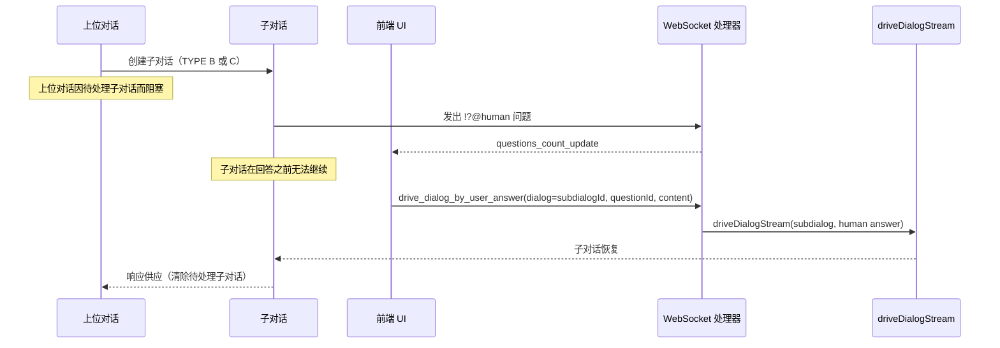

### Q4H 与思维清晰操作

**关键设计决策**：Q4H 问题被 `clear_mind` 操作**清除**。

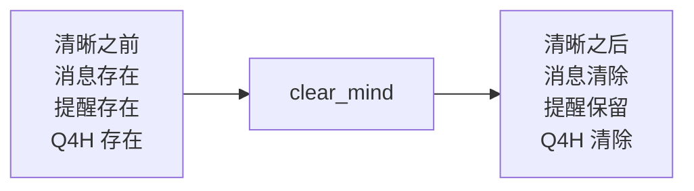

---

## 对话层级与子对话

### 层级概述

```mermaid
flowchart TD
  Root[根对话] --> S1[子对话 sub-001]
  Root --> S2[子对话 sub-002]
  Root --> S3[子对话 sub-003]

  S1 --> N1[嵌套子对话 sub-001-001]

  Root -.-> Reg["registry.yaml<br/>(根作用域，仅 TYPE B)"]
  Root -.-> QRoot[q4h.yaml (根)]
  S1 -.-> QS1[q4h.yaml (sub-001)]
  N1 -.-> QN1[q4h.yaml (sub-001-001)]
```

**典型存储（路径是相对于 rtws（运行时工作区）的相对路径）**：

- `.dialogs/run/<root-id>/dialog.yaml`
- `.dialogs/run/<root-id>/latest.yaml`
- `.dialogs/run/<root-id>/reminders.json`
- `.dialogs/run/<root-id>/q4h.yaml`
- `.dialogs/run/<root-id>/course-001.jsonl`（第 1 程对话，还可以有编号递增的后续多程）
- `.dialogs/run/<root-id>/subdialogs/<sub-id>/dialog.yaml`
- `.dialogs/run/<root-id>/subdialogs/<sub-id>/q4h.yaml`
- `.dialogs/run/<root-id>/registry.yaml`（仅根；TYPE B 注册表）

### 子对话响应供应机制

**核心原则**：子对话通过持久化向上位对话的上下文供应响应，而不是通过回调。

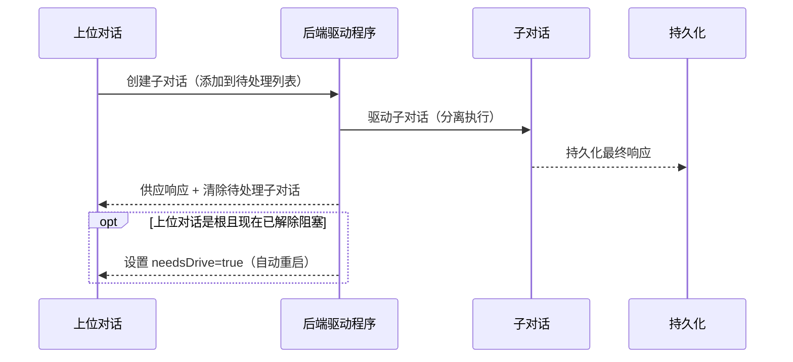

### 子对话 Q4H 和上位对话恢复

当子对话提出 Q4H 并等待人工输入时，上位对话的自动重启逻辑必须处理这种情况：

```typescript
// 上位对话检查子对话完成状态
async function checkSubdialogRevival(supdialog: Dialog): Promise<void> {
  const pending = await loadPendingSubdialogs(supdialog.id);

  for (const p of pending) {
    // 检查子对话是否有未解决的 Q4H
    const subdialogQ4H = await DialogPersistence.loadQuestions4HumanState(p.subdialogId);

    if (subdialogQ4H.length > 0) {
      // 子对话正在等待人工输入
      // 不要自动重启 - 等待人工回答 Q4H
      log.debug(`子对话 ${p.subdialogId} 有 ${subdialogQ4H.length} 个 Q4H，跳过自动重启`);
      continue;
    }

    // 子对话没有 Q4H，检查是否完成
    const isDone = await isSubdialogCompleted(p.subdialogId);
    if (isDone) {
      // 合并响应并自动重启
      await incorporateSubdialogResponse(supdialog, p.subdialogId);
    }
  }
}
```

---

## 对话控制工具

**实现**：`clear_mind` 委托给 `Dialog.startNewCourse(newCoursePrompt)`，它：

1. 清除所有聊天消息
2. 清除所有 Q4H 问题
3. 增加“多程对话”（course）计数器
4. 更新对话的时间戳
5. 将 `newCoursePrompt` 排队到 `dlg.upNext`，以便驱动程序可以启动新的协程并将其用作新一程的**第一个 `role=user` 消息**

### `clear_mind`

**目的**：通过清除对话噪声同时保留基本上下文来实现思维清晰。

**函数工具参数**：

- `reminder_content?: string`（清除前要添加的可选提醒）

示例：

```text
调用函数工具 `clear_mind`：
```

**行为**：

- 清除当前对话中的所有聊天消息
- 保留所有提醒
- **清除所有 Q4H 问题**（关键！）
- 保留子对话注册表（仅限根对话）
- 对上位对话没有影响
- 将注意力重定向到 Taskdoc
- 系统生成的“开启新一程对话”提示已排队，作为新一程的首个 role=user 消息
- 开启新一程对话

**实现说明**：

- 操作仅作用于当前对话
- 子对话不受父级 `clear_mind` 的影响
- Taskdoc 保持不变且可访问
- 提醒在清晰操作中提供连续性

### `change_mind`

**目的**：更新对话树中所有对话引用的共享 Taskdoc 内容（不开启新一程对话）。

**函数工具参数**：

- `selector: "goals" | "constraints" | "progress"`
- `content: string`

示例：

```text
调用函数工具 `change_mind`：
```

**行为**：

- 更新 rtws（运行时工作区）Taskdoc 内容（`*.tsk/` Taskdoc 包中恰好一个章节文件）
- **不更改 Taskdoc 路径。** `dlg.taskDocPath` 在对话的整个生命周期中是不可变的。
- 更新的文件立即对引用它的所有对话可用
- **不开启新一程对话。** 如需开启新一程对话，请单独使用 `clear_mind`。
- 本身不清除消息、提醒、Q4H 或注册表
- 影响引用相同 Taskdoc 的所有参与智能体（主对话和子对话）

**实现说明**：

- `change_mind` 仅在根对话中可用（不在子对话中）；子对话必须通过回问诉请（`!?@tellasker`）询问诉请者以更新共享 Taskdoc。
- 对于 `*.tsk/` Taskdoc 包，Taskdoc 是封装的：通用文件工具不得读取/写入/列出/删除 `*.tsk/` 下的任何内容。请参阅 [`encapsulated-taskdoc.zh.md`](./encapsulated-taskdoc.zh.md)。

---

## 提醒管理

**工具**：`add_reminder`、`update_reminder`、`delete_reminder`

**目的**：管理跨对话清理持续存在的对话作用域工作内存。

**行为**：

- 作用域为单个对话
- **在 clear_mind 操作中存活**
- **在 change_mind 操作中存活**
- 为刷新后的精神焦点提供指导
- 支持结构化捕获见解、决策和下一步

**与 Q4H 的关系**：

- 提醒在思维清晰操作中持续存在
- Q4H 被思维清晰操作清除
- 它们服务于不同的目的：
  - **提醒**：用于连续性的自生成笔记（在清晰操作中存活）
  - **Q4H**：需要人工输入的外部请求（被清晰操作清除）

---

## 子对话注册表

### 概述

**子对话注册表** 是根对话作用域的数据结构，维护通过 TYPE B（已注册子对话 Tellask / `Tellask Session`）队友 Tellask 创建的已注册子对话的持久引用。

### 关键特征

| 方面         | 描述                                      |
| ------------ | ----------------------------------------- |
| **作用域**   | 仅限根对话（子对话无法访问）              |
| **键格式**   | `agentId!tellaskSession`（单级 Map）      |
| **存储**     | 根对话目录中的 `registry.yaml`            |
| **生命周期** | 在对话生命周期中永远不会被删除            |
| **持久化**   | 根完成时随根移动到 `done/`                |
| **恢复**     | 在根加载时通过扫描 done/ 子对话 YAML 重建 |

### 注册表操作

示例 `registry.yaml`（概念性）：

```yaml
researcher!market-analysis:
  subdialogId: uuid-123
  agentId: researcher
  tellaskSession: market-analysis
  createdAt: 2025-12-27T10:00:00Z
  lastAccessed: 2025-12-27T11:30:00Z
```

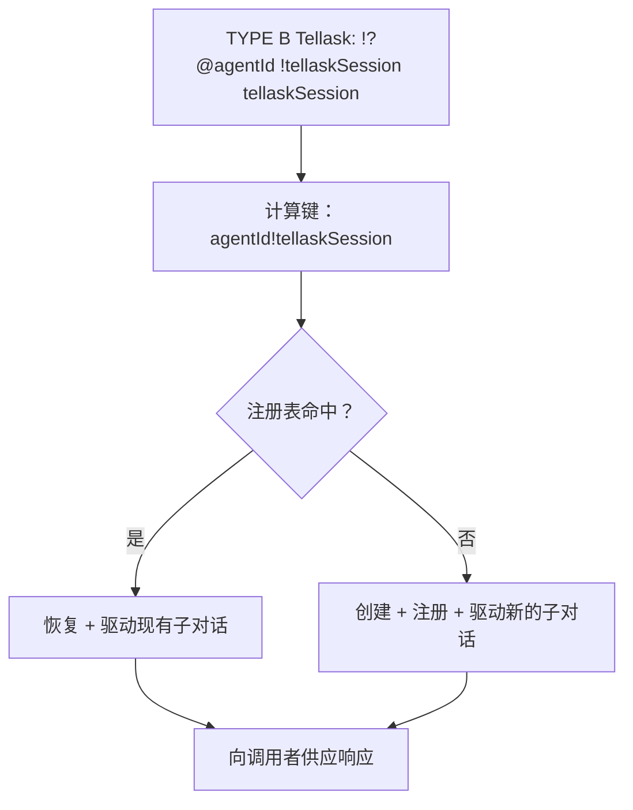

### 类设计：RootDialog vs SubDialog

**关键设计原则**：子对话注册表仅由 `RootDialog` 管理，**子对话实例无法访问**。

**职责**：

- `RootDialog`
  - 拥有 TYPE B 子对话注册表（`registry.yaml`）
  - 创建/注册/查找已注册的子对话（`agentId!tellaskSession`）
- `SubDialog`
  - 有一个 `supdialog` 引用（直接父级）并将其用于 TYPE A（`!?@tellasker`）
  - 无法访问或更改根注册表（按设计）

**互斥锁语义**：

- `locked: true` → 子对话当前正在被驱动（持有互斥锁）
- `locked: false` → 条目存在但子对话未锁定（可以恢复）
- 注册表不跟踪：'active' | 'completed' | 'suspended' 生命周期状态

**设计原则**：注册表跟踪"锁定"（正在被驱动）与"未锁定"（可以恢复）状态。它不跟踪对话生命周期状态（active/completed/suspended）。这些是 Dialog 的关注点，不是 Registry 的关注点。已注册的子对话可能未锁定（当前未被驱动）但仍然作为已完成或已暂停的对话存在。

### 注册表持久化

**文件位置**：`<root-dialog-path>/registry.yaml`

**格式**：

```typescript
interface SubdialogRegistry {
  [key: string]: {
    subdialogId: string; // 子对话的 UUID
    agentId: string; // 智能体标识符
    tellaskSession: string; // Tellask 会话键
    createdAt: string; // ISO 时间戳
    lastAccessed?: string; // ISO 时间戳（在每次 Tellask 时更新）
    locked: boolean; // 互斥锁状态 - 现在有人正在驱动这个吗？
  };
}
```

**持久化行为**：

1. **注册时**：新条目添加到注册表，文件保存
2. **恢复时**：`lastAccessed` 更新，文件保存
3. **Clear Mind 时**：注册表保留（不被清除）
4. **根完成时**：注册表随根移动到 `done/`
5. **根加载时**：注册表从 done/ 子对话 YAML 重建

---

## 技术架构

### 对话类结构

完整的对话类实现，包含所有方法、属性和详细行为，可以在 `dominds/main/dialog.ts` 中找到。

**关键组件**：

- **层级支持**：用于子对话管理的父子关系
- **内存管理**：持久化提醒和临时聊天消息
- **清理头脑操作**：`startNewRound(newRoundPrompt)` 方法（清除消息，清除 Q4H，开启新一程对话，为下一轮驱动排队开启提示）
- **子对话管理**：专门子任务的创建和协调
- **Q4H 管理**：用于问题跟踪的 `updateQuestions4Human()` 方法
- **内存访问**：与 Taskdoc 和团队/智能体内存的集成
- **注册表管理**（仅限 RootDialog）：子对话的注册和查找

### 主对话解析

对于需要与主对话（根对话）通信的子对话，请参阅 `dominds/main/dialog.ts` 中的实现，该实现提供了遍历对话层级的方法。

### 持久化层

持久化层处理：

- **对话存储**：`dominds/main/persistence.ts`
- **Q4H 存储**：每个对话的 `q4h.yaml`（被 clear_mind 清除）
- **提醒存储**：每个对话的 `reminders.json`
- **事件持久化**：基于轮的 JSONL 文件
- **注册表存储**：每个根对话的 `registry.yaml`

**Q4H 持久化方法**：

```typescript
// 在 persistence.ts 中
static async _saveQuestions4HumanState(
  dialogId: DialogID,
  questions: HumanQuestion[],
): Promise<void>

static async loadQuestions4HumanState(
  dialogId: DialogID,
): Promise<HumanQuestion[]>

static async clearQuestions4HumanState(
  dialogId: DialogID,
): Promise<void>
```

**注册表持久化方法**：

```typescript
// 在 RootDialog（dialog.ts）中
interface RegistryMethods {
  loadRegistry(): Promise<SubdialogRegistry>;
  saveRegistry(registry: SubdialogRegistry): Promise<void>;
  registerSubdialog(key: string, metadata: SubdialogMetadata): void;
  lookupSubdialog(key: string): SubdialogMetadata | undefined;
  getRegistry(): SubdialogRegistry;
}
```

---

## 对话管理

### 层级管理

**创建**：当智能体需要委派专门任务或复杂问题需要分解时，会创建子对话。

**上下文继承**：新的子对话自动接收：

- 对相同 rtws（运行时工作区）Taskdoc 的引用（推荐：`tasks/feature-auth.tsk/`）；`dlg.taskDocPath` 在对话创建时固定，永不重新分配
- 上位 Tellask 上下文（tellaskHead + tellaskBody）解释其目的
- 访问共享团队内存
- 访问其智能体的个人内存

**存储**：所有子对话都平铺存储在主对话（根对话）的 `subdialogs/` 目录下，无论嵌套深度如何。

**导航**：每个子对话都保持对其父级的引用，向上遍历到主对话。

**注册表**：已注册的子对话（TYPE B Tellask）在根对话的注册表中跟踪，并在重启后持久化。

### 生命周期管理

**活动状态**：智能体正在工作时，对话保持活动状态。

**完成**：当以下情况时，对话转换为完成状态：

- 任务成功完成
- 智能体明确标记它们完成
- 上位对话确定子任务不再需要
- 所有待处理的子对话都完成且所有 Q4H 已回答

**完成时的注册表**：当根对话完成时，其注册表随它移动到 `done/` 目录，并保留以供潜在恢复。

**清理**：完成的对话可以根据保留策略进行归档或清理。

### 通信模式

**向上通信**：子对话向上位对话通信结果、问题和升级。

- **澄清请求（TYPE A / `TellaskBack`）**：子对话在处理其子任务时可能向上位对话 Tellask 以请求澄清。上位对话提供指导，子对话在新上下文中继续。
- **子任务响应**：当子对话产生最终的 "saying" 内容块（没有待处理的 Q4H）时，该消息被视为对**当前调用者**的响应，记录在 `assignmentFromSup` 中（根或另一个子对话）。这使响应与最新的 Tellask 站点保持一致。
- **Q4H 升级**：如果子对话有 Q4H，它会暂停。用户可以通过 UI 回答，这只会触发子对话的继续。
- **已注册的子对话（TYPE B / `Tellask Session`）**：父级可以恢复先前创建的已注册子对话，实现持续的任务继续。
- **瞬态子对话（TYPE C / `Fresh Tellask`）**：父级可以生成一次性子对话用于不需要持久化的独立任务。

**向下通信**：上位对话向子对话提供上下文、目标和指导。

**横向通信**：兄弟子对话通过共享上位对话进行协调。

**广播通信**：主对话（根对话）可以通过 Taskdoc 引用将更改（如 rtws Taskdoc 文件更新）传达给所有对话。

---

## 内存管理

### 对话作用域内存

**聊天消息**：可以清除以实现思维清晰的临时对话内容。

**提醒**：在清晰操作中存活的半持久化工作内存。

**Q4H 问题**：需要人工输入的临时问题，被思维清晰操作**清除**。

**父级调用上下文**：解释为什么创建子对话的不可变上下文。

**子对话注册表**：根对话作用域的已注册子对话持久映射（在清晰操作中存活）。

### rtws 持久化内存

**团队共享内存**：在整个项目生命周期中持久化，由所有智能体共享。

**智能体个人内存**：每个智能体的个人知识，在所有对话中持久化。

### 内存同步

**Taskdoc 传播**：对 rtws Taskdoc 文件的更改对引用它的所有对话立即可见。

**内存更新**：团队和智能体内存异步更新，最终在所有对话中保持一致。

**Q4H 持久化**：Q4H 问题在创建时持久化，在回答时或调用 clear_mind 时原子地清除。

**注册表持久化**：注册表在每次修改后持久化，并在根对话加载时恢复。

---

## 系统集成

### 文件系统集成

**对话存储**：每个对话对应一个包含以下内容的目录结构：

- `<dialog-root>/dialog.yaml` — 对话元数据和配置
- `<dialog-root>/latest.yaml` — 当前对话过程跟踪和状态
- `<dialog-root>/reminders.json` — 持久化提醒存储
- `<dialog-root>/q4h.yaml` — Q4H 索引（被清晰工具清除）
- `<dialog-root>/registry.yaml` — 子对话注册表（仅限根对话）
- `<dialog-root>/course-001.jsonl`（第 1 程对话，还可以有编号递增的后续多程）— 流式消息文件
- `<dialog-root>/subdialogs/<subdialog-id>/dialog.yaml`
- `<dialog-root>/subdialogs/<subdialog-id>/q4h.yaml` — 每个子对话的 Q4H 索引（被清晰清除）

**Taskdoc 存储**：Taskdoc 是对话通过路径引用的 rtws 产物。Taskdoc 必须是封装的 `*.tsk/` Taskdoc 包。

**内存存储**：团队和智能体内存存储在 rtws 内的专用文件中。
**注册表存储**：子对话注册表（`registry.yaml`）存储在根对话目录中，并在根完成时移动到 `done/`。

### 流式生成子流顺序契约（Thinking / Saying）

Dominds 将 LLM 输出拆分为多个“子流”（thinking、saying，以及从 saying 进一步解析出的 markdown / function tool call 子段）并通过 WebSocket 事件推送给 UI。
为了让 UI **忠实体现原始生成顺序**，以及让“乱序”成为可观测、可定位的全栈问题，必须遵守以下契约：

- **允许任意多段交替**：在同一轮生成（同一 `genseq`）内，thinking 与 saying 可以出现任意多段，按 `start → chunk* → finish` 的片段形式交替出现。
- **禁止重叠**：任意时刻最多只有一个活跃的子流（thinking 或 saying）。不允许 “前一个未 finish，后一个就 start” 的并发/重叠。
- **UI 仅按事件顺序渲染**：前端不应通过重排 DOM 来“修复”乱序；应按事件抵达顺序追加 section，以体现真实的生成轨迹。
- **乱序必须大声报错**：一旦检测到重叠/乱序（例如 thinking 与 saying 同时活跃），后端应发出 `stream_error_evt` 并中断该次生成，以便尽快暴露 provider/解析链路的协议问题并定位。

### CLI 集成

**对话创建**：新对话通过带有适当上下文的 CLI 命令创建。

**工具调用**：思维清晰工具通过 CLI 命令或智能体操作调用。

**状态监控**：对话状态、待处理子对话、Q4H 计数和已注册的子对话可以通过 CLI 工具检查。

### 智能体集成

**自主操作**：智能体可以独立创建子对话（TYPE B 和 C）、管理提醒、提出 Q4H 并触发清晰操作。

**上下文感知**：智能体可以完全访问其对话上下文、内存、层级位置、来自子对话的待处理 Q4H，以及（对于根对话）子对话注册表。

**队友 Tellask 能力**：智能体可以调用所有三种类型的队友 Tellask：

- TYPE A / `TellaskBack`：向上位对话 Tellask 以请求澄清
- TYPE B / `Tellask Session`：Tellask/恢复已注册的子对话
- TYPE C / `Fresh Tellask`：生成瞬态子对话

**工具访问**：所有思维清晰工具、Q4H 能力和队友 Tellask 工具都可用于智能体进行自主认知管理。

### 对话状态机

Dominds 的运行时**不**持久化单一的类似枚举的 "awaiting …" 状态。对话是否可以
驱动是从持久化的事实派生的：

- 持久化状态（API/索引）：`running | completed | archived`
- 持久化 `latest.yaml`：`status`、`needsDrive`、`generating`
- 派生的门控：`hasPendingQ4H()` 和 `hasPendingSubdialogs()`

**持久化状态生命周期**：

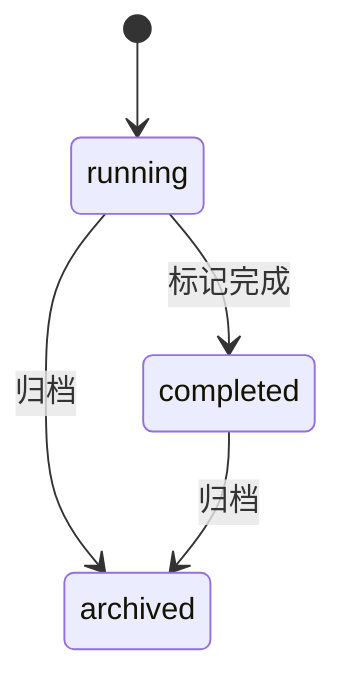

**根驱动程序门控（概念性）**：

```mermaid
flowchart TD
  A[status=running] --> B{可以驱动？\\n（没有待处理的 Q4H\\n且没有待处理的子对话）}
  B -- 否 --> S[已暂停\\n（等待 Q4H 和/或子对话）]
  S -->|Q4H 回答\\n或子对话响应供应| C{需要驱动？}
  B -- 是 --> C{需要驱动？}
  C -- 否 --> I[空闲\\n（等待触发器）}
  C -- 是 --> D[驱动循环\\n（流式传输时 generating=true）}
  D --> E{有下一个？}
  E -- 是 --> C
  E -- 否 --> I
```

### 队友 Tellask 状态转换

这些图表专注于**控制流**，避免框图对齐，以便在不同的markdown查看器中呈现时保持可读性。

#### TYPE A：回问诉请（`TellaskBack`）（`!?@tellasker`，无 `!tellaskSession`）

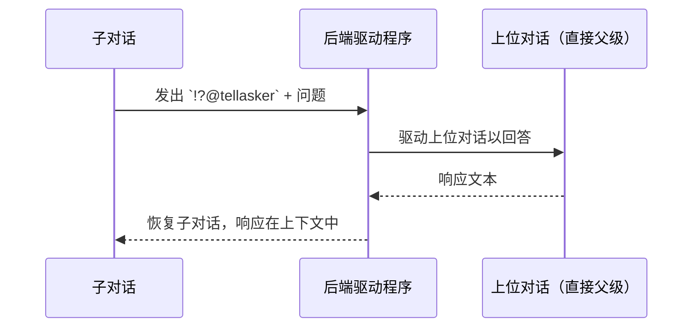

#### TYPE B：已注册子对话 Tellask（`Tellask Session`）（`!?@agentId !tellaskSession tellaskSession`，或 `!?@self !tellaskSession tellaskSession`）

```mermaid
sequenceDiagram
  participant Caller as 调用者对话
  participant Driver as 后端驱动程序
  participant Reg as 根子对话注册表
  participant Sub as 已注册的子对话

  Caller->>Driver: 发出 `!?@agentId !tellaskSession tellaskSession`
  Driver->>Reg: 查找 `agentId!tellaskSession`
  alt 注册表命中
    Reg-->>Driver: 现有子对话 selfId
    Driver->>Sub: 恢复 + 驱动
  else 注册表未命中
    Reg-->>Driver: 无
    Driver->>Sub: 创建 + 注册 + 驱动
  end
  Sub-->>Driver: 最终响应
  Driver-->>Caller: 供应响应 + 清除待处理子对话
  opt 调用者是根且现在已解除阻塞
    Driver-->>Caller: 设置 `needsDrive=true`（自动重启调度）
```

end

````

#### TYPE C：瞬态子对话 Tellask（`Fresh Tellask`）（`!?@agentId`，或 `!?@self`）

```mermaid
sequenceDiagram
  participant Caller as 调用者对话
  participant Driver as 后端驱动程序
  participant Sub as 瞬态子对话

  Caller->>Driver: 发出 `!?@agentId`
  Driver->>Sub: 创建（不注册）
  Driver->>Sub: 驱动
  Sub-->>Driver: 最终响应
  Driver-->>Caller: 供应响应（无注册表更新）
````

### Q4H 生命周期状态

```mermaid
flowchart TD
  A[!?@human Tellask 发出] --> B[将 HumanQuestion 条目追加到 q4h.yaml]
  B --> C[发出 questions_count_update]
  C --> D[UI 显示 Q4H 徽章/列表]
  D --> E{如何清除？}
  E -->|用户回答（drive_dialog_by_user_answer）| F[从 q4h.yaml 中移除问题\\n（如果为空则删除文件）]
  E -->|clear_mind| G[清除 q4h.yaml（所有问题）]
  F --> H[对话可能再次变为可驱动]
  G --> H
```

`q4h.yaml` 被视为索引；真理之源"提出的问题"内容存在于对话的消息流中，由 `callSiteRef` 引用。

### 子对话 + Q4H 交互

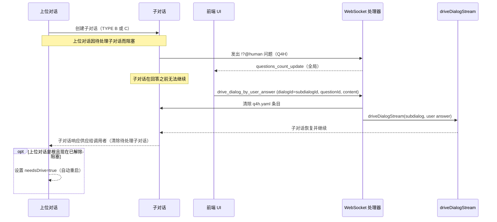

---

## 完整流程参考

### 1. 主对话提出 Q4H

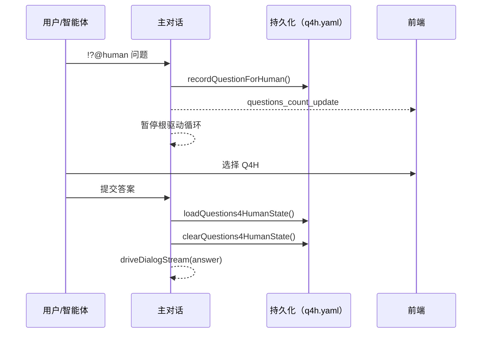

### 2. 子对话提出 Q4H，用户通过根回答

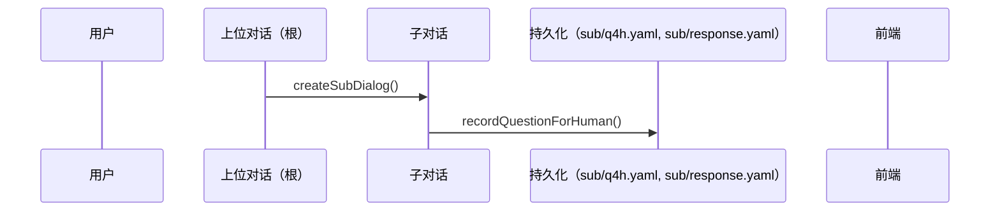

### 2. 子对话发起 Q4H，用户通过根对话回答

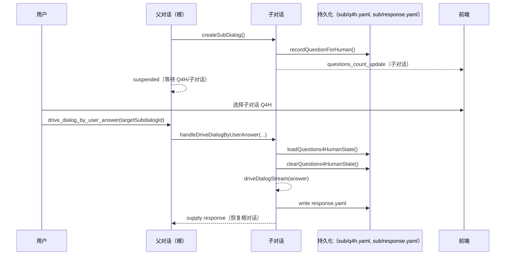

### 3. 已注册子对话 Tellask（TYPE B / `Tellask Session` / 长线诉请）

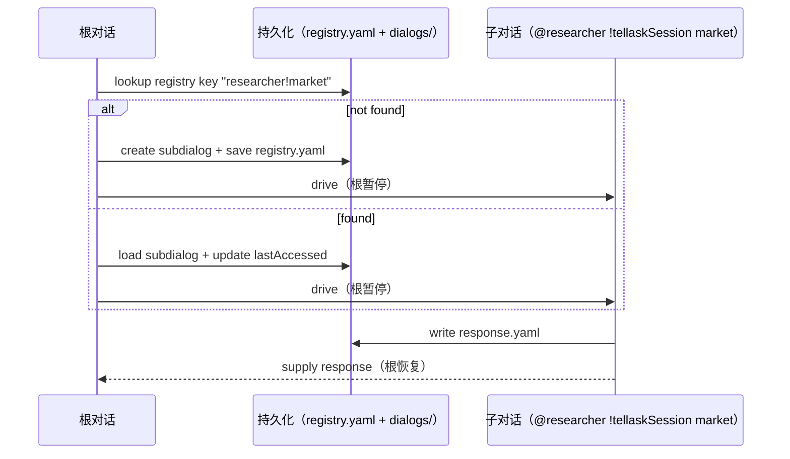

### 4. 清晰度操作保留注册表

| 状态元素 | `clear_mind` 的效果             |
| -------- | ------------------------------- |
| 消息     | 清除（新一轮 / 全新消息上下文） |
| Q4H      | 清除                            |
| 提醒项   | 保留                            |
| 注册表   | 保留                            |

`change_mind` 不是清晰度操作；它就地更新任务文档内容，不会清除消息/Q4H/提醒项/注册表。

---

## 性能考量

### 可扩展性

**扁平存储**：子对话扁平存储防止深层目录嵌套问题。

**注册表效率**：已注册子对话的单级 Map 查找为 O(1)。

**内存效率**：共享内存在对话之间减少重复。

**懒加载**：对话内容按需加载以最小化内存使用。

### 可靠性

**原子操作**：Q4H 和注册表持久化使用原子写入模式（临时文件 + 重命名）。

**备份与恢复**：对话状态可以独立备份和恢复。注册表从 done/ 加载时恢复。

**错误处理**：系统优雅地处理对话损坏、文件丢失和注册表损坏。

### 监控

**性能指标**：系统跟踪对话创建、完成、注册表大小、资源使用和 Q4H 计数。

**健康检查**：定期验证对话层次结构完整性、Q4H 持久化、注册表一致性和内存。

**调试支持**：全面的日志记录和检查工具，用于排查队友 Tellasks、注册表操作和 Q4H 流程。

---

## 总结

Dominds 对话系统为层次化、人在回路的 AI 协作提供了一个强大的框架：

### 四个核心机制

| 机制             | 目的             | 存活于清晰度 | 清除方式   |
| ---------------- | ---------------- | ------------ | ---------- |
| **对话层次结构** | 父子任务委托     | N/A          | N/A        |
| **Q4H**          | 人机交互请求     | 否           | clear_mind |
| **心智清晰度**   | 上下文重置工具   | N/A          | N/A        |
| **提醒项**       | 持久化工作内存   | 是           | N/A        |
| **子对话注册表** | 已注册子对话跟踪 | 是           | 永不删除   |

### 三种队友 Tellask 类型

| 类型（内部） | 用户可见术语      | 语法                              | 注册表                   | 用例             |
| ------------ | ----------------- | --------------------------------- | ------------------------ | ---------------- |
| TYPE A       | `TellaskBack`     | `!?@tellasker`                    | 无注册表                 | 澄清（询问来源） |
| TYPE B       | `Tellask Session` | `!?@agentId !tellaskSession <id>` | `agentId!tellaskSession` | 可恢复多轮工作   |
| TYPE C       | `Fresh Tellask`   | `!?@agentId`                      | 未注册                   | 单次 / 不可恢复  |

### 类职责

- **根对话**：管理注册表，可以发起所有三种队友 Tellask 类型
- **子对话**：拥有父对话引用，可以直接发起 TYPE A 和 TYPE C；TYPE B 通过根注册表路由，并在每次 Tellask 时更新调用者上下文

### 持久化保证

- **Q4H**：持久化，由清晰度操作清除
- **提醒项**：持久化，在清晰度操作中存活
- **注册表**：持久化，在清晰度操作中存活，完成时移至 done/
- **子对话**：已注册的子对话在注册表中持久化；临时子对话不会被注册
