# Dominds 对话系统实现

英文版：[English](./dialog-system.md)

本文档提供 Dominds 对话系统的详细实现规范，包括核心工具、技术架构、对话管理、内存管理、系统集成以及向人请示（Q4H）机制。

## 目录

1. [术语](#术语)
2. [后端驱动架构](#后端驱动架构)
3. [三类队友诉请分类](#三类队友诉请分类)
4. [核心机制](#核心机制)
5. [Q4H：向人请示](#q4h向人请示)
6. [对话关系与支线对话](#对话关系与支线对话)
7. [思维清晰工具](#思维清晰工具)
8. [提醒管理](#提醒管理)
9. [支线对话注册表](#支线对话注册表)
10. [技术架构](#技术架构)
11. [对话管理](#对话管理)
12. [内存管理](#内存管理)
13. [系统集成](#系统集成)
14. [状态图](#状态图)
15. [完整流程参考](#完整流程参考)

---

## 术语

本章定义本文档中使用的面向实现的术语。
关于双语/面向用户的命名约定（主线对话/支线对话；诉请者/被诉请者），请参阅 [`dominds-terminology.md`](./dominds-terminology.md)。
关于差遣牒任务包结构和封装规则，请参阅 [`encapsulated-taskdoc.zh.md`](./encapsulated-taskdoc.zh.md)。

### askerDialog（诉请者）

**askerDialog（诉请者）**是在实现语境中当前拥有某个支线 assignment 或 reply obligation 的对话。它可以是主线对话，也可以是另一个支线对话；这是诉请/回复关系，不天然表示层级上位。

注意：**askerDialog** 不是结构诉请者的同义词。TYPE A（`tellaskBack`）时，诉请者就是直接 askerDialog；TYPE B/C 时，诉请者可能是不同的对话。

askerDialog 可以在执行期间接收来自当前需向它回复的支线对话的**回问诉请**。当支线对话需要指导或额外上下文时，它可以用 `tellaskBack({ tellaskContent: "..." })` 回问，并将响应反馈到支线对话上下文。

### SideDialog（支线对话）

**sideDialog（支线对话）** 是由 askerDialog 生成的专门对话，用于处理特定支线任务。支线对话使用新的上下文操作，专注于定向目标，同时保持与 askerDialog 的通信链接。

**回问诉请**：支线对话可以在任务执行期间向**诉请者**回问澄清。TYPE A 中诉请者就是直接 askerDialog。此机制允许支线对话在保持自身上下文和进度的同时提问并接收指导。

### 诉请者 / 被诉请者（调用角色）

**诉请者**是发起本次诉请的一侧，**被诉请者**是处理本次诉请的一侧（当前对话）。这是 **Tellask 角色**，不是层级关系：

- TYPE A（`tellaskBack`）时，诉请者是直接 askerDialog。
- TYPE B/C 时，诉请者可能是主线对话，也可能是其他支线对话。
- 回贴会路由到 `assignmentFromAsker` 中记录的**当前诉请者**。

### 主线对话

**主线对话**是没有 askerDialog 关系的顶层对话。它作为任务执行的主要入口点，可以生成多级支线对话。

### 向人请示（Q4H）

**Q4H** 是由对话（主线对话或支线对话）提出的待处理问题，需要人工输入才能继续。Q4H 被索引在对话的 `q4h.yaml` 文件中（一个索引，不是真理之源），并由 `clear_mind` 操作清除。实际的问题内容存储在对话的对话消息中，其中记录了 `askHuman({ tellaskContent: "..." })` 诉请。

### 支线对话索引 (subdlg.yaml)

**subdlg.yaml** 文件索引诉请者正在等待的待处理支线对话。与 `q4h.yaml` 类似，它是一个索引文件，不是真理之源：

- 索引跟踪诉请者正在等待哪些支线对话 ID
- 实际的支线对话状态从磁盘 (done/ 目录) 验证
- 用于后端协程的崩溃恢复和自动重启

### 支线对话注册表

**支线对话注册表** 是主线对话作用域的 Map，维护对已注册支线对话的持久引用。注册表使用 `agentId!sessionSlug` 作为其键格式。当主线完成时，它随主线移动到 `done/`，并在主线加载时通过扫描 done/ 支线对话 YAML 重建。若某个支线对话被宣布卡死，其对应的 TYPE B 注册表条目会被移除，以便后续可用同一 `agentId!sessionSlug` 创建全新的支线对话。

### 队友诉请

**队友诉请** 是 Dominds 特定的语法，触发与另一个作为支线对话的智能体的通信。队友诉请有三种不同模式，具有不同语义（见第 3 节）。

**诉请块结构**（另见 [`dominds-terminology.md`](./dominds-terminology.md)）：

- **诉请头**：诉请块第一行 `tellaskSessionless({ targetAgentId: "<name>", tellaskContent: "..." })`（同一诉请块内，后续以 `tellask* function call` 开头的行会并入诉请头）。
- **诉请正文**：由 tellask-special 函数参数 `tellaskContent` 承载的正文载荷。
- `sessionSlug` 等结构化指令必须写在诉请头中。

---

## 后端驱动架构

### 核心设计原则

对话驱动是一个**唯一的后端算法**。前端/客户端从不驱动对话。所有对话状态转换、恢复逻辑和生成循环都在后端协程中完全执行。前端只订阅发布频道 (PubChan) 以进行实时 UI 更新。

### 注册表结构

系统维护三个级别的注册表用于对话管理：

**全局注册表（服务器作用域）**
`rootId → MainDialog` 对象的服务器范围映射。这是所有活动主线对话的单一真理之源。后端协程扫描此注册表以找到需要驱动的对话。

**本地注册表（每个主线对话）**
每个主线的 `selfId → Dialog` 对象映射。此注册表包含主线对话本身以及所有已加载的支线对话，支持在同一对话树内对任何对话进行 O(1) 查找。

**支线对话注册表（每个主线对话）**
每个主线的 `agentId!sessionSlug → SideDialog` 对象映射。此注册表跟踪用于在多次交互中恢复的 TYPE B 已注册支线对话。TYPE C 瞬态支线对话永远不会被注册。

### 每对话互斥锁

每个 Dialog 对象带有一个具有关联等待队列的排他互斥锁。当后端协程需要驱动对话时，它首先获取互斥锁。如果对话已被锁定，协程将其 promise 加入队列并等待直到互斥锁被释放。这确保任何时刻只有一个协程驱动对话，防止竞争条件并确保状态一致。

### 后端协程驱动循环

后端协程使用以下模式驱动对话：

1. 扫描全局注册表以识别需要驱动的主线对话
2. 对于每个候选者，检查恢复条件（Q4H 已回答，支线对话完成已接收）
3. 在驱动之前获取对话的互斥锁
4. 执行生成循环直到挂起点或完成
5. 释放互斥锁
6. 将所有状态变更持久化到存储

驱动循环持续进行，直到对话挂起（等待 Q4H 或支线对话）或完成。当条件变化时（用户回答 Q4H，支线对话完成），后端通过存储检查检测这些变化并自动恢复驱动。

### 前端集成

前端客户端从不驱动对话。相反，它们：

- 订阅当前对话的 PubChan 以获取实时更新
- 接收消息、状态变化和 UI 指标的事件
- 通过 API 端点发送用户输入（drive_dlg_by_user_msg, drive_dialog_by_user_answer）
- **绝不在前端维护任何全量（缓存）对话列表**：前端仅保留当前可渲染视图所需的数据；未渲染节点必须按需向后端请求，折叠后应丢弃其子节点内存并在下次展开时重拉

所有驱动逻辑、恢复决策和状态管理仍然是纯粹的后端关注点。

### 全局对话事件广播器

有一类对话事件属于 rtws 全局状态，而不是某个对话自己的局部流，包括 `new_q4h_asked`、`q4h_answered`、`sideDialog_created_evt`、`dlg_touched_evt`。

这些事件要求 runtime 在任何对话驱动逻辑开始前，就先完成**全局对话事件广播器**的 bootstrap。它是必要基础设施，不是可选优化：

- WebUI server runtime 安装 WebSocket fanout broadcaster
- script / test / future runtime 也必须安装 broadcaster，通常使用 recording broadcaster
- tests 应在 runtime 入口完成 broadcaster bootstrap；需要验证广播时断言捕获内容，不需要时可直接忽略

因此，“缺少 broadcaster”应被视为 runtime bootstrap 不变式被破坏，而不是 Q4H/业务层条件。

### 状态持久化

对话状态在关键点持久化到存储：

- 每次消息生成后
- 挂起时（Q4H 提出，支线对话创建）
- 恢复时（Q4H 已回答，支线对话完成）
- 完成时

这确保了崩溃恢复，并使后端能够从任何持久化状态恢复，而不依赖于前端状态。

### 用户插话暂停与 Continue 语义

当某个对话仍带有跨对话回复义务，但用户临时插话要求它先处理本地问题时，系统必须区分**UI 投影**与**真实驱动源状态**。

**规范语义**：

1. 每条用户插话消息都按正常驱动轮完整执行。
2. 若该轮需要工具，则必须先完整跑完该工具轮及其 post-tool follow-up。
3. 只有当这条插话确实打断了一个仍待恢复的“原任务”时，系统才把该原任务投影为可 `Continue` 的 `stopped`，让用户先看到最后一条回复。
4. 若当前并不存在待恢复的原任务（例如没有待重申的跨对话回复义务），则插话轮结束后应直接回到真实 underlying state，而不显示这个特殊 `stopped` 面板。
5. 只要用户继续发送新消息，就继续作为插话临时对话处理；这个 paused projection 仅在它已被建立时持续保持。
6. 只有用户显式点击 UI `Continue`，系统才尝试恢复原任务。

**严格边界**：`askHuman` 的正式回答不属于这里的“用户插话”。只要一条 prompt 带着真实的 `q4hAnswerCallId`，它就属于 askHuman 回复通道，语义上是在继续已 materialize 的提问/应答链路，绝不能被压入“本地临时插话聊天”。

**关键点**：这里的 `stopped` 只是一个临时 run-control / UI 投影，不等于普通 system-stop 失败，也不是最终的业务真源；并且它不是所有插话都会出现，只在“确有一个待恢复的原任务被临时停靠”时出现。

点击 `Continue` 后，后端必须重新从 persistence 真源判定当前对话属于哪一种情况，而不能只根据表面的 `displayState` 做静态推断：

- **情况 1：当前对话没有回复义务**
  这时若也没有其他 blocker，就应直接继续 drive；若已回到普通待用户输入态，则 `resume_dialog` 不应再被视为可继续。
- **情况 2：当前对话仍有回复义务，但处于 suspend 状态**
  常见于仍在等待 Q4H / pending sideDialogs。此时 `Continue` 应退出插话 paused projection，并恢复成真实的 `blocked`。
- **情况 3：当前对话仍有回复义务，但已不再 suspend，具备继续推进条件**
  例如 blocker 已消失，或存在允许继续的 queued prompt。此时 `Continue` 不应先落一个中间 `blocked/idle` 占位态，而应直接继续 drive。

**因此有两个实现约束**：

- `refreshRunControlProjectionFromPersistenceFacts()` 在用户尚未点击 `Continue` 前，必须保留这层“插话已处理；原任务已暂停”的 `stopped` 投影；否则 UI 会过早塌回普通 `blocked`，破坏多轮插话体验。反过来，如果当前其实没有待恢复原任务，则根本不应建立这层 paused projection。
- 真正决定 `Continue` 结果的逻辑，必须在恢复驱动路径中重新读取 fresh persistence facts；不能把“可点 Continue”误解为“必然立即 proceeding”。
- 若 `Continue` 后真源仍是 `blocked`，回复责任重申文案应当立即作为 runtime guide 同时进入 `dlg.msgs` 与持久化课程历史，并同步发前端气泡；这样后面真正恢复 drive 时只需正常读取上下文，不应再额外补发一条重复的 runtime prompt。
- run-control 工具栏中的 `resumable` 计数，应与“是否允许手动 Continue 尝试”保持一致。因此，处于 interjection-paused `stopped` 的对话即便底层仍有 blocker，也应计入 `resumable`；因为 `Continue` 的业务语义正是“退出这层临时 paused projection，并从真源重判下一步”。

**心智模型提醒**：

- 不能只看 `displayState.kind === 'stopped'` 就理解这条链路。
- 不能只看 blocker facts 就理解为什么 UI 仍显示 `stopped`。
- 也不能只看 `resume_dialog` eligibility 就推断恢复后一定马上运行。
- 更不能把所有 `origin === 'user'` 的输入都笼统视作“用户插话”；`q4hAnswerCallId` 非空的 prompt 是 askHuman answer continuation，必须按另一条语义链处理。

必须把以下几块一起看，才能形成完整且精确的理解：

- reply-guidance 中对插话轮的回复义务 suppression / deferred reassertion
- flow 中“插话回复后停车”与“Continue 后 fresh fact 二次判定”
- dialog-display-state 中 paused projection 的保留策略
- websocket resume 入口对“可尝试 Continue”与“实际已恢复 drive”的区分

这是一条跨模块协同语义，不允许在单点上做“表面看起来更简单”的局部简化。

---

## 三类队友诉请分类

本节记录 Dominds 系统中三种不同类型的队友诉请，它们的语法、行为和用例。

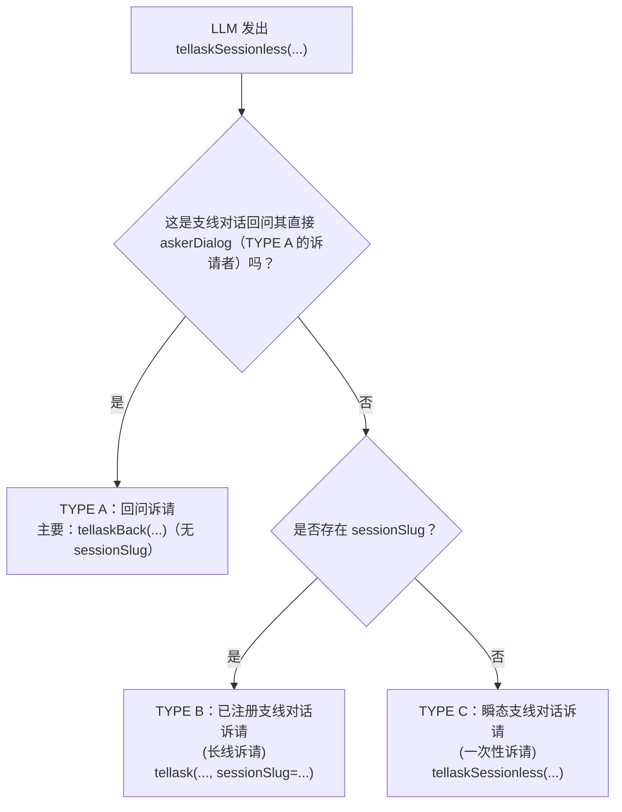
```mermaid
flowchart TD
  M["LLM 发出 tellaskSessionless(...)"] --> Q{"这是支线对话回问其直接 askerDialog（TYPE A 的诉请者）吗？"}
  Q -- 是 --> A["TYPE A：回问诉请<br/>主要：tellaskBack(...)（无 sessionSlug）"]
  Q -- 否 --> T{是否存在 sessionSlug？}
  T -- 是 --> B["TYPE B：已注册支线对话诉请<br/>(长线诉请)<br/>tellask(..., sessionSlug=...)"]
  T -- 否 --> C["TYPE C：瞬态支线对话诉请<br/>(一次性诉请)<br/>tellaskSessionless(...)"]
```

### TYPE A：回问诉请

**主要语法**：`tellaskBack({ tellaskContent: "..." })`（无 `sessionSlug`）— `tellaskBack({ tellaskContent: "..." }) sessionSlug ...` 是**语法错误**

**行为**：

1. 当前支线对话**挂起**
2. 驱动程序切换到驱动**诉请者**（TYPE A 中为直接 askerDialog；使用 `sideDialog.askerDialog` 引用）
3. 诉请者的响应流回支线对话
4. 支线对话**恢复**，诉请者的响应在上下文中

**关键特征**：

- 使用 `sideDialog.askerDialog` 引用（无注册表查找）
- 无需注册 — 诉请者关系是固有的
- TYPE A 始终指向直接 askerDialog（本次诉请的诉请者）
- `tellaskBack({ tellaskContent: "..." })` 是**规范**的 TYPE A 语法：它始终路由到“诉请者”（发起本次诉请的对话），避免自行猜测。

**支线交付规则（规范）**：

- 只有当所有目标完成时，支线对话才可直接正常回复诉请者。
- 若目标尚未完成，不要默认直接 `tellaskBack`；应先按团队规程 / SOP / 职责卡判断能否明确负责人，若能明确且属于执行性处理，直接 `tellask` / `tellaskSessionless` 对应负责人。
- 只有当必须由诉请者补充需求、澄清目标、做业务裁决、确认验收口径、提供缺失输入，或现有规程无法明确判责时，才使用 `tellaskBack({ tellaskContent: "..." })` 回问诉请者再继续。
- **FBR 例外**：FBR 支线对话禁止一切 tellask（包括 `tellaskBack` / `tellask` / `tellaskSessionless` / `askHuman`），只能列出缺口与阻塞原因并直接回复。

**跨对话传递与标记（强制）**：

- 运行时会生成“跨对话传递正文”作为标准载荷；该正文会进入目标智能体上下文，且 UI 必须与其保持一致。
- 首行标记由运行时按工作语言和语义自动注入到该传递正文，智能体不应手写：
  - 中文工作语言：
    - 回问诉请回贴：`【回问诉请】`
    - 常规支线完成回贴：`【最终完成】`
    - FBR 回贴：`【FBR-直接回复】` 或 `【FBR-仅推理】`
  - 英文工作语言：
    - 回问诉请回贴：`【TellaskBack】`
    - 常规支线完成回贴：`【Completed】`
    - FBR 回贴：`【FBR-Direct Reply】` 或 `【FBR-Reasoning Only】`
- 若诉请方在正文中定义“回贴格式/交付格式”，只写业务交付结构即可；不得要求被诉请者手写任何标记，因为这些标记由运行时自动注入。
- 源对话的模型原始输出（raw）天然保留在源对话持久记录中；跨对话传递不得改写或覆盖该源 raw。
- 允许将“某对话的模型原文”拼接进运行时模板后，作为传递到另一对话的正文（即模板化传递是规范路径）。

**协议澄清**：

- 需要回问诉请者时必须真实调用 `tellaskBack({ tellaskContent: "..." })`；但在此之前应先判断是否已有团队规程可直接判责到其他负责人。不得发送普通文本中间汇报。

**示例**：

```
当前对话：sub-001（agentId: "backend-dev"）
诉请者："orchestrator"（agentId）

LLM 发出：tellaskSessionless({ targetAgentId: "orchestrator", tellaskContent: "..." }) 我应该如何处理数据库迁移？

结果：
- sub-001 挂起
- 驱动程序使用问题驱动 orchestrator
- orchestrator 用指导响应
- sub-001 恢复，Orchestrator 的响应在上下文中
```

### TYPE B：已注册支线对话诉请（长线诉请）

**语法**：`tellask({ targetAgentId: "<anyAgentId>", sessionSlug: "<tellaskSession>", tellaskContent: "..." })`（注意 `sessionSlug` 前的空格）

**扪心自问 (FBR) 语法**：`freshBootsReasoning({ tellaskContent: "..." })`

- `freshBootsReasoning` 是专用函数工具，不是诉请的特殊 target 别名。
- FBR 不接受 `sessionSlug` 或 `mentionList`。
- FBR 由更严格的“无工具”策略驱动；详见 [`fbr.zh.md`](./fbr.zh.md)。

**诉请会话键模式**：`<tellaskSession>` 使用与 `<mention-id>` 相同的标识符模式：`[a-zA-Z][a-zA-Z0-9_-]*`。解析在空白或标点处停止；任何尾随的标题文本在 tellaskSession 解析时被忽略。

**注册表键**：`agentId!sessionSlug`

**行为**：

1. 检查注册表中是否存在键为 `agentId!sessionSlug` 的现有支线对话
2. **如果存在**：恢复已注册的支线对话
3. **如果不存在**：创建新的支线对话并使用键 `agentId!sessionSlug` 注册它
4. 诉请者在支线对话运行时**挂起**
5. 支线对话的响应流回诉请者
6. 诉请者**恢复**，支线对话的响应在上下文中

**当前诉请者跟踪（对复用很重要）：**

当已注册的支线对话再次收到诉请（相同的 `agentId!sessionSlug`）时，诉请者可能是**不同的对话**（主线对话或其他支线对话）。在每次 TYPE B 诉请时，支线对话的元数据都会更新为：

- **当前诉请者 ID**（这样响应就会路由回*最新*的诉请者）
- **诉请信息**（标题/正文、来源角色、来源成员、callId）

这使得 TYPE B 支线对话可以在多个诉请站点复用，而不会丢失正确的响应路由。

**恢复时的诉请上下文**：

- 在每次 TYPE B 诉请（新的或恢复的）时，诉请者提供的 `mentionList`/`tellaskContent`
  在驱动支线对话之前作为新用户消息追加到支线对话中。
  这确保支线对话在每次诉请时都能收到最新的请求上下文。
- 系统注入的恢复提示仅用于上下文，**不会被解析**为队友诉请或工具调用。

**关键特征**：

- 每次诉请都会执行注册表查找
- 支持**恢复**先前的支线对话
- 已注册的支线对话在正常流程中会保留；若支线被宣布卡死，其条目会从注册表移除
- 注册表是主线对话作用域的（支线对话无法访问）

**示例**：

```
主线对话：orchestrator
注册表：{}（空）

LLM 发出：tellask({ targetAgentId: "researcher", sessionSlug: "market-analysis", tellaskContent: "..." })

结果（第一次调用）：
- 注册表查找：不存在 "researcher!market-analysis"
- 创建新的支线对话 "researcher!market-analysis"
- 在主线的注册表中注册它
- orchestrator 挂起
- 驱动 researcher 支线对话
- 响应流回 orchestrator
- orchestrator 恢复

LLM 再次发出：tellask({ targetAgentId: "researcher", sessionSlug: "market-analysis", tellaskContent: "..." })

结果（第二次调用）：
- 注册表查找："researcher!market-analysis" 存在
- 恢复现有的支线对话
- orchestrator 挂起
- 从离开的地方继续驱动现有的 researcher 支线对话
- 响应流回 orchestrator
- orchestrator 恢复
```

### TYPE C：瞬态支线对话诉请（一次性诉请）

**语法**：`tellaskSessionless({ targetAgentId: "<nonAskerDialogAgentId>", tellaskContent: "..." })`（无 `sessionSlug`）

**扪心自问 (FBR) 自调用语法（默认；最常见）**：`freshBootsReasoning({ tellaskContent: "..." })`

- `freshBootsReasoning({ tellaskContent: "..." })` 指向当前对话的 agentId，并创建一条路由到同一 agentId 的**新的临时支线对话**。
- 由 `freshBootsReasoning({ tellaskContent: "..." })` 创建的支线对话属于 FBR，并以更严格的“无工具”策略驱动；详见 [`fbr.zh.md`](./fbr.zh.md)。
- 对于大多数扪心自问 会话使用此方式：隔离单个子问题，产生答案，然后返回。

**行为**：

1. 当前对话**挂起**
2. 使用指定的 agentId 创建**新的支线对话**
3. 驱动新的支线对话：
   - 一般 TYPE C 支线对话是“完整能力”的（可回问诉请者、队友诉请、按配置使用工具）。
   - `freshBootsReasoning({ tellaskContent: "..." })` 属于 FBR 特例：无工具、禁止任何诉请（见 `fbr.zh.md`）。
4. 支线对话的响应流回诉请者
5. 诉请者**恢复**，支线对话的响应在上下文中

**关键特征**：

- **无注册表查找** - 总是创建新的支线对话
- **不注册** - 在各次诉请之间不持久化
- **无任务安排更新通道** - 发出后不能像 TYPE B 那样就地更新同一路诉请要求
- 再次发起 `tellaskSessionless` 只会创建**另一条新的瞬态支线对话**，不会更新、更不会要求先前那条 TYPE C 支线停止
- 若你后续可能需要改要求、纠偏或提前收口，应该从一开始就选择带 `sessionSlug` 的 TYPE B `tellask`
- 支线对话本身一般是“完整能力”的；但 `freshBootsReasoning({ tellaskContent: "..." })` FBR 是特例：无工具且禁止任何诉请（见 `fbr.zh.md`）。
- 与 TYPE B 的唯一区别：无注册表查找/恢复能力
- 用于一次性的、独立的任务

**示例**：

```
当前对话：orchestrator

LLM 发出：@code-reviewer 请审查这个 PR

结果：
- orchestrator 挂起
- 使用 agentId "code-reviewer" 创建新的支线对话
- 驱动 code-reviewer 支线对话（它可以进行自己的诉请、工具等）
- code-reviewer 完成并返回审查结果
- orchestrator 恢复，审查结果在上下文中

LLM 再次发出：@code-reviewer 审查这个其他 PR

结果：
- orchestrator 挂起
- 创建另一个新的支线对话（与之前的不同！）
- 驱动新的 code-reviewer 支线对话
- orchestrator 恢复，新的审查结果在上下文中
```

### 对比总结

| 方面             | TYPE A：回问诉请                         | TYPE B：已注册支线对话诉请（长线诉请）                                                   | TYPE C：瞬态支线对话诉请（一次性诉请）                                                    |
| ---------------- | ---------------------------------------- | ---------------------------------------------------------------------------------------- | ----------------------------------------------------------------------------------------- |
| **语法**         | `tellaskBack({ tellaskContent: "..." })` | `tellask({ targetAgentId: "<anyAgentId>", sessionSlug: "<id>", tellaskContent: "..." })` | `tellaskSessionless({ targetAgentId: "<nonAskerDialogAgentId>", tellaskContent: "..." })` |
| **sessionSlug**  | 不允许                                   | 必须                                                                                     | 不允许                                                                                    |
| **注册表查找**   | 否（使用 `sideDialog.askerDialog`）      | 是（`agentId!sessionSlug`）                                                              | 否（永不注册）                                                                            |
| **恢复**         | 否（诉请者不是支线对话）                 | 是（查找找到现有的）                                                                     | 否（总是新的）                                                                            |
| **注册**         | 不适用                                   | 创建并注册                                                                               | 永不注册                                                                                  |
| **诉请者行为**   | 支线对话挂起                             | 诉请者挂起                                                                               | 诉请者挂起                                                                                |
| **支线对话能力** | 完整（回问诉请者、队友、工具）           | 完整（回问诉请者、队友、工具）                                                           | 完整（回问诉请者、队友、工具）                                                            |
| **用例**         | 从诉请者澄清                             | 恢复持久支线任务                                                                         | 一次性独立任务                                                                            |

---

## 核心机制

Dominds 对话系统建立在四个相互关联的核心机制之上，这些机制共同工作，提供稳健的、人在环路的 AI 协作环境：

```mermaid
flowchart TD
  H[对话关系<br/>(main ↔ 支线对话)] <--> S[支线对话供应<br/>(响应、待处理列表、注册表)]
  H --> Q["Q4H（askHuman(...)）<br/>(q4h.yaml 索引)"]
  S --> Q

  Q --> UI[前端 Q4H 面板<br/>(questions_count_update)]
  UI --> Ans[用户回答 Q4H<br/>(drive_dialog_by_user_answer)]
  Ans --> Q

  清晰度[clear_mind] -->|清除| Q
  清晰度 -->|保留| R[提醒]
  清晰度 -->|保留| Reg[注册表（仅主线）]
```

### 关键设计原则

1. **Q4H 索引在 `q4h.yaml` 中**：Q4H 问题被索引在 `q4h.yaml` 中（作为索引，不是真理之源），并由思维清晰操作清除。实际的问题内容在对话的对话消息中，其中记录了 `askHuman({ tellaskContent: "..." })` 诉请。它们不会在 `clear_mind` 中存活。

2. **对话作用域 Q4H**：对话树中的任何对话都可以自行提出 Q4H（主线对话或支线对话）。问题被索引在提出问题的对话中，而不是转交给诉请者。

3. **支线对话 Q4H 自主性**：支线对话可以直接提出 Q4H 问题，而不是作为诉请者的智能体。用户导航到支线对话的对话中以内联回答。

4. **UI 将 Q4H 呈现为队友诉请**：UI 类似于其他队友诉请处理 Q4H，具有导航链接到对话中的诉请站点。用户使用与常规消息相同的输入文本区域内联回答。

5. **支线对话响应供应**：支线对话通过持久化将响应写入*当前诉请者*的上下文（不是回调）。对于 TYPE B，每次诉请都会用最新的诉请者 + tellaskInfo 更新支线对话的 `assignmentFromAsker`，因此响应被路由到最近的诉请者（主线或支线对话）。这支持分离操作、复用和崩溃恢复。

6. **支线对话注册表**：已注册的支线对话（TYPE B 长线诉请）在主线对话作用域的注册表中跟踪。注册表在 `clear_mind` 操作中持续存在，并在主线加载时重建。

7. **状态保留契约**：
   - `clear_mind`：清除消息，清除 Q4H 索引，保留提醒，保留注册表
   - 支线对话完成：向当前诉请者写入响应，从待处理列表中删除（注册表不变）
   - 支线对话宣布卡死：将 runState 标记为 dead，并移除对应 TYPE B 注册表条目；同一 slug 可作为全新支线重新发起
   - Q4H 回答：从索引中清除已回答的问题，继续对话

---

## Q4H：向人类提问

### 概述

Q4H（向人类提问）是对话可以暂停执行并请求人工输入的机制。它是一个核心的、完整的机制，与支线对话、提醒和思维清晰工具无缝协作。

### Q4H 数据结构

```typescript
/**
 * HumanQuestion - 索引条目持久化在每个对话的 q4h.yaml 中
 * 注意：这是索引，不是真理之源。实际的 question
 * 内容在对话的对话消息中，其中记录了 askHuman() 诉请
 *（通过 askHuman({ tellaskContent: "..." }) 调用）。
 */
interface HumanQuestion {
  readonly id: string; // 唯一标识符（UUID）- 匹配消息 ID
  readonly mentionList: string; // 问题标题
  readonly tellaskContent: string; // 详细问题上下文
  readonly askedAt: string; // ISO 时间戳
}
```

**存储位置**：`<dialog-path>/q4h.yaml` - 作为快速查找的索引

**真理之源**：实际的 `askHuman({ tellaskContent: "..." })` 诉请存储在对话的对话消息中（course JSONL 文件），即提出问题的地方。

### Q4H 机制流程

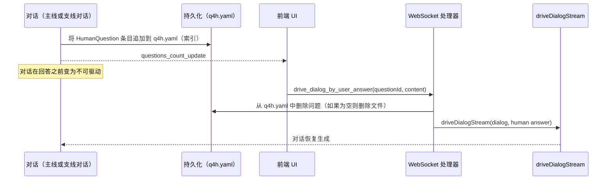
```mermaid
sequenceDiagram
  participant D as 对话（主线或支线对话）
  participant P as 持久化（q4h.yaml）
  participant UI as 前端 UI
  participant WS as WebSocket 处理器
  participant Driver as driveDialogStream

  D->>P: 将 HumanQuestion 条目追加到 q4h.yaml（索引）
  D-->>UI: questions_count_update
  Note over D: 对话在回答之前变为不可驱动

  UI->>WS: drive_dialog_by_user_answer(questionId, content)
  WS->>P: 从 q4h.yaml 中删除问题（如果为空则删除文件）
  WS->>Driver: driveDialogStream(dialog, human answer)
  Driver-->>D: 对话恢复生成
```

### 对话何时提出 Q4H？

当 `askHuman({ tellaskContent: "..." })` tellask 函数被任何对话（主线或支线对话）自行调用时，会提出 Q4H：

```typescript
// 来自 main/llm/kernel-driver/tellask-special.ts
const isQ4H = callName === 'askHuman';
```

**调用模式**：

```typescript
askHuman({ tellaskContent: '<问题标题>\n<问题正文内容>' });
```

### Q4H 记录过程

```typescript
// 当检测到 askHuman({ tellaskContent: "..." }) 作为队友诉请时
async function recordQuestionForHuman(
  dlg: Dialog,
  mentionList: string,
  tellaskContent: string,
): Promise<void> {
  const question: HumanQuestion = {
    id: generateDialogID(),
    mentionList,
    tellaskContent,
    askedAt: formatUnifiedTimestamp(new Date()),
  };

  // 加载现有问题
  const existing = await DialogPersistence.loadQuestions4HumanState(dlg.id);

  // 追加新问题
  await DialogPersistence._saveQuestions4HumanState(dlg.id, [...existing, question]);

  // 为 UI 通知发出事件
  await dlg.updateQuestions4Human([...existing, question]);
}
```

### UI 如何知道 Q4H

**基于事件的通知**：

当一个问题被记录时，系统会发出 `questions_count_update` 事件：

```typescript
// 来自 main/persistence.ts，DiskFileDialogStore.updateQuestions4Human
const questionsCountUpdateEvt: QuestionsCountUpdateEvent = {
  type: 'questions_count_update',
  previousCount: existing.length,
  questionCount: questions.length,
  dialog: {
    selfId: dialog.id.selfId,
    rootId: dialog.id.rootId,
  },
  course: dialog.currentCourse,
};
postDialogEvent(dialog, questionsCountUpdateEvt);
```

**前端响应**：

1. 接收 `questions_count_update` 事件
2. 读取 `q4h.yaml` 获取问题索引条目
3. 在对话上显示 Q4H 指示器/徽章
4. 问题链接到对话中它们的诉请站点
5. 用户点击链接导航到诉请站点，内联回答

### 用户如何回答 Q4H（智能体拉取模型）

**线路协议**：`drive_dialog_by_user_answer`

当对话因 Q4H 暂停时，智能体正在等待人工输入。线路协议使用"智能体拉取"样式的数据包来触发恢复：

```typescript
// shared/types/wire.ts
interface DriveDialogByUserAnswerRequest {
  type: 'drive_dialog_by_user_answer';
  dialog: DialogIdent;
  content: string; // 用户的回答文本
  msgId: string; // 用于跟踪的唯一 ID
  questionId: string; // 来自 q4h.yaml 的被回答问题的 ID
  continuationType: 'answer';
}
```

**流程（智能体拉取模型）**：

1. 用户在 UI 中看到 Q4H 指示器/徽章
2. 用户点击面板/列表中的 Q4H，导航到 `askHuman()` 诉请站点
3. 用户在输入文本区域中输入答案（与常规消息相同）
4. 前端发送 `drive_dialog_by_user_answer` 数据包
5. 后端根据 q4h.yaml 验证 `questionId`
6. 后端从 q4h.yaml 索引中清除已回答的 Q4H
7. 后端使用人工响应作为提示调用 `driveDialogStream()`
8. 智能体在新上下文中恢复生成（智能体拉取已满足）

**关键设计点**：

- 使用专用数据包类型回答 Q4H，与常规用户消息区分
- `questionId` 确保正确的 Q4H 被清除和回答
- 后端原子操作：清除 q4h.yaml → 恢复对话
- 智能体拉取：智能体在继续之前等待此特定数据包

**与常规消息的比较**：

| 方面       | 常规消息                | Q4H 回答                      |
| ---------- | ----------------------- | ----------------------------- |
| 数据包类型 | `drive_dlg_by_user_msg` | `drive_dialog_by_user_answer` |
| questionId | 不存在                  | 必须                          |
| 后端操作   | 只需驱动对话            | 先清除 q4h.yaml → 驱动对话    |
| 继续类型   | N/A                     | `'answer'`                    |

### 支线对话 Q4H 处理

**关键原则**：

1. Q4H 被索引在提出问题的对话中，而不是转交给诉请者
2. 支线对话自行提出 Q4H（不是作为诉请者的智能体）
3. 用户导航到支线对话的对话中以内联回答
4. `q4h.yaml` 文件是索引，不是真理之源

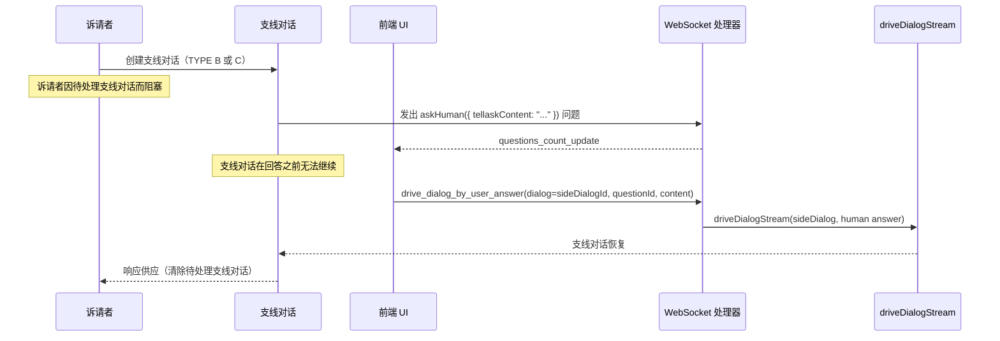
```mermaid
sequenceDiagram
  participant Asker as 诉请者
  participant Side as 支线对话
  participant UI as 前端 UI
  participant WS as WebSocket 处理器
  participant Driver as driveDialogStream

  Asker->>Side: 创建支线对话（TYPE B 或 C）
  Note over Asker: 诉请者因待处理支线对话而阻塞

  Side->>WS: 发出 askHuman({ tellaskContent: "..." }) 问题
  WS-->>UI: questions_count_update
  Note over Side: 支线对话在回答之前无法继续

  UI->>WS: drive_dialog_by_user_answer(dialog=sideDialogId, questionId, content)
  WS->>Driver: driveDialogStream(sideDialog, human answer)
  Driver-->>Side: 支线对话恢复
  Side-->>Asker: 响应供应（清除待处理支线对话）
```

### Q4H 与思维清晰操作

**关键设计决策**：Q4H 问题被 `clear_mind` 操作**清除**。

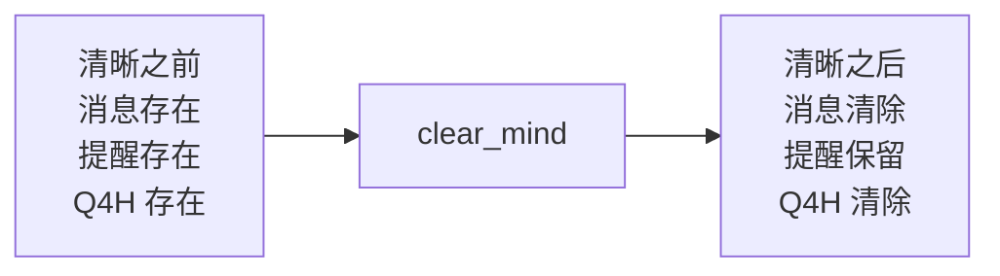
```mermaid
flowchart LR
  Before["清晰之前<br/>消息存在<br/>提醒存在<br/>Q4H 存在"] --> Op[clear_mind]
  Op --> After["清晰之后<br/>消息清除<br/>提醒保留<br/>Q4H 清除"]
```

---

## 对话关系与支线对话

### 对话树概述

```mermaid
flowchart TD
  Main[主线对话] --> S1[支线对话 sub-001]
  Main --> S2[支线对话 sub-002]
  Main --> S3[支线对话 sub-003]

  S1 --> N1[嵌套支线对话 sub-001-001]

  Main -.-> Reg["registry.yaml<br/>(主线作用域，仅 TYPE B)"]
  Main -.-> QRoot[q4h.yaml (根)]
  S1 -.-> QS1[q4h.yaml (sub-001)]
  N1 -.-> QN1[q4h.yaml (sub-001-001)]
```

**典型存储（路径是相对于 rtws（运行时工作区）的相对路径）**：

- `.dialogs/run/<root-id>/dialog.yaml`
- `.dialogs/run/<root-id>/latest.yaml`
- `.dialogs/run/<root-id>/reminders.json`
- `.dialogs/run/<root-id>/q4h.yaml`
- `.dialogs/run/<root-id>/course-001.jsonl`（第 1 程对话，还可以有编号递增的后续多程）
- `.dialogs/run/<root-id>/sideDialogs/<sub-id>/dialog.yaml`
- `.dialogs/run/<root-id>/sideDialogs/<sub-id>/q4h.yaml`
- `.dialogs/run/<root-id>/registry.yaml`（仅主线；TYPE B 注册表）

### 支线对话响应供应机制

**核心原则**：支线对话通过持久化向**当前诉请者**的上下文供应响应，而不是通过回调（TYPE A 时诉请者为直接 askerDialog）。

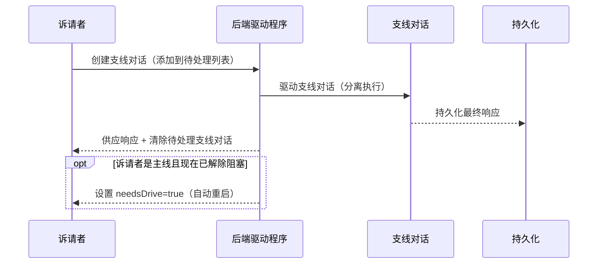
```mermaid
sequenceDiagram
  participant Asker as 诉请者
  participant Driver as 后端驱动程序
  participant Side as 支线对话
  participant Store as 持久化

  Asker->>Driver: 创建支线对话（添加到待处理列表）
  Driver->>Side: 驱动支线对话（分离执行）
  Side-->>Store: 持久化最终响应
  Driver-->>Asker: 供应响应 + 清除待处理支线对话
  opt 诉请者是主线且现在已解除阻塞
    Driver-->>Asker: 设置 needsDrive=true（自动重启）
  end
```

### 支线对话 Q4H 和诉请者恢复

当支线对话提出 Q4H 并等待人工输入时，诉请者的自动重启逻辑必须处理这种情况：

```typescript
// 诉请者检查支线对话完成状态
async function checkSideDialogRevival(askerDialog: Dialog): Promise<void> {
  const pending = await loadPendingSideDialogs(askerDialog.id);

  for (const p of pending) {
    // 检查支线对话是否有未解决的 Q4H
    const sideDialogQ4H = await DialogPersistence.loadQuestions4HumanState(p.sideDialogId);

    if (sideDialogQ4H.length > 0) {
      // 支线对话正在等待人工输入
      // 不要自动重启 - 等待人工回答 Q4H
      log.debug(`支线对话 ${p.sideDialogId} 有 ${sideDialogQ4H.length} 个 Q4H，跳过自动重启`);
      continue;
    }

    // 支线对话没有 Q4H，检查是否完成
    const isDone = await isSideDialogCompleted(p.sideDialogId);
    if (isDone) {
      // 合并响应并自动重启
      await incorporateSideDialogResponse(askerDialog, p.sideDialogId);
    }
  }
}
```

---

## 对话控制工具

**实现**：`clear_mind` 委托给 `Dialog.startNewCourse(newCoursePrompt)`，它：

1. 清除所有聊天消息
2. 清除所有 Q4H 问题
3. 增加“某一程对话”（dialog course）计数器
4. 更新对话的时间戳
5. 将 `newCoursePrompt` 排进对话的“下一条待处理提示”队列，以便驱动程序可以启动新的协程并将其用作新一程的**第一个 `role=user` 消息**

### `clear_mind`

**目的**：通过清除对话噪声同时保留基本上下文来实现思维清晰。

**函数工具参数**：

- `reminder_content?: string`（清除前要添加的可选提醒）

示例：

```text
调用函数工具 `clear_mind`：
```

**行为**：

- 清除当前对话中的所有聊天消息
- 保留所有提醒
- **清除所有 Q4H 问题**（关键！）
- 保留支线对话注册表（仅限主线对话）
- 对诉请者没有影响
- 将注意力重定向到差遣牒
- 系统生成的“开启新一程对话”提示已排队，作为新一程的首个 role=user 消息
- 开启新一程对话

**实现说明**：

- 操作仅作用于当前对话
- 支线对话不受诉请者 `clear_mind` 的影响
- 差遣牒保持不变且可访问
- 提醒在清晰操作中提供连续性

### `change_mind`

**目的**：更新对话树中所有对话引用的共享差遣牒内容（不开启新一程对话）。把差遣牒当作任务的**实时协调公告板**。

**函数工具参数**：

- `selector: "goals" | "constraints" | "progress"`
- `content: string`

示例：

```text
调用函数工具 `change_mind`：
```

**行为**：

- 更新 rtws（运行时工作区）差遣牒内容（`*.tsk/` 任务包中恰好一个章节文件）
- **不更改差遣牒路径。** `dlg.taskDocPath` 在对话的整个生命周期中是不可变的。
- 更新的文件立即对引用它的所有对话可用
- **不开启新一程对话。** 如需开启新一程对话，请单独使用 `clear_mind`。
- 本身不清除消息、提醒、Q4H 或注册表
- 影响引用相同差遣牒的所有参与智能体（主线对话和支线对话）
- 关键决策/当前状态/下一步写回 `progress`；硬约束写回 `constraints`（不要只留在对话/提醒项里）。

**实现说明**：

- `change_mind` 仅在主线对话中可用（不在支线对话中）；支线对话必须通过回问诉请（`tellaskBack({ tellaskContent: "..." })`）询问诉请者以更新共享差遣牒。
- 对于 `*.tsk/` 差遣牒任务包，差遣牒是封装的：通用文件工具不得读取/写入/列出/删除 `*.tsk/` 下的任何内容。请参阅 [`encapsulated-taskdoc.zh.md`](./encapsulated-taskdoc.zh.md)。

---

## 提醒管理

**工具**：`add_reminder`、`update_reminder`、`delete_reminder`

**目的**：管理跨对话清理持续存在的对话作用域工作内存。

**行为**：

- 作用域为单个对话
- **在 clear_mind 操作中存活**
- **在 change_mind 操作中存活**
- 为刷新后的精神焦点提供指导
- 支持结构化捕获见解、决策和下一步

**与 Q4H 的关系**：

- 提醒在思维清晰操作中持续存在
- Q4H 被思维清晰操作清除
- 它们服务于不同的目的：
  - **提醒**：用于连续性的自生成笔记（在清晰操作中存活）
  - **Q4H**：需要人工输入的外部请求（被清晰操作清除）

---

## 支线对话注册表

### 概述

**支线对话注册表** 是主线对话作用域的数据结构，维护通过 TYPE B（已注册支线对话诉请 / 长线诉请）创建的已注册支线对话的持久引用。

### 关键特征

| 方面         | 描述                                          |
| ------------ | --------------------------------------------- |
| **作用域**   | 仅限主线对话（支线对话无法访问）              |
| **键格式**   | `agentId!sessionSlug`（单级 Map）             |
| **存储**     | 主线对话目录中的 `registry.yaml`              |
| **生命周期** | 正常流程保留；被宣布卡死的支线对话条目会移除  |
| **持久化**   | 根完成时随主线移动到 `done/`                  |
| **恢复**     | 在主线加载时通过扫描 done/ 支线对话 YAML 重建 |

### 注册表操作

示例 `registry.yaml`（概念性）：

```yaml
researcher!market-analysis:
  sideDialogId: uuid-123
  agentId: researcher
  tellaskSession: market-analysis
  createdAt: 2025-12-27T10:00:00Z
  lastAccessed: 2025-12-27T11:30:00Z
```

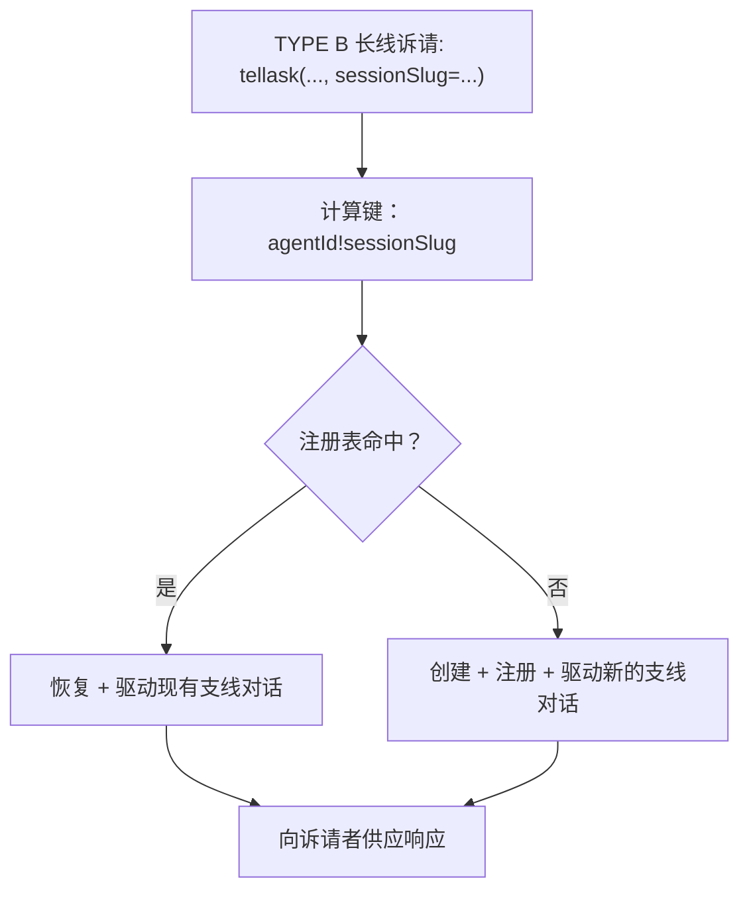
```mermaid
flowchart TD
  Tellask["TYPE B 长线诉请: tellask(..., sessionSlug=...)"] --> Key[计算键：agentId!sessionSlug]
  Key --> Lookup{注册表命中？}
  Lookup -- 是 --> Resume[恢复 + 驱动现有支线对话]
  Lookup -- 否 --> Create[创建 + 注册 + 驱动新的支线对话]
  Resume --> Supply[向诉请者供应响应]
  Create --> Supply
```

**前一轮仍在等待时又收到更新诉请（规范）**：

- 对同一个已注册支线（同一 `agentId!sessionSlug`），运行时只维护一个“当前等待中的诉请者轮次”。
- 如果新的 TYPE B 诉请在上一轮回复前到达，运行时会立刻用一条系统生成的失败回贴结束上一轮等待；文案必须从业务事实描述，不使用协议/实现术语。
- 被诉请侧不会被强行打断。运行时会在它下一次收到的提示里说明“工作要求已更新”，明确要求不要单独回复“收到/好的”，并直接附上最新完整诉请。
- 这条更新后的 assignment 提示要按顺序排进“下一条待处理提示”队列，在安全的 turn 边界送达；不能仅仅因为队列里已经有另一条正常提示，就拒绝这次更新写入。
- 如果支线对话在最新 assignment 提示真正落到本地之前先产出了回复，这条回复不得作为新一轮的结果回贴给诉请者。

### 类设计：MainDialog vs SideDialog

**关键设计原则**：支线对话注册表仅由 `MainDialog` 管理，**支线对话实例无法访问**。

**职责**：

- `MainDialog`
  - 拥有 TYPE B 支线对话注册表（`registry.yaml`）
  - 创建/注册/查找已注册的支线对话（`agentId!sessionSlug`）
- `SideDialog`
  - 有一个 `askerDialog` 引用（直接诉请者）并将其用于 TYPE A（`tellaskBack({ tellaskContent: "..." })`）
  - 无法访问或更改主线注册表（按设计）

**互斥锁语义**：

- `locked: true` → 支线对话当前正在被驱动（持有互斥锁）
- `locked: false` → 条目存在但支线对话未锁定（可以恢复）
- 注册表不跟踪：'active' | 'completed' | 'suspended' 生命周期状态

**设计原则**：注册表跟踪"锁定"（正在被驱动）与"未锁定"（可以恢复）状态。它不跟踪对话生命周期状态（active/completed/suspended）。这些是 Dialog 的关注点，不是 Registry 的关注点。已注册的支线对话可能未锁定（当前未被驱动）但仍然作为已完成或已暂停的对话存在。

### 注册表持久化

**文件位置**：`<main-dialog-path>/registry.yaml`

**格式**：

```typescript
interface SideDialogRegistry {
  [key: string]: {
    sideDialogId: string; // 支线对话的 UUID
    agentId: string; // 智能体标识符
    tellaskSession: string; // 诉请会话键
    createdAt: string; // ISO 时间戳
    lastAccessed?: string; // ISO 时间戳（在每次诉请时更新）
    locked: boolean; // 互斥锁状态 - 现在有人正在驱动这个吗？
  };
}
```

**持久化行为**：

1. **注册时**：新条目添加到注册表，文件保存
2. **恢复时**：`lastAccessed` 更新，文件保存
3. **Clear Mind 时**：注册表保留（不被清除）
4. **根完成时**：注册表随主线移动到 `done/`
5. **主线加载时**：注册表从 done/ 支线对话 YAML 重建

---

## 技术架构

### 对话类结构

完整的对话类实现，包含所有方法、属性和详细行为，可以在 `dominds/main/dialog.ts` 中找到。

**关键组件**：

- **层级支持**：用于支线对话管理的诉请/响应关系
- **内存管理**：持久化提醒和临时聊天消息
- **清理头脑操作**：`startNewCourse(newCoursePrompt)` 方法（清除消息，清除 Q4H，开启新一程对话，并为下一次驱动排队开启提示）
- **支线对话管理**：专门支线任务的创建和协调
- **Q4H 管理**：用于问题跟踪的 `updateQuestions4Human()` 方法
- **内存访问**：与差遣牒和团队/智能体内存的集成
- **注册表管理**（仅限 MainDialog）：支线对话的注册和查找

### 主线对话解析

对于需要与主线对话通信的支线对话，请参阅 `dominds/main/dialog.ts` 中的实现，该实现提供了遍历对话关系的方法。

### 持久化层

持久化层处理：

- **对话存储**：`dominds/main/persistence.ts`
- **Q4H 存储**：每个对话的 `q4h.yaml`（被 clear_mind 清除）
- **提醒存储**：每个对话的 `reminders.json`
- **事件持久化**：按程分文件的 JSONL 事件流
- **注册表存储**：每个主线对话的 `registry.yaml`

**Q4H 持久化方法**：

```typescript
// 在 persistence.ts 中
static async _saveQuestions4HumanState(
  dialogId: DialogID,
  questions: HumanQuestion[],
): Promise<void>

static async loadQuestions4HumanState(
  dialogId: DialogID,
): Promise<HumanQuestion[]>

static async clearQuestions4HumanState(
  dialogId: DialogID,
): Promise<void>
```

**注册表持久化方法**：

```typescript
// 在 MainDialog（dialog.ts）中
interface RegistryMethods {
  loadRegistry(): Promise<SideDialogRegistry>;
  saveRegistry(registry: SideDialogRegistry): Promise<void>;
  registerSideDialog(key: string, metadata: SideDialogMetadata): void;
  lookupSideDialog(key: string): SideDialogMetadata | undefined;
  getRegistry(): SideDialogRegistry;
}
```

---

## 对话管理

### 对话树管理

**创建**：当智能体需要委派专门任务或复杂问题需要分解时，会创建支线对话。

**上下文继承**：新的支线对话自动接收：

- 对相同 rtws（运行时工作区）差遣牒的引用（推荐：`tasks/feature-auth.tsk/`）；`dlg.taskDocPath` 在对话创建时固定，永不重新分配
- 诉请者的诉请上下文（mentionList + tellaskContent）解释其目的
- 访问共享团队内存
- 访问其智能体的个人内存

**存储**：所有支线对话都平铺存储在主线对话的 `sideDialogs/` 目录下，无论嵌套深度如何。

**导航**：每个支线对话都保持对其诉请者的引用，可沿对话树回到主线对话。

**注册表**：已注册的支线对话（TYPE B 长线诉请）在主线对话的注册表中跟踪，并在重启后持久化；若支线对话被宣布卡死，其条目会被裁剪，不再参与后续同 slug 复用。

### Main dialog fork（主线对话分叉）

运行中的一个完整 main dialog tree 可以在某个 root generation 起点处被 fork 成新的 main dialog。该能力用于“保留此前上下文，但从某个历史分叉点重新走后续主线/支线”。

**入口**：

- UI 仅对 main dialog（`selfId === rootId`）的 generation bubble 显示 `Fork 对话`
- 后端 API：`POST /api/dialogs/:rootId/fork`
- 请求体：`{ course, genseq, status? }`

**语义（强制）**：

- 选中的 generation bubble **不会**被复制到 fork 后的新主线；fork 切点语义是“从该 generation 开始前分叉”
- 复制范围不是单个对话，而是**整棵 main dialog tree**
- 支线对话是否纳入 fork，取决于它是否已经在切点之前被主线对话显式记录为已创建
- 支线对话 transcript 的保留边界由 root generation anchor 决定，而不是支线对话自身的本地 `genseq`

**fork 后动作**（由后端返回给 UI）：

- `draft_user_text`：若目标 generation 是一条用户输入，则把该文本回填到新对话输入框中，等待用户决定是否发送
- `restore_pending`：若切点之前存在待处理 Q4H 或待处理支线对话，则恢复这些阻塞态，让新主线继续处于阻塞状态
- `auto_continue`：若切点之前没有待处理阻塞，则新主线以 `interrupted(system_stop: fork_dialog_continue)` 初始化，UI 随后立即发送 `resume_dialog`

**一致性要求**：

- fork 必须保留同一差遣牒引用
- fork 后的 main/sideDialog 都落到 `running/`，并拥有新的 rootId
- 前端不得对 Side Dialog 暴露该入口；当前实现仅支持 fork main dialog

### 支线对话起始角色提示（强制）

每当支线对话进入新一程时，运行时必须在 assignment prompt 前插入角色头：

- ZH：`你是当前对话的对话主理人；诉请者为 @xxx（当前发起本次诉请）。`
- EN：`You are the Dialog Responder for this dialog; the tellasker is @xxx (current tellasker).`

**FBR 特例**（示例）：

- ZH：`这是一次 FBR 支线对话；诉请者为 @xxx（可能与当前对话同一 agent）。`
- EN：`This is an FBR Side Dialog; the tellasker is @xxx (may be the same agent).`

**插入点**：优先通过 `formatAssignmentFromAskerDialog()` 单点注入（覆盖 `dialog.ts` / `tellask-bridge`）。现在不再保留单独的前端 twin；权威格式化实现位于 [`main/runtime/inter-dialog-format.ts`](../main/runtime/inter-dialog-format.ts)。

### 生命周期管理

**活动状态**：智能体正在工作时，对话保持活动状态。

**完成**：当以下情况时，对话转换为完成状态：

- 任务成功完成
- 智能体明确标记它们完成
- 诉请者确定支线任务不再需要
- 所有待处理的支线对话都完成且所有 Q4H 已回答

**完成时的注册表**：当主线对话完成时，其注册表随它移动到 `done/` 目录，并保留以供潜在恢复。

**清理**：完成的对话可以根据保留策略进行归档或清理。

### 通信模式

**面向诉请者的通信**：支线对话向诉请者通信结果、问题和升级。

- **澄清请求（TYPE A / 回问诉请）**：支线对话在处理其支线任务时可能向诉请者发起诉请以请求澄清。TYPE A 中诉请者为直接 askerDialog。诉请者提供指导，支线对话在新上下文中继续。
- **支线任务响应**：当支线对话产生最终的 "saying" 内容块（没有待处理的 Q4H）时，该消息被视为对 `assignmentFromAsker` 中记录的**当前诉请者**的响应（主线对话或另一个支线对话）。这使响应与最新的诉请站点保持一致。
- **Q4H 升级**：如果支线对话有 Q4H，它会暂停。用户可以通过 UI 回答，这只会触发支线对话的继续。
- **已注册的支线对话（TYPE B / 长线诉请）**：诉请者可以恢复先前创建的已注册支线对话，实现持续的任务继续。
- **瞬态支线对话（TYPE C / 一次性诉请）**：诉请者可以生成一次性支线对话用于不需要持久化的独立任务。

**面向支线的通信**：诉请者向支线对话提供上下文、目标和指导。

**横向通信**：兄弟支线对话通过共享诉请者进行协调。

**广播通信**：主线对话可以通过差遣牒引用将更改（如 rtws 差遣牒文件更新）传达给所有对话。

---

## 内存管理

### 对话作用域内存

**聊天消息**：可以清除以实现思维清晰的临时对话内容。

**提醒**：在清晰操作中存活的半持久化工作内存。

**Q4H 问题**：需要人工输入的临时问题，被思维清晰操作**清除**。

**诉请者上下文**：解释为什么创建支线对话的不可变上下文。

**支线对话注册表**：主线对话作用域的已注册支线对话持久映射（在清晰操作中存活）。

### rtws 持久化内存

**团队共享内存**：在整个项目生命周期中持久化，由所有智能体共享。

**智能体个人内存**：每个智能体的个人知识，在所有对话中持久化。

### 内存同步

**差遣牒传播**：对 rtws 差遣牒文件的更改对引用它的所有对话立即可见。

**内存更新**：团队和智能体内存异步更新，最终在所有对话中保持一致。

**Q4H 持久化**：Q4H 问题在创建时持久化，在回答时或调用 clear_mind 时原子地清除。

**注册表持久化**：注册表在每次修改后持久化，并在主线对话加载时恢复。

---

## 系统集成

### 文件系统集成

**对话存储**：每个对话对应一个包含以下内容的目录结构：

- `<dialog-root>/dialog.yaml` — 对话元数据和配置
- `<dialog-root>/latest.yaml` — 当前对话过程跟踪和状态
- `<dialog-root>/reminders.json` — 持久化提醒存储
- `<dialog-root>/q4h.yaml` — Q4H 索引（被清晰工具清除）
- `<dialog-root>/registry.yaml` — 支线对话注册表（仅限主线对话）
- `<dialog-root>/course-001.jsonl`（第 1 程对话，还可以有编号递增的后续多程）— 流式消息文件
- `<dialog-root>/sideDialogs/<sideDialog-id>/dialog.yaml`
- `<dialog-root>/sideDialogs/<sideDialog-id>/q4h.yaml` — 每个支线对话的 Q4H 索引（被清晰清除）

**差遣牒存储**：差遣牒是对话通过路径引用的 rtws 产物。差遣牒必须是封装的 `*.tsk/` 任务包。

**内存存储**：团队和智能体内存存储在 rtws 内的专用文件中。
**注册表存储**：支线对话注册表（`registry.yaml`）存储在主线对话目录中，并在根完成时移动到 `done/`。

### 流式生成子流顺序契约（Thinking / Saying）

Dominds 将 LLM 输出拆分为多个“子流”（thinking、saying，以及从 saying 进一步解析出的 markdown / function tool call 子段）并通过 WebSocket 事件推送给 UI。
为了让 UI **忠实体现原始生成顺序**，以及让“乱序”成为可观测、可定位的全栈问题，必须遵守以下契约：

- **允许任意多段交替**：在同一轮生成（同一 `genseq`）内，thinking 与 saying 可以出现任意多段，按 `start → chunk* → finish` 的片段形式交替出现。
- **禁止重叠**：任意时刻最多只有一个活跃的子流（thinking 或 saying）。不允许 “前一个未 finish，后一个就 start” 的并发/重叠。
- **UI 仅按事件顺序渲染**：前端不应通过重排 DOM 来“修复”乱序；应按事件抵达顺序追加 section，以体现真实的生成轨迹。
- **乱序必须大声报错**：一旦检测到重叠/乱序（例如 thinking 与 saying 同时活跃），后端应发出 `stream_error_evt` 并中断该次生成，以便尽快暴露 provider/解析链路的协议问题并定位。

### LLM Provider 消息投影（role/turn）

Dominds 内部持久化的消息粒度较细（thinking/saying/tool call/tool result 等会以独立条目出现），而当前主流 LLM Provider 的对话协议一般仅支持 `role=user|assistant`（以及少量实现把工具结果视作特殊的 tool/user 变体）。

- **理想目标**：Provider 协议能够原生支持 `role='environment'`（或等价机制）来承载运行时注入的环境/系统信息（例如 reminders、transient guide 等），从而避免把“环境信息”伪装成用户发言。
- **当前现实**：大多数 Provider 不支持 `role='environment'`。因此 Dominds 在投影到 Provider 请求 payload 时，必须把内部消息类型压平到 Provider 可接受的角色集合中。
  - 运行时/系统提示（`environment_msg`）投影为 `role='user'` 的文本块。
  - 智能体自写的短指导/自我提醒（`transient_guide_msg`）投影为 `role='assistant'` 的文本块。
  - reminders 不再一刀切：系统托管的状态型提醒（如运行时状态信号）应落在 `user` 侧并带明确系统提示头标；智能体自维护的工作提醒项则保留在 `assistant` 侧，以第一人称工作便签的语义出现。

另外，一些 Provider（尤其是 Anthropic-compatible endpoint）对 **role 交替** 与 **tool_use/tool_result 的边界** 有更严格的结构校验。Dominds 的投影层需要把内部细粒度条目组装为更“turn 化”的 Provider 消息序列（turn assembly），而不是把内部条目逐条 1:1 发送。

### CLI 集成

**对话创建**：新对话通过带有适当上下文的 CLI 命令创建。

**工具调用**：思维清晰工具通过 CLI 命令或智能体操作调用。

**状态监控**：对话状态、待处理支线对话、Q4H 计数和已注册的支线对话可以通过 CLI 工具检查。

### 智能体集成

**自主操作**：智能体可以独立创建支线对话（TYPE B 和 C）、管理提醒、提出 Q4H 并触发清晰操作。

**上下文感知**：智能体可以完全访问其对话上下文、内存、对话关系位置、来自支线对话的待处理 Q4H，以及（对于主线对话）支线对话注册表。

**队友诉请能力**：智能体可以调用所有三种类型的队友诉请：

- TYPE A / 回问诉请：向诉请者发起诉请以请求澄清
- TYPE B / 长线诉请：诉请或恢复已注册的支线对话
- TYPE C / 一次性诉请：生成瞬态支线对话

**工具访问**：所有思维清晰工具、Q4H 能力和队友诉请工具都可用于智能体进行自主认知管理。

### 对话状态机

Dominds 的运行时**不**持久化单一的类似枚举的 "awaiting …" 状态。对话是否可以
驱动是从持久化的事实派生的：

- 持久化状态（API/索引）：`running | completed | archived`
- 持久化 `latest.yaml`：`status`、`needsDrive`、`generating`
- 派生的门控：`hasPendingQ4H()` 和 `hasPendingSideDialogs()`

**持久化状态生命周期**：

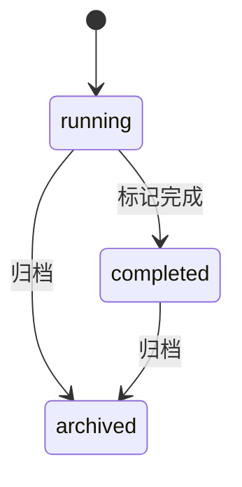
```mermaid
stateDiagram-v2
  [*] --> running
  running --> completed: 标记完成
  running --> archived: 归档
  completed --> archived: 归档
```

**主线驱动程序门控（概念性）**：

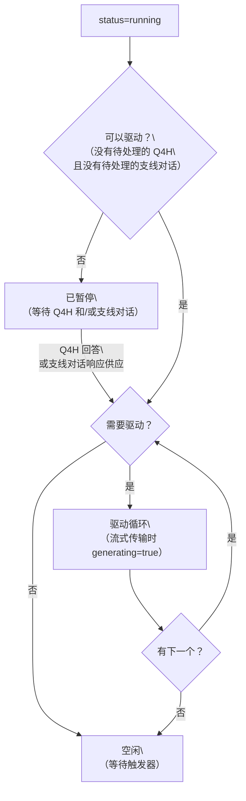
```mermaid
flowchart TD
  A[status=running] --> B{可以驱动？\\n（没有待处理的 Q4H\\n且没有待处理的支线对话）}
  B -- 否 --> S[已暂停\\n（等待 Q4H 和/或支线对话）]
  S -->|Q4H 回答\\n或支线对话响应供应| C{需要驱动？}
  B -- 是 --> C{需要驱动？}
  C -- 否 --> I[空闲\\n（等待触发器）]
  C -- 是 --> D[驱动循环\\n（流式传输时 generating=true）]
  D --> E{有下一个？}
  E -- 是 --> C
  E -- 否 --> I
```

### 队友诉请状态转换

这些图表专注于**控制流**，避免框图对齐，以便在不同的markdown查看器中呈现时保持可读性。

#### TYPE A：回问诉请（`tellaskBack({ tellaskContent: "..." })`，无 `sessionSlug`）

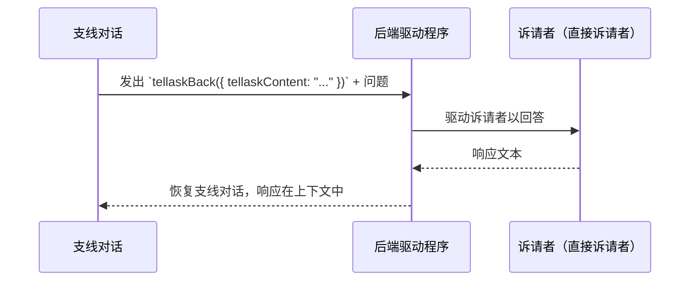
```mermaid
sequenceDiagram
  participant Side as 支线对话
  participant Driver as 后端驱动程序
  participant Asker as 诉请者（直接诉请者）

  Side->>Driver: 发出 `tellaskBack({ tellaskContent: "..." })` + 问题
  Driver->>Asker: 驱动诉请者以回答
  Asker-->>Driver: 响应文本
  Driver-->>Side: 恢复支线对话，响应在上下文中
```

#### TYPE B：已注册支线对话诉请（长线诉请）（`tellask({ targetAgentId: "agentId", sessionSlug: "tellaskSession", tellaskContent: "..." })`）

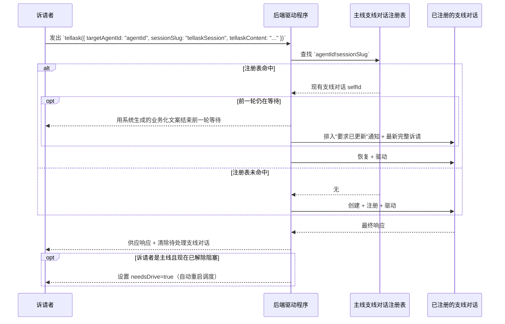
```mermaid
sequenceDiagram
  participant Tellasker as 诉请者
  participant Driver as 后端驱动程序
  participant Reg as 主线支线对话注册表
  participant Side as 已注册的支线对话

  Tellasker->>Driver: 发出 `tellask({ targetAgentId: "agentId", sessionSlug: "tellaskSession", tellaskContent: "..." })`
  Driver->>Reg: 查找 `agentId!sessionSlug`
  alt 注册表命中
    Reg-->>Driver: 现有支线对话 selfId
    opt 前一轮仍在等待
      Driver-->>Tellasker: 用系统生成的业务化文案结束前一轮等待
      Driver->>Side: 排入“要求已更新”通知 + 最新完整诉请
    end
    Driver->>Side: 恢复 + 驱动
  else 注册表未命中
    Reg-->>Driver: 无
    Driver->>Side: 创建 + 注册 + 驱动
  end
  Side-->>Driver: 最终响应
  Driver-->>Tellasker: 供应响应 + 清除待处理支线对话
  opt 诉请者是主线且现在已解除阻塞
    Driver-->>Tellasker: 设置 needsDrive=true（自动重启调度）
  end
```

#### TYPE C：瞬态支线对话诉请（一次性诉请）（`tellaskSessionless({ targetAgentId: "agentId", tellaskContent: "..." })`，或 `freshBootsReasoning({ tellaskContent: "..." })`）

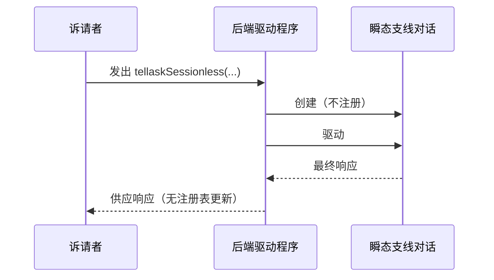
```mermaid
sequenceDiagram
  participant Tellasker as 诉请者
  participant Driver as 后端驱动程序
  participant Side as 瞬态支线对话

  Tellasker->>Driver: 发出 tellaskSessionless(...)
  Driver->>Side: 创建（不注册）
  Driver->>Side: 驱动
  Side-->>Driver: 最终响应
  Driver-->>Tellasker: 供应响应（无注册表更新）
```

### Q4H 生命周期状态

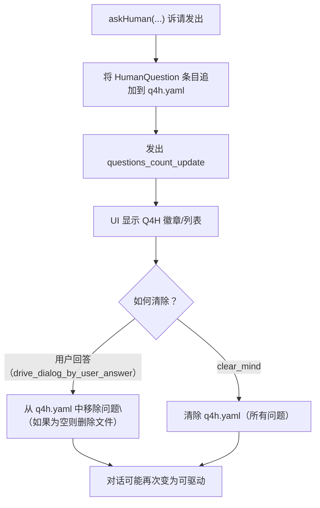
```mermaid
flowchart TD
  A["askHuman(...) 诉请发出"] --> B[将 HumanQuestion 条目追加到 q4h.yaml]
  B --> C[发出 questions_count_update]
  C --> D[UI 显示 Q4H 徽章/列表]
  D --> E{如何清除？}
  E -->|用户回答（drive_dialog_by_user_answer）| F[从 q4h.yaml 中移除问题\\n（如果为空则删除文件）]
  E -->|clear_mind| G[清除 q4h.yaml（所有问题）]
  F --> H[对话可能再次变为可驱动]
  G --> H
```

`q4h.yaml` 被视为索引；真理之源"提出的问题"内容存在于对话的消息流中，由 `callSiteRef` 引用。

### 支线对话 + Q4H 交互

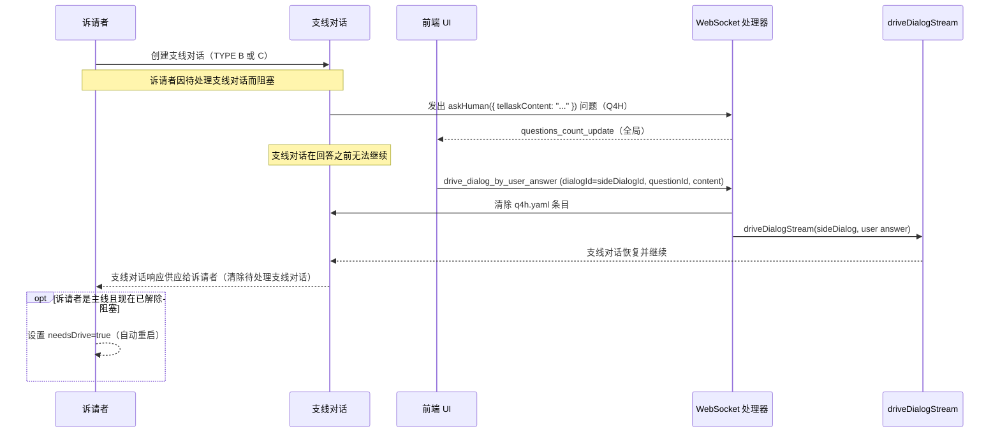
```mermaid
sequenceDiagram
  participant Asker as 诉请者
  participant Side as 支线对话
  participant UI as 前端 UI
  participant WS as WebSocket 处理器
  participant Driver as driveDialogStream

  Asker->>Side: 创建支线对话（TYPE B 或 C）
  Note over Asker,Side: 诉请者因待处理支线对话而阻塞
  Side->>WS: 发出 askHuman({ tellaskContent: "..." }) 问题（Q4H）
  WS-->>UI: questions_count_update（全局）

  Note over Side: 支线对话在回答之前无法继续

  UI->>WS: drive_dialog_by_user_answer (dialogId=sideDialogId, questionId, content)
  WS->>Side: 清除 q4h.yaml 条目
  WS->>Driver: driveDialogStream(sideDialog, user answer)
  Driver-->>Side: 支线对话恢复并继续
  Side-->>Asker: 支线对话响应供应给诉请者（清除待处理支线对话）

  opt 诉请者是主线且现在已解除阻塞
    Asker-->>Asker: 设置 needsDrive=true（自动重启）
  end
```

---

## 完整流程参考

### 1. 主线对话提出 Q4H

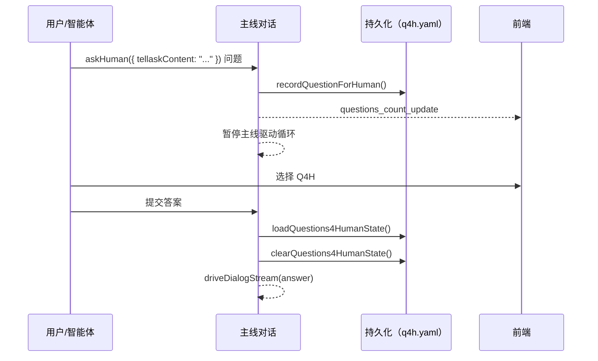
```mermaid
sequenceDiagram
	  participant User as 用户/智能体
  participant Main as 主线对话
  participant Store as 持久化（q4h.yaml）
  participant UI as 前端

  User->>Main: askHuman({ tellaskContent: "..." }) 问题
  Main->>Store: recordQuestionForHuman()
  Main-->>UI: questions_count_update
  Main-->>Main: 暂停主线驱动循环

  User->>UI: 选择 Q4H
  User->>Main: 提交答案
  Main->>Store: loadQuestions4HumanState()
  Main->>Store: clearQuestions4HumanState()
  Main-->>Main: driveDialogStream(answer)
```

### 2. 支线对话提出 Q4H，用户通过主线回答

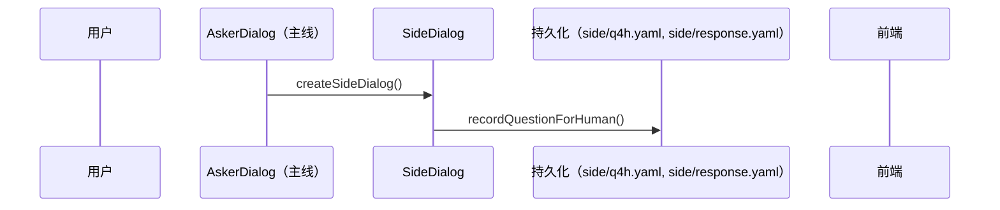
```mermaid
sequenceDiagram
  participant User as 用户
  participant Asker as AskerDialog（主线）
  participant Side as SideDialog
  participant Store as 持久化（side/q4h.yaml, side/response.yaml）
  participant UI as 前端

  Asker->>Side: createSideDialog()
  Side->>Store: recordQuestionForHuman()
```

### 2. 支线对话发起 Q4H，用户通过主线对话回答

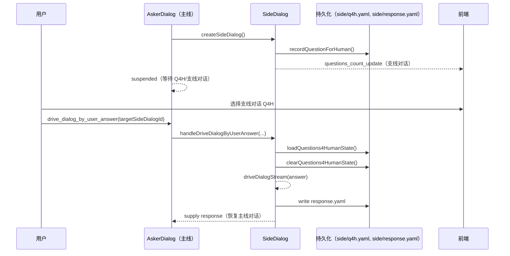
```mermaid
sequenceDiagram
  participant User as 用户
  participant Asker as AskerDialog（主线）
  participant Side as SideDialog
  participant Store as 持久化（side/q4h.yaml, side/response.yaml）
  participant UI as 前端

  Asker->>Side: createSideDialog()
  Side->>Store: recordQuestionForHuman()
  Side-->>UI: questions_count_update（支线对话）
  Asker-->>Asker: suspended（等待 Q4H/支线对话）

  User->>UI: 选择支线对话 Q4H
  User->>Asker: drive_dialog_by_user_answer(targetSideDialogId)
  Asker->>Side: handleDriveDialogByUserAnswer(...)
  Side->>Store: loadQuestions4HumanState()
  Side->>Store: clearQuestions4HumanState()
  Side-->>Side: driveDialogStream(answer)
  Side->>Store: write response.yaml
  Side-->>Asker: supply response（恢复主线对话）
```

### 3. 已注册支线对话诉请（TYPE B / 长线诉请）

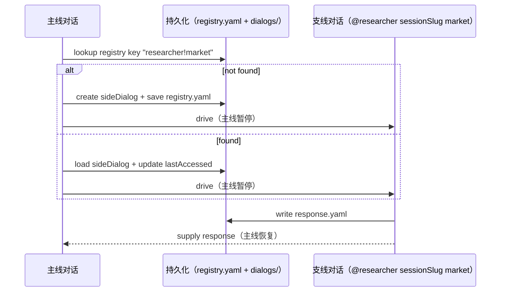
```mermaid
sequenceDiagram
  participant Main as 主线对话
  participant Store as 持久化（registry.yaml + dialogs/）
  participant Side as 支线对话（@researcher sessionSlug market）

  Main->>Store: lookup registry key "researcher!market"
  alt not found
    Main->>Store: create sideDialog + save registry.yaml
    Main->>Side: drive（主线暂停）
  else found
    Main->>Store: load sideDialog + update lastAccessed
    Main->>Side: drive（主线暂停）
  end

  Side->>Store: write response.yaml
  Side-->>Main: supply response（主线恢复）
```

### 4. 清晰度操作保留注册表

| 状态元素 | `clear_mind` 的效果             |
| -------- | ------------------------------- |
| 消息     | 清除（新一轮 / 全新消息上下文） |
| Q4H      | 清除                            |
| 提醒项   | 保留                            |
| 注册表   | 保留                            |

`change_mind` 不是清晰度操作；它就地更新差遣牒内容，不会清除消息/Q4H/提醒项/注册表。

---

## 性能考量

### 可扩展性

**扁平存储**：支线对话扁平存储防止深层目录嵌套问题。

**注册表效率**：已注册支线对话的单级 Map 查找为 O(1)。

**内存效率**：共享内存在对话之间减少重复。

**懒加载**：对话内容按需加载以最小化内存使用。

### 可靠性

**原子操作**：Q4H 和注册表持久化使用原子写入模式（临时文件 + 重命名）。

**备份与恢复**：对话状态可以独立备份和恢复。注册表从 done/ 加载时恢复。

**错误处理**：系统优雅地处理对话损坏、文件丢失和注册表损坏。

### 监控

**性能指标**：系统跟踪对话创建、完成、注册表大小、资源使用和 Q4H 计数。

**健康检查**：定期验证对话树完整性、Q4H 持久化、注册表一致性和内存。

**调试支持**：全面的日志记录和检查工具，用于排查队友诉请、注册表操作和 Q4H 流程。

---

## 总结

Dominds 对话系统为树状协作、人在回路的 AI 协作提供了一个强大的框架：

### 四个核心机制

| 机制               | 目的                | 存活于清晰度 | 清除方式                                   |
| ------------------ | ------------------- | ------------ | ------------------------------------------ |
| **对话树**         | 诉请者/支线任务委托 | N/A          | N/A                                        |
| **Q4H**            | 人机交互请求        | 否           | clear_mind                                 |
| **心智清晰度**     | 上下文重置工具      | N/A          | N/A                                        |
| **提醒项**         | 持久化工作内存      | 是           | N/A                                        |
| **支线对话注册表** | 已注册支线对话跟踪  | 是           | `declare_sideDialog_dead` 时裁剪 dead 条目 |

### 三种队友诉请类型

| 类型（内部） | 用户可见术语 | 语法                                                                                | 注册表                | 用例             |
| ------------ | ------------ | ----------------------------------------------------------------------------------- | --------------------- | ---------------- |
| TYPE A       | 回问诉请     | `tellaskBack({ tellaskContent: "..." })`                                            | 无注册表              | 澄清（询问来源） |
| TYPE B       | 长线诉请     | `tellask({ targetAgentId: "agentId", sessionSlug: "<id>", tellaskContent: "..." })` | `agentId!sessionSlug` | 可恢复多轮工作   |
| TYPE C       | 一次性诉请   | `tellaskSessionless({ targetAgentId: "agentId", tellaskContent: "..." })`           | 未注册                | 单次 / 不可恢复  |

### 类职责

- **主线对话**：管理注册表，可以发起所有三种队友诉请类型
- **支线对话**：拥有诉请者引用，可以直接发起 TYPE A 和 TYPE C；TYPE B 通过主线注册表路由，并在每次诉请时更新诉请者上下文

### 持久化保证

- **Q4H**：持久化，由清晰度操作清除
- **提醒项**：持久化，在清晰度操作中存活
- **注册表**：持久化，在清晰度操作中存活，完成时移至 done/；dead 条目会在宣布卡死时被裁剪
- **支线对话**：已注册的支线对话在注册表中持久化；临时支线对话不会被注册
